# 1. 이론 {#sec-ch2}

> 이 장은 신경망 학습을 지탱하는 이론적 뼈대를 폭넓게 다룹니다. 인공지능의 역사에서 시작해 학습의 종류, 신경망의 기본 요소, 학습의 순서, 성능 평가와 검증 전략, 경사하강법과 옵티마이저, 과적합과 정규화, 파라미터 초기화, 그리고 데이터 파이프라인 설계까지 이어집니다. 1장에서 만든 학습 루프 템플릿이 "왜" 그렇게 구성되는지를 이 장의 개념들이 설명합니다.

## 인공지능의 역사와 발전 과정 {#sec-history}

인공지능은 한 번에 등장한 기술이 아니라, 여러 번의 도약과 침체(이른바 "AI 겨울")를 거치며 발전했습니다. 큰 흐름을 시간 순으로 정리하면 다음과 같습니다.

```{mermaid}
timeline
    title 인공지능·신경망·딥러닝의 발전
    1943 : 매컬럭-피츠 인공뉴런
    1958 : 로젠블랫 퍼셉트론
    1969 : 퍼셉트론의 한계 지적(XOR)
    1986 : 오차 역전파의 재조명
    1998 : LeNet 합성곱 신경망
    2006 : 심층 신뢰망·딥러닝 명명
    2012 : AlexNet, ImageNet 우승
    2017 : 트랜스포머 등장
    2020s : 대규모 언어모델·생성 AI
```

### 인공지능의 등장

인공지능이라는 개념은 1943년 매컬럭과 피츠가 **인공 뉴런**을 논리 계산 소자로 모형화하면서 싹텄습니다. 1958년 로젠블랫은 학습이 가능한 **퍼셉트론(perceptron)**을 제안했는데, 이는 입력의 가중합에 임계값을 적용해 분류를 수행하는 단일 뉴런 모델입니다. 그러나 1969년 민스키와 페이퍼트는 단층 퍼셉트론이 XOR처럼 선형 분리가 불가능한 문제를 풀 수 없음을 수학적으로 보였고, 이로 인해 신경망 연구는 한동안 정체됩니다.

### 뉴럴 네트워크의 탄생과 부흥

정체를 끝낸 결정적 사건은 1986년 **오차 역전파(backpropagation)** 알고리즘의 재조명입니다. 역전파는 여러 층으로 이루어진 신경망의 각 가중치에 대한 손실의 기울기를 연쇄법칙으로 효율적으로 계산합니다. 이로써 다층 신경망을 실제로 학습시킬 수 있게 되었고, XOR 같은 비선형 문제도 은닉층을 통해 풀 수 있게 되었습니다. 1998년 르쿤 등은 합성곱 신경망 LeNet으로 손글씨 숫자 인식에서 성과를 냈습니다.

### 딥러닝의 발전 시작

2006년 힌튼 등은 층별 사전학습으로 깊은 신경망을 안정적으로 학습시키는 방법을 제시하며 **딥러닝(deep learning)**이라는 이름을 널리 알렸습니다. 결정적 전환점은 2012년 AlexNet이 ImageNet 대회에서 기존 방법을 큰 격차로 앞선 사건입니다. 이 성공에는 GPU를 활용한 대규모 병렬 학습, ReLU 활성화, 드롭아웃 정규화가 함께 기여했습니다. 이후 딥러닝은 영상·음성·자연어 전반으로 빠르게 확산됩니다.

딥러닝이 2010년대에 폭발적으로 성장한 배경에는 세 가지 요인이 동시에 무르익은 사정이 있습니다. 첫째는 **데이터**입니다. 인터넷과 디지털 기기의 보급으로 ImageNet 같은 대규모 라벨 데이터가 만들어졌고, 이는 파라미터가 많은 큰 모델을 학습시킬 재료가 되었습니다. 둘째는 **연산**입니다. GPU가 딥러닝의 행렬 연산에 적합했고, 하드웨어의 발전으로 과거에는 몇 주가 걸리던 학습을 며칠로 단축할 수 있게 되었습니다. 셋째는 **알고리즘**입니다. ReLU, 드롭아웃, 배치 정규화, 더 나은 초기화와 옵티마이저 등, 깊은 망을 안정적으로 학습시키는 기법들이 축적되었습니다. 이 세 축—데이터·연산·알고리즘—이 맞물리면서 딥러닝은 비로소 실용 기술로 자리 잡았습니다.

### 트랜스포머 이전과 이후

트랜스포머 이전, 순서가 있는 데이터(문장, 시계열)는 주로 순환 신경망(RNN)과 그 변형인 LSTM으로 처리했습니다. 그러나 순환 구조는 시점을 하나씩 순차 처리해야 해서 병렬화가 어렵고, 멀리 떨어진 정보를 연결하기 힘든 한계가 있었습니다. 2017년 등장한 **트랜스포머(Transformer)**는 순환을 완전히 제거하고 오직 어텐션 메커니즘만으로 시퀀스를 처리해 이 한계를 돌파했습니다.

```{mermaid}
flowchart LR
    subgraph BEFORE["트랜스포머 이전"]
        R["RNN·LSTM<br/>순차 처리<br/>병렬화 어려움"]
    end
    subgraph AFTER["트랜스포머 이후"]
        T["셀프 어텐션<br/>전체 병렬 처리<br/>장거리 의존성 포착"]
    end
    BEFORE -->|"2017"| AFTER
    AFTER --> U["BERT·GPT·ViT<br/>대규모 사전학습"]
```

트랜스포머는 전체 시퀀스를 한 번에 병렬 처리하고, 임의의 두 위치를 직접 연결할 수 있어 장거리 의존성 포착에 강합니다. 이 구조는 자연어의 BERT와 GPT, 나아가 이미지의 ViT까지 확장되어, 오늘날 대규모 언어모델과 생성 AI의 공통 기반이 되었습니다. 트랜스포머는 4장에서 자세히 다룹니다.

## 인공지능·머신러닝·딥러닝의 관계 {#sec-ai-ml-dl}

세 용어는 포함 관계에 있습니다. 인공지능이 가장 넓은 개념이고, 머신러닝은 그 하위 분야, 딥러닝은 머신러닝의 한 갈래입니다.

::: {.figbody}
{width=88% fig-alt="인공지능·머신러닝·딥러닝 포함 관계"}
:::
::: {.figcap}
**그림 2.1** 인공지능·머신러닝·딥러닝의 포함 관계. **인공지능(AI)**이 가장 넓은 개념으로 탐색·추론·규칙 기반 전문가 시스템까지 아우르고, 그 안에 데이터로부터 규칙을 학습하는 **머신러닝(ML)**이, 다시 그 안에 다층 신경망으로 표현까지 학습하는 **딥러닝(DL)**이 자리합니다. 안쪽으로 갈수록 더 구체적이고 데이터 주도적인 방법이 됩니다.
:::

- **인공지능**은 규칙 기반 전문가 시스템부터 탐색·추론까지, 지능적 행동을 구현하는 모든 기법을 포괄합니다.
- **머신러닝**은 사람이 규칙을 직접 코딩하는 대신, 데이터에서 규칙을 학습합니다.
- **딥러닝**은 다층 신경망으로 데이터의 표현(feature)까지 스스로 학습합니다. 특징 공학을 사람이 설계하던 전통적 머신러닝과 달리, 딥러닝은 원시 입력에서 유용한 표현을 자동으로 추출합니다.

## 학습의 종류 {#sec-learning-types}

학습은 데이터에 정답(라벨)이 얼마나 주어지는지에 따라 나뉩니다.

| 유형 | 데이터 | 목표 | 예시 |
|------|--------|------|------|
| 지도학습 | 입력 + 라벨 | 입력→라벨 사상 학습 | 분류, 회귀 |
| 비지도학습 | 입력만 | 데이터 구조·분포 발견 | 군집화, 차원축소 |
| 준지도학습 | 소량 라벨 + 다량 비라벨 | 비라벨을 활용해 성능 향상 | 라벨 부족 상황 |
| 강화학습 | 상태·행동·보상 | 누적 보상 최대화 정책 학습 | 게임, 로봇 제어 |

- **지도학습(supervised)**은 입력과 정답 쌍으로 학습하며, 이 교재의 분류·회귀·시계열 예측이 대부분 여기 속합니다.
- **비지도학습(unsupervised)**은 라벨 없이 데이터의 숨은 구조를 찾습니다. 군집화나 오토인코더가 예입니다.
- **준지도학습(semi-supervised)**은 라벨이 적고 비라벨 데이터가 많을 때, 비라벨 데이터의 분포 정보를 활용합니다.
- **강화학습(reinforcement)**은 환경과 상호작용하며 받는 보상을 최대화하는 정책을 학습합니다.

### 준지도학습 자세히 보기 {#sec-semi-supervised}

현실에서 라벨링은 비쌉니다. 의료영상에 병변을 표시하려면 전문의가, 음성을 글자로 옮기려면 전사자가 필요합니다. 반면 **라벨 없는 데이터는 넘쳐납니다** — 병원의 미판독 CT, 인터넷의 방대한 이미지·텍스트가 그렇습니다. [준지도학습(semi-supervised learning)]{.imp}은 이 상황을 겨냥합니다. **소량의 라벨 데이터와 다량의 비라벨 데이터를 함께** 써서, 라벨만으로는 얻기 어려운 성능을 끌어냅니다.

::: {.figbody}
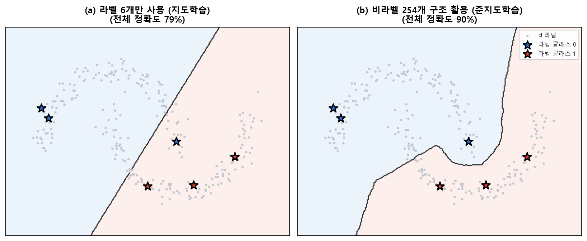{width=95% fig-alt="라벨 소수만 사용한 지도학습과 비라벨을 활용한 준지도학습의 결정경계 비교"}
:::
::: {.figcap}
**그림 2.2** 두 반달 데이터에서 클래스마다 3개씩, 총 6개만 라벨한 상황. **(a)** 라벨된 6개만 쓰면(지도학습) 직선 경계가 반달을 가로질러 잘못 나뉩니다. **(b)** 비라벨 254개가 드러내는 반달 구조를 활용하면(준지도학습·라벨 전파) 경계가 데이터가 드문 골짜기를 따라 휘어, 같은 라벨 수로도 정확도가 크게 오릅니다(79% → 90%).
:::

#### 왜 비라벨 데이터가 도움이 될까

비라벨 데이터에는 정답이 없지만 **입력의 분포**가 담겨 있습니다. 준지도학습은 이 분포에 대한 몇 가지 가정을 통해 라벨 정보를 비라벨 영역으로 확장합니다.

- **군집 가정(cluster assumption)**: 같은 밀집 군집에 속한 점들은 같은 라벨일 가능성이 높다.
- **저밀도 분리(low-density separation)**: 결정경계는 데이터가 드문 저밀도 영역을 지나야 한다. 그림 2.2(b)의 경계가 두 반달 사이 빈 골짜기를 따라간 것이 바로 이 원리입니다.
- **매니폴드 가정(manifold assumption)**: 고차원 데이터는 낮은 차원의 매니폴드 위에 놓이며, 같은 매니폴드 위의 점들은 같은 라벨을 공유한다.

라벨은 소수의 점에만 있지만, 비라벨 데이터가 이런 **구조(군집·저밀도·매니폴드)**를 드러내 주므로, 소수의 라벨을 그 구조를 따라 자연스럽게 퍼뜨릴 수 있습니다.

#### 대표적인 방법

- **자기학습·유사라벨(self-training / pseudo-labeling)**: 소량 라벨로 모델을 먼저 학습한 뒤, 비라벨 데이터에 대한 예측 중 **확신이 높은 것**을 임시 정답(유사라벨)으로 삼아 학습 데이터에 추가하고 다시 학습하는 과정을 반복합니다.
- **일관성 정규화(consistency regularization)**: 같은 입력에 작은 변형(잡음·데이터 증강)을 줘도 예측이 **일관되게** 나오도록 강제합니다. Mean Teacher, FixMatch 등이 이 계열로, 최신 준지도학습의 핵심 아이디어입니다.
- **그래프 기반 라벨 전파(label propagation / spreading)**: 서로 가까운 점을 잇는 이웃 그래프를 만들고, 라벨을 그래프를 따라 이웃으로 퍼뜨립니다. 그림 2.2(b)가 이 방식으로 얻은 결과입니다.

::: {.callbox}
**주의 — 가정이 틀리면 독이 됩니다.** 군집이 라벨과 무관하거나, 유사라벨에 오류가 섞이면 그 오류가 재학습을 거치며 스스로 강화되는 **확증편향(confirmation bias)**이 생겨 오히려 성능이 나빠질 수 있습니다. 비라벨 데이터가 라벨 데이터와 같은 분포에서 왔는지, 확신 임계값이 적절한지 점검해야 합니다.
:::

정리하면, 준지도학습은 라벨이 귀한 실제 문제—의료 진단, 음성 인식, 웹 규모 이미지 분류—에서 **비싼 라벨을 최소로 쓰면서 방대한 비라벨 데이터의 구조를 활용**하는 실용적 전략입니다.

::: {.keybox}
준지도학습의 핵심은 **비라벨 데이터가 드러내는 입력 분포의 구조**(군집·저밀도·매니폴드)를 이용해 소수의 라벨을 확장하는 것입니다. 가정이 맞을 때는 적은 라벨로 큰 성능 향상을, 틀릴 때는 확증편향에 의한 악화를 부를 수 있습니다.
:::

## 신경망의 기본 요소 {#sec-nn-elements}

신경망은 몇 가지 기본 요소의 조합입니다. 각 요소를 차례로 봅니다.

### 선형 변환

한 층의 핵심 연산은 **선형(아핀) 변환**입니다. 입력 $\mathbf{x}\in\mathbb{R}^{d}$에 대해 가중치 $W\in\mathbb{R}^{h\times d}$와 편향 $\mathbf{b}\in\mathbb{R}^{h}$를 써서 다음과 같이 계산합니다.

$$
\mathbf{z} = W\mathbf{x} + \mathbf{b}.
$$

이는 입력 공간을 회전·확대·평행이동하는 변환입니다. 그러나 선형 변환을 여러 번 합성해도 결국 하나의 선형 변환으로 축약됩니다. 즉 $W_2(W_1\mathbf{x})=(W_2 W_1)\mathbf{x}$이므로, 층을 쌓는 의미가 사라집니다.

### 비선형 활성화 함수

층 사이에 **비선형 활성화 함수** $\phi$를 끼우면 이 문제가 해결됩니다.

$$
\mathbf{h} = \phi(W\mathbf{x} + \mathbf{b}).
$$

비선형성이 있어야 신경망은 복잡한 함수를 근사할 수 있습니다. 은닉층이 하나라도 있으면 임의의 연속 함수를 원하는 정밀도로 근사할 수 있다는 **보편 근사 정리**가 그 이론적 근거입니다. 대표적 활성화 함수는 다음과 같습니다.

$$
\text{ReLU}(x)=\max(0,x), \qquad
\sigma(x)=\frac{1}{1+e^{-x}}, \qquad
\tanh(x)=\frac{e^{x}-e^{-x}}{e^{x}+e^{-x}}.
$$

ReLU는 계산이 간단하고 기울기 소실이 덜해 깊은 망에서 널리 쓰입니다. 시그모이드와 탄젠트는 출력 범위가 유한하지만, 입력이 크면 기울기가 0에 가까워지는 포화 문제가 있습니다. 최근에는 부드러운 변형인 GELU도 많이 쓰입니다.

활성화 함수의 계보를 조금 더 자세히 보면 각각의 등장 이유가 드러납니다. ReLU는 음수 입력에서 출력과 기울기가 모두 0이 되어, 학습 중 일부 뉴런이 영영 죽어 버리는 **죽은 ReLU(dying ReLU)** 문제가 있습니다. 이를 완화하려고 음수 구간에 작은 기울기를 남긴 **LeakyReLU** $\phi(x)=\max(\alpha x, x)$와, 음수를 부드럽게 눌러 평균을 0에 가깝게 만드는 **ELU**가 제안되었습니다. **Swish/SiLU** $\phi(x)=x\cdot\sigma(x)$나 GELU처럼 부드럽게 꺾이는 함수는 트랜스포머 계열에서 특히 좋은 성능을 보입니다. 어떤 활성화가 항상 최선인 것은 아니므로, 문제와 구조에 맞춰 선택합니다.

한편 분류 신경망의 마지막 층에서는 활성화가 특별한 역할을 합니다. 이진 분류에는 출력을 확률로 바꾸는 **시그모이드**를, 다중 분류에는 여러 로짓을 확률 분포로 바꾸는 **소프트맥스**를 씁니다. 소프트맥스는 다음과 같이 정의됩니다.

$$
\text{softmax}(\mathbf{z})_c = \frac{e^{z_c}}{\sum_{k=1}^{C} e^{z_k}}.
$$

각 출력이 0과 1 사이이고 전체 합이 1이 되어, 클래스별 확률로 해석할 수 있습니다. 이 확률을 교차 엔트로피 손실과 결합하는 것이 다중 분류의 표준 구성입니다.

```{mermaid}
flowchart LR
    X["입력 x"] --> A["선형 변환<br/>Wx + b"]
    A --> B["비선형 활성화<br/>φ(·)"]
    B --> C["다음 층으로"]
    style B fill:#fde68a
```

### 손실 함수: 회귀와 분류

**손실 함수**는 모델의 예측이 정답과 얼마나 다른지를 하나의 수로 요약합니다. 학습이란 이 손실을 줄이는 방향으로 파라미터를 조정하는 과정입니다.

회귀에서는 평균제곱오차(MSE)나 평균절대오차(MAE)를 씁니다.

$$
\text{MSE}=\frac{1}{N}\sum_{i=1}^{N}(y_i-\hat{y}_i)^2, \qquad
\text{MAE}=\frac{1}{N}\sum_{i=1}^{N}\lvert y_i-\hat{y}_i\rvert .
$$

분류에서는 **교차 엔트로피**를 씁니다. $C$개 클래스의 소프트맥스 확률 $\hat{p}_{i,c}$와 원-핫 라벨 $y_{i,c}$에 대해,

$$
\mathcal{L}_{\text{CE}} = -\frac{1}{N}\sum_{i=1}^{N}\sum_{c=1}^{C} y_{i,c}\log \hat{p}_{i,c}.
$$

이진 분류는 그 특수한 경우로 1장에서 본 BCE가 됩니다.

교차 엔트로피가 분류의 손실로 쓰이는 데는 확률론적 근거가 있습니다. 모델의 출력을 각 클래스의 확률로 보면, 학습은 관측된 정답이 나올 **가능도(likelihood)를 최대로** 만드는 파라미터를 찾는 문제가 됩니다. 이 최대가능도 추정에서 로그를 취해 부호를 바꾸면 정확히 교차 엔트로피가 됩니다. 즉 교차 엔트로피를 최소화하는 것은 정답 데이터의 가능도를 최대화하는 것과 같습니다. 회귀에서 쓰는 평균제곱오차 역시, 잡음이 정규분포를 따른다는 가정 아래 최대가능도 추정으로부터 유도됩니다. 이렇게 서로 달라 보이는 손실 함수들이 사실은 하나의 통계적 원리에서 나온다는 점을 알면, 문제에 맞는 손실을 고르는 안목이 생깁니다.

실무에서는 소프트맥스와 교차 엔트로피를 **하나로 묶어** 계산합니다. 소프트맥스의 지수 연산은 값이 커지면 넘칠 수 있는데, 두 연산을 결합하면 로그와 지수가 상쇄되어 수치적으로 안정됩니다. 파이토치의 `CrossEntropyLoss`가 바로 이 결합된 형태로, 모델은 소프트맥스를 거치지 않은 **로짓**을 그대로 출력하면 됩니다.

### 자동미분과 계산 그래프

손실을 파라미터에 대해 미분한 값, 즉 **기울기**가 파라미터를 어느 방향으로 바꿀지 알려줍니다. 파이토치는 순전파 중 연산들을 **계산 그래프**로 기록해 두었다가, 역방향으로 연쇄법칙을 적용해 기울기를 자동으로 계산합니다.

```{mermaid}
flowchart LR
    x["x"] --> mul["z = Wx+b"]
    W["W"] --> mul
    mul --> act["h = φ(z)"]
    act --> loss["L = 손실"]
    y["정답 y"] --> loss
    loss -.->|"역전파: ∂L/∂W"| W
```

### 최적화 알고리즘과 파라미터 갱신

기울기를 얻으면 **옵티마이저**가 파라미터를 갱신합니다. 가장 기본은 경사의 반대 방향으로 조금씩 이동하는 경사하강법입니다. 학습률 $\eta$에 대해,

$$
\theta \leftarrow \theta - \eta \nabla_\theta \mathcal{L}.
$$

이 갱신 규칙과 그 발전형은 뒤의 @sec-gd 에서 자세히 다룹니다.

## 신경망 학습의 순서 {#sec-training-steps}

한 번의 파라미터 갱신은 네 단계로 이루어지며, 이를 미니배치마다 반복합니다.

```{mermaid}
flowchart LR
    F["① 순방향 전파<br/>예측 계산"] --> E["② 손실·성능 평가"]
    E --> B["③ 역방향 계산<br/>기울기 산출"]
    B --> U["④ 파라미터 갱신<br/>optimizer.step()"]
    U -.->|"다음 배치"| F
```

1. **순방향 전파**: 입력을 층마다 통과시켜 예측을 계산합니다.
2. **성능 평가**: 예측과 정답으로 손실을 계산합니다.
3. **역방향 계산**: 자동미분으로 각 파라미터의 기울기를 구합니다.
4. **파라미터 갱신**: 옵티마이저가 기울기를 이용해 파라미터를 조정합니다.

## 밑바닥부터 구현하는 역전파 (NumPy) {#sec-backprop-numpy}

앞의 네 단계—순전파·손실·역전파·갱신—를 파이토치의 자동미분에 맡기기 전에, **아주 작은 신경망 하나를 NumPy만으로 처음부터 구현**해 봅니다. 입력 2개·은닉 2개·출력 2개로 이루어진 [2·2·2 신경망]{.imp}을 예로, 손으로 연쇄법칙을 적용해 각 가중치의 갱신식을 유도하고 그대로 코드로 옮깁니다. 이 과정을 한 번 거치면, 뒤에서 `loss.backward()` 한 줄이 내부에서 무엇을 대신하는지가 분명해집니다.

### 예제 신경망과 기호

::: {.figbody}
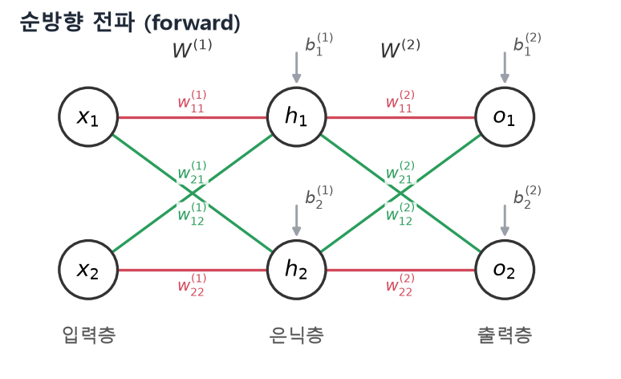{width=78% fig-alt="2-2-2 예제 신경망의 순방향 전파"}
:::
::: {.figcap}
**그림 2.3** 예제로 쓰는 2·2·2 신경망. 입력층 $(x_1,x_2)$, 은닉층 $(h_1,h_2)$, 출력층 $(o_1,o_2)$이 두 가중치 행렬 $W^{(1)},W^{(2)}$와 편향 $b^{(1)},b^{(2)}$로 연결됩니다. 빨강은 직진 가중치$(w_{11},w_{22})$, 초록은 교차 가중치$(w_{12},w_{21})$입니다.
:::

활성화 함수는 **시그모이드** $\varphi$를 씁니다. 도함수가 자기 자신으로 표현되어 역전파에서 특히 편리합니다.

$$
\varphi(x)=\frac{1}{1+e^{-x}},\qquad
\varphi'(x)=\varphi(x)\bigl(1-\varphi(x)\bigr).
$$

::: {.eqnote}
- $x_i$: 입력, $\;z^{(1)}_j$: 은닉층 **로짓**(활성화 전 가중합), $\;h_j=\varphi(z^{(1)}_j)$: 은닉층 출력
- $z^{(2)}_k$: 출력층 로짓, $\;o_k=\varphi(z^{(2)}_k)$: 최종 출력, $\;d_k$: 목표값
- $W^{(1)},W^{(2)},b^{(1)},b^{(2)}$: 층별 가중치·편향. 위첨자 $(1),(2)$는 층 번호, 아래첨자 $kj$는 "$k$번 뉴런이 이전 층 $j$번에서 받는" 가중치를 뜻합니다.
:::

### 순방향 전파

입력에서 출력까지 층을 차례로 통과시킵니다. 은닉층은 먼저 가중합인 **로짓** $z^{(1)}$을 만들고, 여기에 활성화 함수를 적용해 출력 $h$를 냅니다.

$$
\begin{pmatrix} z^{(1)}_1 \\ z^{(1)}_2 \end{pmatrix}
=\begin{pmatrix} w^{(1)}_{11} & w^{(1)}_{12} \\ w^{(1)}_{21} & w^{(1)}_{22} \end{pmatrix}
\begin{pmatrix} x_1 \\ x_2 \end{pmatrix}
+\begin{pmatrix} b^{(1)}_1 \\ b^{(1)}_2 \end{pmatrix},
\qquad
\begin{pmatrix} h_1 \\ h_2 \end{pmatrix}
=\begin{pmatrix} \varphi(z^{(1)}_1) \\ \varphi(z^{(1)}_2) \end{pmatrix}.
$$

출력층도 같은 방식으로 로짓 $z^{(2)}$를 거쳐 최종 출력 $o$를 냅니다.

$$
\begin{pmatrix} z^{(2)}_1 \\ z^{(2)}_2 \end{pmatrix}
=\begin{pmatrix} w^{(2)}_{11} & w^{(2)}_{12} \\ w^{(2)}_{21} & w^{(2)}_{22} \end{pmatrix}
\begin{pmatrix} h_1 \\ h_2 \end{pmatrix}
+\begin{pmatrix} b^{(2)}_1 \\ b^{(2)}_2 \end{pmatrix},
\qquad
\begin{pmatrix} o_1 \\ o_2 \end{pmatrix}
=\begin{pmatrix} \varphi(z^{(2)}_1) \\ \varphi(z^{(2)}_2) \end{pmatrix}.
$$

**로짓(logit)**은 활성화 함수를 거치기 직전의 가중합을 가리키는 말로, 뒤의 역전파에서 미분의 중간 다리 역할을 합니다.

전체를 한 줄로 쓰면 출력은 두 층의 합성입니다.

$$
\mathbf{o}=\varphi\!\bigl(W^{(2)}\,\varphi(W^{(1)}\mathbf{x}+b^{(1)})+b^{(2)}\bigr).
$$

### 손실

목표 $d_k$와 출력 $o_k$의 제곱오차를 손실로 씁니다. 미분할 때 계수 2가 상쇄되도록 $\tfrac12$을 곱해 둡니다.

$$
c=c_1+c_2=\tfrac12(d_1-o_1)^2+\tfrac12(d_2-o_2)^2.
$$

### 손실을 줄이려면 무엇이 필요한가

학습의 목표는 손실 $c$를 줄이는 것이고, 그러려면 각 가중치를 손실이 줄어드는 방향으로 조금씩 옮겨야 합니다. 이것이 **경사하강법**입니다(학습률 $\eta$).

$$
w \leftarrow w-\eta\,\frac{\partial c}{\partial w}.
$$

그러므로 할 일은 딱 하나, **각 가중치에 대한 손실의 기울기 $\partial c/\partial w$를 구하는 것**입니다. 이를 연쇄법칙으로 차근차근 구해 보면, 뒤에서 델타 규칙이 자연스럽게 따라 나옵니다.

### 출력층 기울기: 연쇄법칙

::: {.figbody}
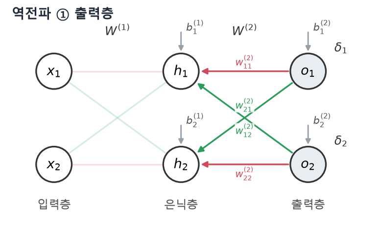{width=78% fig-alt="출력층에서 연쇄법칙으로 기울기를 구하고 델타로 묶는다"}
:::
::: {.figcap}
**그림 2.4** 출력층 가중치의 기울기. 연쇄법칙으로 구한 기울기에서 반복되는 항을 **델타** $\delta_k$로 묶으면, 갱신이 "델타 × 은닉 출력 $h_j$"라는 단순한 형태가 됩니다.
:::

출력층 가중치 $w^{(2)}_{11}$ 하나가 손실에 영향을 주는 경로를 따라가 봅니다. 이 가중치는 먼저 출력 로짓 $z^{(2)}_1=\sum_j w^{(2)}_{1j}h_j+b^{(2)}_1$에 들어가고, 그 로짓이 출력 $o_1=\varphi(z^{(2)}_1)$을, 출력이 손실 $c$를 만듭니다. 연쇄법칙은 이 경로의 미분을 곱으로 잇습니다.

$$
\frac{\partial c}{\partial w^{(2)}_{11}}
=\underbrace{\frac{\partial c}{\partial o_1}}_{①}\cdot
 \underbrace{\frac{\partial o_1}{\partial z^{(2)}_1}}_{②}\cdot
 \underbrace{\frac{\partial z^{(2)}_1}{\partial w^{(2)}_{11}}}_{③}.
$$

세 항을 각각 구합니다. ①은 손실 $c=\tfrac12\sum_k(d_k-o_k)^2$을 $o_1$로 미분한 것, ②는 시그모이드의 도함수 $\varphi'=\varphi(1-\varphi)$(여기서 $o_1=\varphi(z^{(2)}_1)$), ③은 로짓이 가중합이므로 $w^{(2)}_{11}$ 앞의 계수인 $h_1$입니다.

$$
①\;\frac{\partial c}{\partial o_1}=-(d_1-o_1),\qquad
②\;\frac{\partial o_1}{\partial z^{(2)}_1}=o_1(1-o_1),\qquad
③\;\frac{\partial z^{(2)}_1}{\partial w^{(2)}_{11}}=h_1.
$$

셋을 곱하면 기울기가 나옵니다.

$$
\frac{\partial c}{\partial w^{(2)}_{11}}=-(d_1-o_1)\,o_1(1-o_1)\,h_1.
$$

여기서 마지막 $h_1$(가중치로 들어온 입력)을 뺀 나머지 $-(d_1-o_1)o_1(1-o_1)$은 출력 뉴런 1에만 딸린 값입니다. 이 반복되는 항을 [델타 $\delta_1$]{.imp}로 묶습니다. 일반적으로 델타는 **로짓에 대한 손실 기울기의 음수**로 정의합니다.

$$
\delta_k\equiv -\frac{\partial c}{\partial z^{(2)}_k}=(d_k-o_k)\,o_k(1-o_k).
$$

그러면 기울기와 갱신식이 아주 단순해집니다 — **델타 × 그 가중치로 들어온 입력**.

$$
\frac{\partial c}{\partial w^{(2)}_{kj}}=-\delta_k\,h_j
\;\;\Longrightarrow\;\;
w^{(2)}_{kj}\leftarrow w^{(2)}_{kj}+\eta\,\delta_k h_j,\qquad
b^{(2)}_k\leftarrow b^{(2)}_k+\eta\,\delta_k.
$$

편향은 입력이 항상 $1$인 연결이라 델타만 곱해집니다. 이렇게 델타로 정리된 갱신 규칙을 [일반화 델타 규칙(generalized delta rule)]{.imp}이라 부릅니다.

### 은닉층 기울기: 오차를 거꾸로 전달

::: {.figbody}
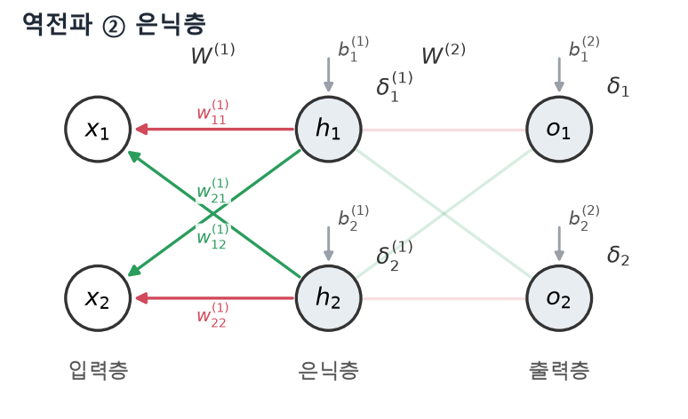{width=78% fig-alt="출력층 델타를 가중치를 따라 거꾸로 보내 은닉층 델타를 만든다"}
:::
::: {.figcap}
**그림 2.5** 은닉층 가중치의 기울기. 은닉 뉴런은 여러 출력에 영향을 주므로, 출력층 델타 $\delta_k$를 가중치 $w^{(2)}_{kj}$를 따라 거꾸로 보내 합한 뒤 같은 방식으로 은닉층 델타 $\delta^{(1)}_j$를 만듭니다.
:::

은닉층 가중치 $w^{(1)}_{ji}$도 같은 방법으로 구합니다. 다만 은닉 뉴런의 출력 $h_j$는 **모든 출력 뉴런**에 영향을 주므로 경로가 여러 갈래로 갈라지고, 연쇄법칙에서 이는 출력들에 대한 **합**으로 나타납니다.

$$
\frac{\partial c}{\partial h_j}
=\sum_k \frac{\partial c}{\partial z^{(2)}_k}\,\frac{\partial z^{(2)}_k}{\partial h_j}
=\sum_k(-\delta_k)\,w^{(2)}_{kj}
=-\sum_k w^{(2)}_{kj}\,\delta_k.
$$

즉 **출력층에서 구한 델타 $\delta_k$를, 둘을 잇는 가중치 $w^{(2)}_{kj}$를 따라 거꾸로 보내** 은닉 뉴런의 오차를 만드는 것입니다. 이것이 "역전파(backpropagation)"라는 이름의 핵심입니다. 나머지는 출력층과 똑같습니다. 은닉 로짓 $z^{(1)}_j$에 대한 델타를 정의하고($h_j=\varphi(z^{(1)}_j)$이므로 $\varphi'=h_j(1-h_j)$),

$$
\delta^{(1)}_j\equiv -\frac{\partial c}{\partial z^{(1)}_j}
= h_j(1-h_j)\sum_k w^{(2)}_{kj}\,\delta_k,
$$

델타 × 입력으로 갱신합니다.

$$
w^{(1)}_{ji}\leftarrow w^{(1)}_{ji}+\eta\,\delta^{(1)}_j\,x_i,\qquad
b^{(1)}_j\leftarrow b^{(1)}_j+\eta\,\delta^{(1)}_j.
$$

::: {.keybox}
역전파는 **연쇄법칙을 출력에서 입력 방향으로 적용**해 모든 가중치의 기울기를 한 번에 구하는 절차입니다. 핵심은 각 뉴런의 **델타**(로짓에 대한 손실 기울기)를 뒤로 전달하는 것뿐이고, 갱신은 어디서나 "델타 × 입력" 꼴입니다. 옵티마이저는 이 기울기로 파라미터를 갱신하며, 자동미분은 이 과정을 자동화합니다.
:::

### 여러 층으로 일반화

지금까지의 유도는 층 수와 무관하게 그대로 확장됩니다. $l$번째 층의 로짓과 활성값을 $z^{(l)}_j=\sum_i w^{(l)}_{ji}\,a^{(l-1)}_i+b^{(l)}_j$, $a^{(l)}_j=\varphi(z^{(l)}_j)$로 쓰면(입력은 $a^{(0)}_i=x_i$, 마지막 층은 $L$), 앞 절의 로짓 $z^{(1)},z^{(2)}$가 $z^{(l)}$에, 활성값 $h,o$가 $a^{(l)}$에 해당합니다. 델타는 다음 **재귀식**을 따릅니다.

$$
\delta^{(L)}_j=\bigl(d_j-a^{(L)}_j\bigr)\,\varphi'\!\bigl(z^{(L)}_j\bigr),
\qquad
\delta^{(l)}_j=\varphi'\!\bigl(z^{(l)}_j\bigr)\sum_k w^{(l+1)}_{kj}\,\delta^{(l+1)}_k.
$$

출력층 델타에서 시작해 이 식을 한 층씩 거꾸로 적용하면 모든 층의 델타가 구해지고, 가중치·편향 갱신은 어느 층에서나 같은 형태입니다.

$$
\Delta w^{(l)}_{ji}=\eta\,\delta^{(l)}_j\,a^{(l-1)}_i,
\qquad
\Delta b^{(l)}_j=\eta\,\delta^{(l)}_j.
$$

**왜 "일반화된" 델타 규칙일까요?** 선형 뉴런($y=\sum_i w_i x_i+b$)에 제곱오차를 쓰면 활성화 도함수가 $1$이라 $\Delta w_i=\eta(t-y)x_i$라는 기본 델타 규칙이 됩니다. 여기에 비선형 활성화를 도입하면 도함수 $\varphi'(z)$가 곱해지고($\Delta w_i=\eta(t-y)\varphi'(z)x_i$), 은닉층에서는 직접적인 정답 차이 대신 다음 층에서 전달된 델타의 가중합을 씁니다. 이렇게 기본 델타 규칙을 **미분 가능한 비선형 뉴런과 다층 신경망으로 확장**했기에 일반화된 델타 규칙이라 부릅니다.

::: {.eqnote}
- 출력층 델타는 **제곱오차 + 시그모이드** 조합에서 유도한 형태입니다. 손실함수나 출력 활성화가 바뀌면 출력층 델타는 다시 유도해야 합니다(은닉층 재귀식과 갱신식의 꼴은 그대로).
- 델타의 부호는 교재마다 다를 수 있습니다. 이 책은 $\delta\equiv-\partial c/\partial z$, 갱신 $\Delta w=+\eta\,\delta\,a$로 일관되게 씁니다.
:::

### NumPy로 구현하기

이제 유도한 식을 그대로 코드로 옮깁니다. 문제는 단층 퍼셉트론이 풀지 못하는 대표적 비선형 문제인 **XOR**로, 출력을 원-핫 두 개$([\text{XOR 아님},\ \text{XOR}])$로 두어 2·2·2 망으로 학습합니다.

```python
import numpy as np

def sigmoid(z):
    return 1.0 / (1.0 + np.exp(-z))

# XOR: 입력 2 → 출력 2(원-핫). d는 목표값
X = np.array([[0, 0], [0, 1], [1, 0], [1, 1]], float)
D = np.array([[1, 0], [0, 1], [0, 1], [1, 0]], float)

rng = np.random.default_rng(0)
W1 = rng.normal(0, 1, (2, 2)); b1 = np.zeros(2)   # W1[j,i]: h_j ← x_i
W2 = rng.normal(0, 1, (2, 2)); b2 = np.zeros(2)   # W2[k,j]: o_k ← h_j
eta = 0.5

for epoch in range(3000):
    for x, d in zip(X, D):
        # ── 순방향 전파 ──
        z1 = W1 @ x + b1;  h = sigmoid(z1)        # 은닉층: 로짓 z1 → 출력 h
        z2 = W2 @ h + b2;  o = sigmoid(z2)        # 출력층: 로짓 z2 → 출력 o
        # ── 역방향 전파(일반화 델타 규칙) ──
        delta2 = (d - o) * o * (1 - o)            # 출력층 δ_k = (d-o)·o(1-o)
        delta1 = (W2.T @ delta2) * h * (1 - h)    # 은닉층 δ^(1)_j (오차 역전파)
        # ── 가중치·편향 갱신 ──
        W2 += eta * np.outer(delta2, h);  b2 += eta * delta2
        W1 += eta * np.outer(delta1, x);  b1 += eta * delta1

# 학습 결과 확인
for x, d in zip(X, D):
    o = sigmoid(W2 @ sigmoid(W1 @ x + b1) + b2)
    print(x.astype(int), o.round(3), "→ 예측", int(np.argmax(o)))
```

코드의 `delta2`, `delta1` 두 줄이 각각 그림 2.3과 그림 2.4의 델타 계산이고, `np.outer(delta, 입력)`이 "델타 × 입력"이라는 갱신식입니다. 실행하면 손실이 0에 가깝게 줄고(그림 2.5), 네 입력을 모두 정확히 분류합니다.

```text
[0 0] [0.963 0.037] → 예측 0
[0 1] [0.043 0.956] → 예측 1
[1 0] [0.035 0.965] → 예측 1
[1 1] [0.966 0.034] → 예측 0
```

::: {.figbody}
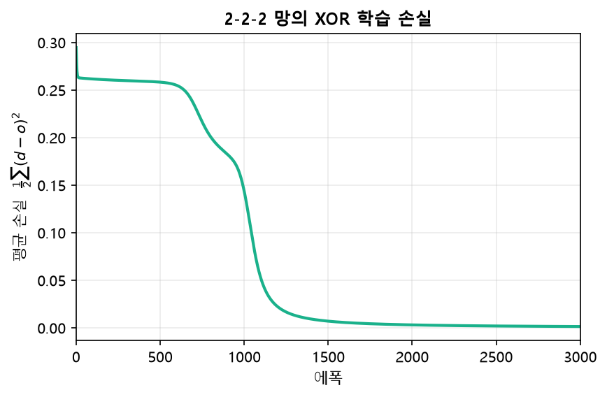{width=70% fig-alt="2-2-2 망의 XOR 학습 손실 곡선"}
:::
::: {.figcap}
**그림 2.6** 2·2·2 신경망을 NumPy 역전파로 학습한 XOR 손실 곡선. 순전파·역전파·갱신을 반복하자 손실이 꾸준히 감소하며, 은닉층 없이는 불가능한 XOR을 정확히 학습했습니다.
:::

### 파이토치라면

방금 손으로 유도하고 구현한 델타 계산·연쇄법칙을, 파이토치에서는 `loss.backward()` **한 줄**이 대신합니다. 순전파에서 기록해 둔 계산 그래프를 따라 자동미분이 정확히 같은 기울기를 계산하기 때문입니다. 밑바닥 구현은 그 내부를 이해하기 위한 것이고, 실제 모델링에서는 자동미분에 맡겨 더 크고 깊은 신경망에 집중합니다.

## 모델 성능 평가 {#sec-metrics}

손실은 학습을 이끄는 값이지만, 사람이 모델의 좋고 나쁨을 판단할 때는 문제에 맞는 **평가 지표**를 함께 봅니다. 분류에서 쓰는 거의 모든 지표는 [혼동행렬(confusion matrix)]{.imp}에서 출발합니다.

### 혼동행렬

혼동행렬은 모델의 **예측**과 **실제 정답**을 교차시켜 센 표입니다. 이진 분류에서는 2×2 표가 되며, 네 칸은 각각 다음을 뜻합니다.

::: {.figbody}
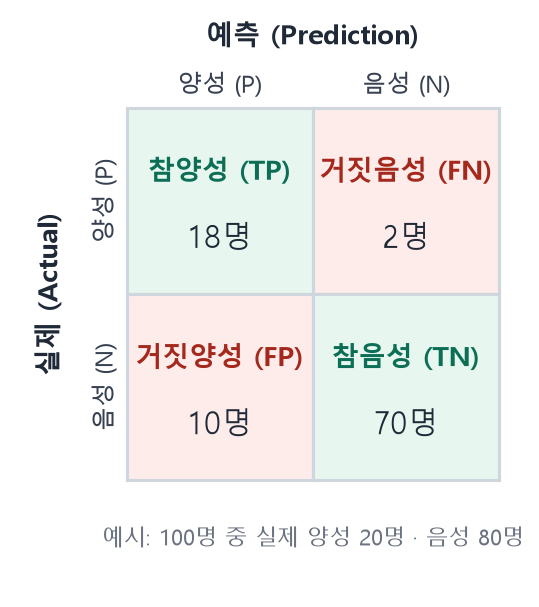{width=62% fig-alt="이진 분류 혼동행렬(TP·FN·FP·TN)"}
:::
::: {.figcap}
**그림 2.7** 이진 분류의 혼동행렬. 행은 실제 클래스, 열은 예측 클래스입니다. 대각선(참양성·참음성)이 맞힌 경우, 비대각선(거짓양성·거짓음성)이 틀린 경우입니다. 숫자는 100명 중 실제 양성 20·음성 80일 때의 예시입니다.
:::

- **참양성(TP, True Positive)**: 실제 양성을 양성으로 맞힘
- **거짓음성(FN, False Negative)**: 실제 양성을 음성으로 **놓침** — 제2종 오류
- **거짓양성(FP, False Positive)**: 실제 음성을 양성으로 **헛경보** — 제1종 오류
- **참음성(TN, True Negative)**: 실제 음성을 음성으로 맞힘

두 종류의 오류는 성격이 다릅니다. **거짓양성**은 멀쩡한 것을 문제라고 잘못 알리는 헛경보이고, **거짓음성**은 진짜 문제를 정상이라며 지나치는 놓침입니다. 어느 쪽이 더 치명적인지는 문제에 따라 다르며, 이 차이가 지표 선택을 좌우합니다.

### 혼동행렬에서 나오는 지표

네 값의 조합으로 여러 지표가 정의됩니다.

$$
\text{정확도}=\frac{TP+TN}{TP+TN+FP+FN}, \qquad
\text{정밀도}=\frac{TP}{TP+FP},
$$

$$
\text{재현율}=\frac{TP}{TP+FN}, \qquad
F_1=2\cdot\frac{\text{정밀도}\cdot\text{재현율}}{\text{정밀도}+\text{재현율}}.
$$

- **정확도(accuracy)**는 전체 중 맞힌 비율이지만, 클래스 불균형이 심하면 오해를 줍니다.
- **정밀도(precision)**는 양성이라고 **예측한 것 중** 실제 양성 비율입니다(헛경보 억제).
- **재현율(recall)**은 **실제 양성 중** 찾아낸 비율입니다(놓침 억제).
- **F1**은 정밀도와 재현율의 조화평균으로, 둘의 균형을 봅니다.

그림 2.7의 예시$(TP=18,\ FN=2,\ FP=10,\ TN=70)$로 직접 계산해 보면,

$$
\text{정확도}=\frac{88}{100}=0.88,\quad
\text{정밀도}=\frac{18}{28}\approx0.64,\quad
\text{재현율}=\frac{18}{20}=0.90,\quad
F_1\approx0.75.
$$

정확도는 88%로 높아 보이지만 정밀도는 0.64에 그칩니다. 양성이라고 경보한 28명 중 10명이 헛경보였기 때문입니다. 이처럼 **정확도 하나만 보면 놓치는 것이 많고**, 특히 양성이 드문 불균형 데이터에서는 "전부 음성"이라고만 찍어도 정확도가 높게 나오므로 정밀도·재현율을 반드시 함께 봐야 합니다.

### 정밀도와 재현율의 트레이드오프

모델이 양성으로 판정하는 **임계값(threshold)**을 낮추면 더 많은 것을 양성이라 부르므로 재현율은 오르지만 헛경보가 늘어 정밀도는 떨어집니다. 반대로 임계값을 높이면 정밀도는 오르고 재현율은 떨어집니다. 둘은 대개 이렇게 맞바꿈 관계에 있어, **문제의 성격에 따라 어느 쪽을 우선할지** 정해야 합니다.

- **재현율이 중요한 경우**: 암 진단·사기 탐지처럼 **놓치면 큰일 나는** 문제. 헛경보를 감수하더라도 실제 양성을 최대한 찾아야 합니다.
- **정밀도가 중요한 경우**: 스팸 필터·추천처럼 **헛경보의 대가가 큰** 문제. 정상 메일을 스팸으로 보내면 곤란하므로 확실할 때만 양성이라 해야 합니다.

임계값을 바꿔 가며 두 지표의 관계를 그린 **정밀도-재현율 곡선**이나 **ROC 곡선**은 한 모델의 전 구간 성능을 한눈에 보여 주어, 임계값 선택과 모델 비교에 널리 쓰입니다.

회귀에서는 앞서 본 MSE·MAE와 그 제곱근인 RMSE를 씁니다. MAE는 이상치에 덜 민감하고, MSE·RMSE는 큰 오차에 더 큰 벌점을 줍니다.

::: {.keybox}
분류 성능은 **혼동행렬**에서 출발합니다. 정확도 하나로는 부족하며, 놓침을 줄이려면 **재현율**, 헛경보를 줄이려면 **정밀도**를 봐야 합니다. 두 지표는 임계값에 따라 맞바꿈 관계이므로, 문제에서 어떤 오류가 더 치명적인지에 맞춰 우선순위를 정합니다.
:::

## 데이터 분할과 검증 전략 {#sec-validation}

모델이 **학습에 쓰지 않은 데이터**에서도 잘 작동하는지를 정직하게 측정하려면 데이터를 나눠야 합니다.

### 홀드아웃

가장 간단한 방법은 데이터를 훈련·검증·테스트로 한 번 나누는 **홀드아웃(hold-out)**입니다. 훈련으로 학습하고, 검증으로 하이퍼파라미터를 고르며, 테스트는 마지막에 한 번만 사용해 일반화 성능을 추정합니다.

```{mermaid}
flowchart LR
    D["전체 데이터"] --> TR["훈련 70%"]
    D --> VA["검증 15%"]
    D --> TE["테스트 15%"]
    TR --> M["모델 학습"]
    VA --> H["하이퍼파라미터 선택"]
    TE --> G["최종 일반화 성능"]
```

### K-겹 교차검증

데이터가 적으면 한 번의 분할이 우연에 좌우됩니다. **K-겹 교차검증(K-fold)**은 데이터를 K개로 나누고, 매번 하나를 검증으로, 나머지를 훈련으로 써서 K번 학습·평가한 뒤 결과를 평균합니다. 모든 샘플이 정확히 한 번 검증에 쓰이므로 추정이 안정적입니다.

```{mermaid}
flowchart TD
    subgraph F["5-겹 교차검증"]
        R1["폴드1: 검증 | 나머지 훈련"]
        R2["폴드2: 검증 | 나머지 훈련"]
        R3["폴드3: 검증 | 나머지 훈련"]
        R4["폴드4: 검증 | 나머지 훈련"]
        R5["폴드5: 검증 | 나머지 훈련"]
    end
    F --> AVG["5개 성능 평균 → 최종 추정"]
```

## 경사하강법 {#sec-gd}

경사하강법은 손실을 줄이는 방향으로 파라미터를 반복 갱신하는 최적화의 근간입니다. 한 번에 얼마나 많은 데이터를 써서 기울기를 추정하느냐에 따라 세 가지로 나뉩니다.

### 전체(배치) 경사하강법

전체 데이터 $N$개로 기울기를 계산합니다. 정확하지만 데이터가 크면 한 걸음이 매우 느립니다.

$$
\theta \leftarrow \theta - \eta \cdot \frac{1}{N}\sum_{i=1}^{N}\nabla_\theta \mathcal{L}_i(\theta).
$$

### 확률적 경사하강법(SGD)

샘플 하나로 기울기를 추정해 즉시 갱신합니다. 갱신이 빠르고 지역 최소를 탈출하는 데 도움이 되지만, 기울기 추정에 잡음이 많습니다.

$$
\theta \leftarrow \theta - \eta \cdot \nabla_\theta \mathcal{L}_i(\theta).
$$

### 미니배치 경사하강법

$B$개 샘플로 이루어진 미니배치로 기울기를 추정합니다. 전체와 SGD의 장점을 절충하며, GPU 병렬 연산과도 잘 맞아 딥러닝의 표준입니다.

$$
\theta \leftarrow \theta - \eta \cdot \frac{1}{B}\sum_{i\in \mathcal{B}}\nabla_\theta \mathcal{L}_i(\theta).
$$

```{mermaid}
flowchart LR
    A["전체 배치<br/>정확·느림"] --- B["미니배치<br/>절충·표준"] --- C["SGD(1개)<br/>빠름·잡음 큼"]
    style B fill:#bbf7d0
```

::: {.figbody}
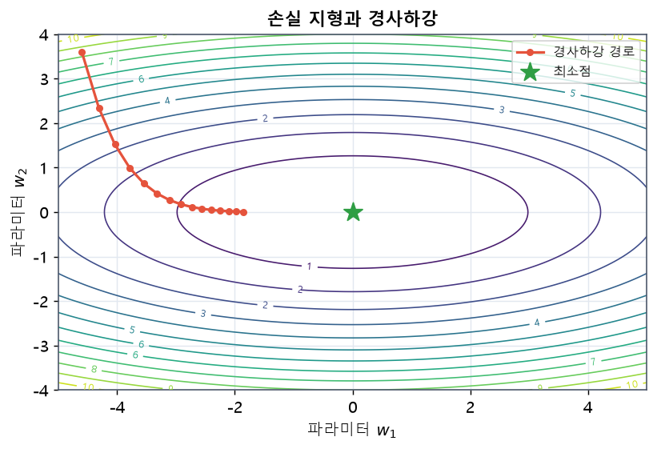{width=68% fig-alt="손실 지형 위 경사하강 경로"}
:::
::: {.figcap}
**그림 2.8** 손실 지형과 경사하강. 등고선은 손실 값이 같은 지점을 잇고, 붉은 경로는 옵티마이저가 매 스텝 경사의 반대 방향으로 조금씩 이동해 최소점(별)으로 내려가는 과정입니다. 골짜기가 길게 늘어진 방향에서는 수렴이 느려집니다.
:::

## 모멘텀과 적응적 학습률 {#sec-optimizers}

기본 경사하강법은 골짜기에서 진동하거나 평평한 구간에서 느려집니다. 이를 개선한 옵티마이저들이 발전해 왔습니다.

### 모멘텀

**모멘텀(momentum)**은 과거 기울기를 지수적으로 누적한 속도 $\mathbf{v}$를 이용해 관성을 부여합니다.

$$
\mathbf{v} \leftarrow \gamma \mathbf{v} + \eta \nabla_\theta \mathcal{L}, \qquad
\theta \leftarrow \theta - \mathbf{v}.
$$

이는 같은 방향의 기울기를 가속하고 진동을 완화합니다.

### 적응적 학습률: Adagrad, RMSProp, Adam

**Adagrad**는 파라미터마다 과거 기울기 제곱합으로 학습률을 조절합니다. 자주 갱신되는 파라미터의 학습률은 줄고, 드물게 갱신되는 파라미터는 크게 갱신됩니다. 다만 제곱합이 계속 커져 학습률이 지나치게 줄어드는 문제가 있어, 이를 지수 이동평균으로 완화한 것이 **RMSProp**과 **Adadelta**입니다.

**Adam**은 모멘텀(1차 모멘트)과 RMSProp(2차 모멘트)을 결합한 옵티마이저로, 오늘날 가장 널리 쓰입니다. 기울기 $g_t$에 대해,

$$
m_t = \beta_1 m_{t-1} + (1-\beta_1) g_t, \qquad
v_t = \beta_2 v_{t-1} + (1-\beta_2) g_t^2,
$$

$$
\hat{m}_t = \frac{m_t}{1-\beta_1^t}, \quad
\hat{v}_t = \frac{v_t}{1-\beta_2^t}, \qquad
\theta \leftarrow \theta - \eta \frac{\hat{m}_t}{\sqrt{\hat{v}_t}+\epsilon}.
$$

**AdamW**는 Adam의 가중치 감쇠 방식을 개선합니다. 기존 Adam에서 L2 정규화를 쓰면 가중치 감쇠가 적응적 학습률 스케일링과 뒤섞여 효과가 약해지는 문제가 있습니다. AdamW는 감쇠를 갱신식에서 **분리(decoupling)**해 다음과 같이 별도로 적용합니다.

$$
\theta_{t+1} = \theta_t - \eta\left(\frac{\hat{m}_t}{\sqrt{\hat{v}_t}+\epsilon} + \lambda\,\theta_t\right).
$$

마지막의 $\lambda\theta_t$ 항이 가중치를 직접 줄이는 감쇠로, 적응적 스케일링과 섞이지 않습니다. 이렇게 분리하면 일반화가 개선되어, AdamW는 오늘날 트랜스포머 계열(BERT·GPT·ViT)의 사실상 표준 옵티마이저가 되었습니다.

Adam에는 여러 개선형이 있습니다. 특정 상황에서 수렴 보장을 강화한 **AMSGrad**, 네스테로프 모멘텀을 결합한 **NAdam**, 학습 초기 2차 모멘트의 분산을 안정화해 워밍업 필요를 줄인 **RAdam**, 기울기 예측 오차로 스텝 크기를 조절하는 **AdaBelief** 등이 대표적입니다. 다만 적응적 옵티마이저가 항상 SGD보다 일반화가 좋은 것은 아니라는 보고도 있어, 문제에 따라 비교가 필요합니다.

### 학습률 스케줄링

옵티마이저만큼 중요한 것이 **학습률을 학습 중에 어떻게 바꾸느냐**입니다. 학습률은 한 걸음의 크기를 정하는데, 초반에는 크게 움직여 빠르게 좋은 영역으로 이동하고 후반에는 작게 움직여 최소점에 안착하는 것이 이상적입니다. 이를 자동화하는 것이 학습률 스케줄러입니다. 대표적 방식은 다음과 같습니다.

- **단계적 감소(step decay)**: 정해진 에폭마다 학습률을 일정 비율로 줄입니다.
- **코사인 감소(cosine annealing)**: 학습률을 코사인 곡선을 따라 부드럽게 0에 가깝게 줄입니다. 부드러운 감소가 후반 수렴을 안정화합니다.
- **워밍업(warmup)**: 학습 맨 처음 수백~수천 스텝 동안 학습률을 0에서 목표값까지 서서히 올립니다. 초기 파라미터가 불안정할 때 큰 학습률로 발산하는 것을 막아 주며, 트랜스포머 학습에서는 사실상 필수로 쓰입니다.

이들을 조합해 "워밍업 후 코사인 감소" 같은 스케줄을 흔히 사용합니다. 학습률은 단일 하이퍼파라미터 중 성능에 가장 큰 영향을 주는 값으로 꼽히므로, 적절한 초기값과 스케줄을 찾는 것이 실전 학습의 핵심 기술입니다.

::: {.figbody}
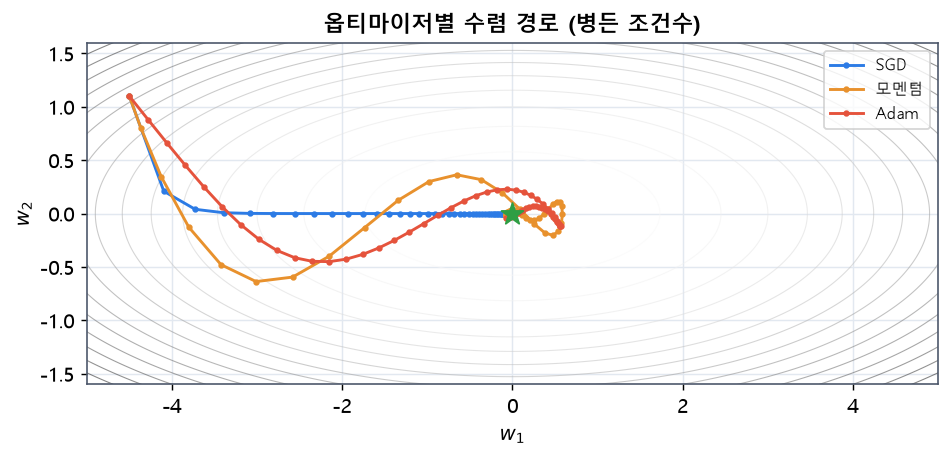{width=80% fig-alt="SGD·모멘텀·Adam 수렴 경로 비교"}
:::
::: {.figcap}
**그림 2.9** 옵티마이저별 수렴 경로 비교(골짜기가 한쪽으로 길게 늘어진 손실 지형). 기본 SGD(파란색)는 골짜기 바닥의 완만한 방향에서 느리게 기어갑니다. 모멘텀(주황색)은 관성으로 가속해 더 빨리 도달하고, Adam(빨간색)은 파라미터별 적응적 학습률로 매끄럽게 최소점에 수렴합니다.
:::

### 현대 옵티마이저의 지형

옵티마이저는 Adam 이후로도 활발히 진화해 왔습니다. 그 발전 흐름을 큰 줄기로 정리하면 다음과 같습니다. 아래 세대 구분은 학계의 공식 분류가 아니라 흐름을 이해하기 위한 교육적 정리입니다.

::: {.figbody}
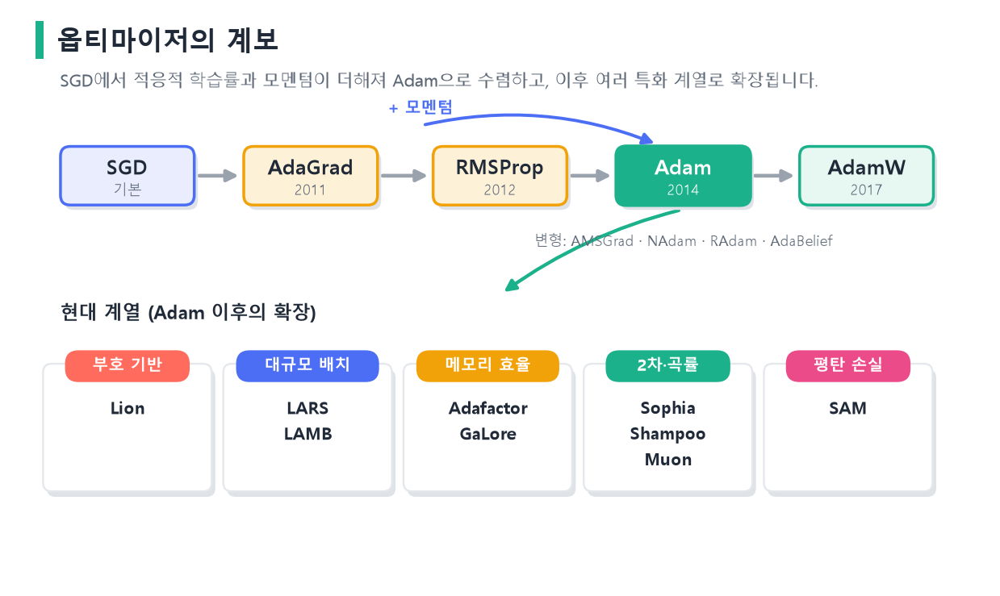{width=96% fig-alt="옵티마이저 계보"}
:::
::: {.figcap}
**그림 2.10** 옵티마이저의 계보. 기본 **SGD**에 적응적 학습률(AdaGrad→RMSProp)과 모멘텀이 더해져 **Adam**(2014)으로 수렴하고, 가중치 감쇠를 분리한 **AdamW**(2017)가 뒤따릅니다. Adam 이후에는 부호 기반(Lion), 대규모 배치(LARS·LAMB), 메모리 효율(Adafactor·GaLore), 2차·곡률(Sophia·Shampoo·Muon), 평탄 손실(SAM) 등 목적에 특화된 계열로 확장되었습니다. 세대 구분은 학계의 공식 분류가 아니라 흐름 이해를 위한 교육적 정리입니다.
:::

주요 갈래를 살펴보면 다음과 같습니다.

- **부호 기반(sign-based)**: 갱신량의 크기 대신 **부호만** 사용합니다. 2차 모멘트 저장을 없애 메모리를 아끼며, 기호적 탐색으로 발견된 **Lion**이 대표적입니다.
- **대규모 배치·레이어별**: 레이어별 가중치·기울기 노름의 비율(trust ratio)로 학습률을 조절해 매우 큰 배치 학습을 가능케 합니다. **LARS**와 그 Adam 버전인 **LAMB**가 대표적입니다.
- **메모리 효율형**: **Adafactor**는 2차 모멘트를 행·열 통계로 분해해 메모리를 크게 줄이고, **GaLore**는 기울기를 저차원 부분공간으로 투영해 대형 언어모델 학습의 메모리를 절감합니다.
- **곡률·2차 정보**: 손실 곡면의 곡률(헤시안)을 근사해 반영하는 **Sophia**, 행렬 구조를 이용한 프리컨디셔닝의 **Shampoo**, 행렬 갱신을 직교화하는 **Muon** 등이 있습니다.
- **평탄성 인식(sharpness-aware)**: **SAM**은 현재 지점의 손실뿐 아니라 주변까지 손실이 낮은 **평평한 최소**를 찾아 일반화를 높입니다.
- **자동 학습률·스케줄 없는**: 학습률을 자동 추정하는 Prodigy·D-Adaptation, 별도 스케줄러 없이 학습하도록 설계된 Schedule-Free 계열이 있습니다.
- **래퍼(wrapper)**: Lookahead처럼 기존 옵티마이저 위에 얹어 안정성을 높이는 방식도 있습니다.

이 가운데 SAM의 동기가 되는 "평평한 최소"의 개념은 그림으로 이해하면 명확합니다.

::: {.figbody}
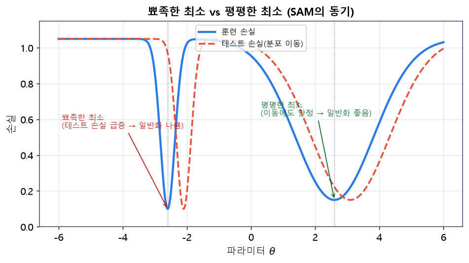{width=76% fig-alt="평평한 최소와 뾰족한 최소"}
:::
::: {.figcap}
**그림 2.11** 평평한 최소와 뾰족한 최소. 훈련 손실(파란색)의 두 최소는 손실 값이 비슷하지만, 테스트 데이터의 분포가 조금만 이동하면(빨간 점선) 뾰족한 최소(왼쪽)에서는 손실이 급증하는 반면 평평한 최소(오른쪽)에서는 손실이 거의 그대로입니다. 즉 평평한 최소가 일반화에 유리하며, SAM은 이런 평평한 지점을 찾도록 학습합니다.
:::

작동 원리에 따라 옵티마이저를 분류하면 다음 표와 같습니다. 실제 논문·교재에서는 "세대"보다 이런 **원리별 분류**를 더 자주 사용합니다.

| 분류 | 대표 알고리즘 | 핵심 원리 |
|------|---------------|-----------|
| 기울기 누적 | AdaGrad | 과거 기울기 제곱 누적 |
| EMA 적응 스케일 | RMSProp, AdaDelta | 기울기 통계의 지수이동평균 |
| 적응적 모멘트 | Adam, AdamW, RAdam | 1·2차 모멘트 결합 |
| 부호 기반 | SignSGD, Lion | 갱신의 부호만 사용 |
| 레이어별 | LARS, LAMB | 레이어별 trust ratio |
| 메모리 효율 | Adafactor, GaLore | 옵티마이저 상태 축소 |
| 곡률·행렬 | Sophia, Shampoo, Muon | 곡률·행렬 구조 활용 |
| 평탄성 인식 | SAM, ASAM | 평평한 최소 탐색 |
| 자동 학습률 | Prodigy, D-Adaptation | 스텝 크기 자동 추정 |

실무에서는 문제 유형에 따라 시작점을 다르게 잡습니다. 아래는 흔히 쓰이는 출발점입니다.

| 과제 | 권장 시작 옵티마이저 |
|------|----------------------|
| CNN·이미지 분류 | SGD+모멘텀, AdamW |
| RNN·LSTM | Adam, RMSProp |
| 트랜스포머·ViT | AdamW (필요시 Lion) |
| LLM 사전학습 | AdamW, Adafactor (대안: Sophia·Muon) |
| 대규모 분산·큰 배치 | LARS, LAMB |

정리하면, 현대 옵티마이저는 단순히 "학습률을 자동으로 바꾸는 방법"을 넘어 메모리, 곡률, 레이어별 스케일, 행렬 구조, 최소의 평탄성까지 함께 고려하는 방향으로 발전하고 있습니다. 그러나 학부 수준의 대부분의 과제에서는 [SGD+모멘텀과 AdamW]{.key} 두 가지로 충분하며, 나머지는 대규모 모델이나 특수한 상황에서 선택하는 도구로 이해하면 됩니다.

::: {.keybox}
**핵심.** 옵티마이저의 큰 흐름은 SGD → 모멘텀 → 적응적 학습률(AdaGrad·RMSProp) → **Adam → AdamW**입니다. 실무의 기본 선택은 이미지엔 SGD+모멘텀 또는 AdamW, 트랜스포머엔 AdamW이며, 그 외 계열은 대규모·특수 상황용 도구입니다.
:::

## 과적합의 이해 {#sec-overfitting}

**과적합(overfitting)**은 모델이 훈련 데이터의 잡음까지 외워, 새로운 데이터에서 성능이 떨어지는 현상입니다. 반대로 모델이 너무 단순해 패턴조차 못 배우면 **과소적합(underfitting)**입니다.

```{mermaid}
flowchart TD
    subgraph OF["학습 곡선"]
        T["훈련 손실 ↓ 계속 감소"]
        V["검증 손실 ↓ 후 다시 ↑"]
    end
    V --> P["검증 손실이 오르기 시작하는 지점 = 과적합 시작"]
```

훈련 손실은 계속 줄지만 검증 손실이 다시 오르기 시작하면 과적합이 시작된 것입니다. 이 지점 근처에서 학습을 멈추는 **조기 종료(early stopping)**가 간단하고 효과적인 대응입니다.

### 편향-분산 트레이드오프

과적합과 과소적합은 [편향-분산 트레이드오프(bias–variance tradeoff)]{.imp}라는 틀로 깔끔하게 설명됩니다. 직관을 잡기 위해 다음 상황을 그려 봅시다. **같은 모집단에서 학습 데이터셋을 5개 뽑아, 똑같은 모델 구조로 각각 학습해 모델 5개를 만듭니다.** 이제 다섯 모델에 **똑같은 입력 $x$**를 넣으면 예측이 5개 나옵니다. 실제 정답이 100일 때, 이 다섯 예측이 정답 주변에 어떻게 놓이는지를 보는 것이 편향과 분산입니다. 여기서 비교하는 것은 한 모델이 여러 입력에 낸 예측이 아니라, **서로 다른 데이터로 학습한 모델들이 같은 입력에 낸 예측**이라는 점에 유의하세요.

::: {.figbody}
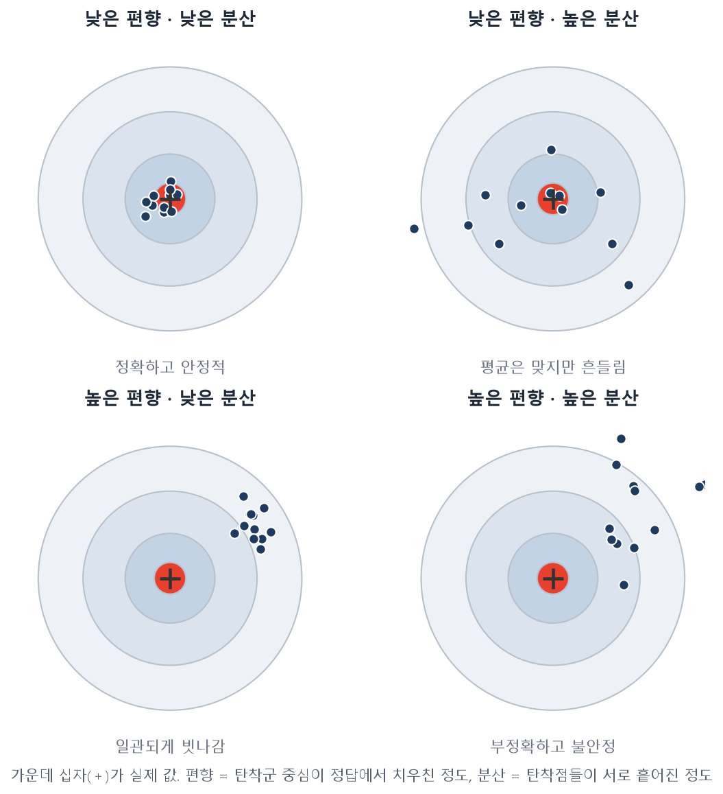{width=78% fig-alt="과녁 비유로 본 편향과 분산의 네 조합"}
:::
::: {.figcap}
**그림 2.12** 과녁으로 본 편향과 분산. 가운데 십자가 정답, 점들이 서로 다른 데이터로 학습한 모델들의 예측입니다. **편향**은 탄착군의 *중심*이 정답에서 치우친 정도, **분산**은 탄착점들이 서로 흩어진 정도입니다. 두 값이 모두 작을 때(왼쪽 위)가 가장 좋습니다.
:::

과녁에 비유하면 이해가 쉽습니다(그림 2.12). 가운데가 정답이고, 다섯 모델의 예측이 탄착점입니다.

- **편향(bias)**은 **탄착군의 중심이 정답에서 얼마나 치우쳤는가**입니다. 즉 예측들의 *평균*이 정답에서 벗어난 정도로, 편향이 크면 아무리 쏴도 한쪽으로 일관되게 빗나갑니다(과소적합).
- **분산(variance)**은 **탄착점들이 서로 얼마나 흩어졌는가**입니다. 즉 학습 데이터가 바뀔 때 예측이 얼마나 흔들리는가로, 분산이 크면 어떤 데이터로 학습했느냐에 따라 예측이 들쭉날쭉합니다(과적합).

한 문장으로, **편향은 '예측의 평균'과 '정답' 사이의 거리, 분산은 '개별 예측'과 '예측의 평균' 사이의 퍼짐**입니다.

#### 숫자로 확인하기

정답은 세 경우 모두 100입니다.

| 모델 5개의 예측 | 예측 평균 | 편향 (평균−정답) | 분산 (평균 주변 퍼짐) |
|---|---:|---:|---:|
| 80, 80, 80, 80, 80 | 80 | **−20** | **0** |
| 80, 90, 100, 110, 120 | 100 | **0** | **200** |
| 100, 100, 100, 100, 100 | 100 | **0** | **0** |

- **첫째 줄**: 다섯 예측이 모두 같아 분산은 0이지만, 평균 80이 정답 100보다 20 낮아 편향은 −20. **안정적이지만 일관되게 틀립니다.**
- **둘째 줄**: 평균이 정답과 같아 편향은 0이지만, 예측이 80~120으로 퍼져 분산은 $\frac{400+100+0+100+400}{5}=200$. **평균적으론 맞지만 데이터에 따라 흔들립니다.**
- **셋째 줄**: 편향도 분산도 0으로 **정확하면서 안정적**입니다.

이론적으로 회귀의 일반화 오차는 이 둘과 잡음의 합으로 분해됩니다.

$$
\mathbb{E}\bigl[(y-\hat f(x))^2\bigr]
=\underbrace{(\text{편향})^2}_{\text{모델이 단순해 생기는 오차}}
+\underbrace{\text{분산}}_{\text{데이터에 민감해 생기는 오차}}
+\underbrace{\sigma^2}_{\text{제거 불가능한 잡음}}.
$$

::: {.eqnote}
여기서 말하는 편향은 신경망의 가중합에 더하는 **편향 파라미터 $b$와는 다른 개념**입니다. 이 편향은 "여러 데이터로 학습한 모델들의 평균 예측이 정답에서 벗어난 정도"를 뜻합니다.
:::

#### 왜 '트레이드오프'인가

모델을 복잡하게 만들수록 표현력이 커져 편향은 줄지만, 데이터의 세부(잡음까지)에 민감해져 분산은 커집니다. 반대로 단순하게 만들수록 분산은 줄지만 편향이 커집니다. 좋은 모델은 이 **둘의 합이 최소가 되는 균형점**에 있습니다.

```{mermaid}
flowchart LR
    S["단순한 모델<br/>높은 편향·낮은 분산<br/>과소적합"] --- G["적절한 복잡도<br/>균형점"] --- C["복잡한 모델<br/>낮은 편향·높은 분산<br/>과적합"]
    style G fill:#bbf7d0
```

이 균형을 회귀로 눈으로 확인해 봅니다.

::: {.figbody}
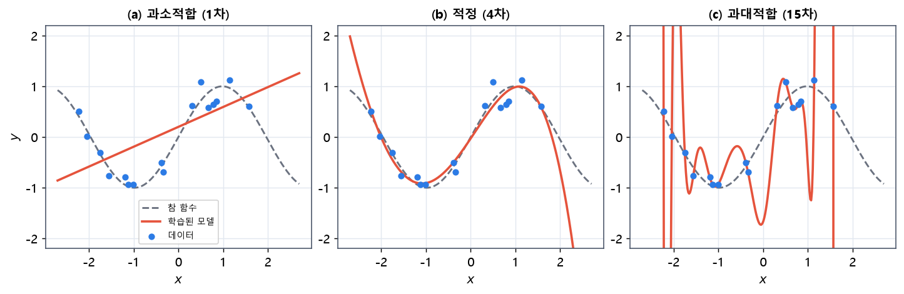{width=100% fig-alt="다항식 회귀의 과소·적정·과대적합"}
:::
::: {.figcap}
**그림 2.13** 편향-분산 트레이드오프를 보여 주는 다항식 회귀. (a) 1차 모델은 너무 단순해 참 함수를 못 따라갑니다(과소적합, 높은 편향). (b) 4차 모델은 참 함수를 잘 근사합니다(적정). (c) 15차 모델은 데이터의 잡음까지 외워 심하게 출렁입니다(과대적합, 높은 분산). 파란 점은 학습 데이터, 점선은 참 함수, 빨간 선은 학습된 모델입니다.
:::

앞으로 배울 정규화 기법들은 대부분 **분산을 줄여** 이 균형점을 과적합 쪽에서 적절한 쪽으로 옮기는 도구이고, **데이터를 늘리는 것** 역시 분산을 줄이는 근본적인 방법입니다.

## 정규화와 일반화 향상 전략 {#sec-regularization}

일반화를 높이는 전략은 크게 두 축입니다.

- **모델 구조 측면**: 모델 복잡도를 조절합니다. 층·뉴런 수를 줄이거나, 가중치의 크기에 벌점을 주는 방식입니다.
- **학습 과정 측면**: 학습 절차에 정규화를 더합니다. 드롭아웃, 데이터 증강, 조기 종료가 여기 속합니다.

### 가중치 감쇠 (L2 정규화)

**L2 정규화**는 원래 손실에 가중치 제곱합을 벌점으로 더해, 과도하게 큰 가중치를 억제합니다. 예측 오차만 줄이는 대신 가중치 크기도 함께 작게 유지하려는 것입니다.

$$
\mathcal{L}_{\text{reg}}(\theta)=\mathcal{L}(\theta)+\frac{\lambda}{2}\lVert\theta\rVert_2^2
=\mathcal{L}(\theta)+\frac{\lambda}{2}\sum_i \theta_i^2.
$$

::: {.eqnote}
- $\mathcal{L}(\theta)$: 원래 손실, $\;\theta$: 정규화 대상 가중치, $\;\lambda\ge0$: 정규화 강도
- $\tfrac12$은 미분할 때 계수 $2$를 상쇄하기 위한 상수입니다.
:::

가중치가 크면 제곱에 비례해 벌점이 커집니다. 다만 큰 가중치 자체가 곧 과적합은 아니며, 정규화는 일반화를 돕기 위한 제약일 뿐 성능 향상을 보장하지는 않습니다.

#### 왜 '가중치 감쇠'라 부르나

정규화 항을 미분하면 $\dfrac{\partial}{\partial\theta_i}\!\left(\dfrac{\lambda}{2}\sum_j\theta_j^2\right)=\lambda\theta_i$이므로, 전체 기울기는 $\nabla_\theta\mathcal{L}_{\text{reg}}=\nabla_\theta\mathcal{L}+\lambda\theta$가 됩니다. 이를 (모멘텀 없는) SGD 갱신식에 넣으면,

$$
\begin{aligned}
\theta_{t+1}
&=\theta_t-\eta\bigl(\nabla_\theta\mathcal{L}(\theta_t)+\lambda\theta_t\bigr)\\
&=\underbrace{(1-\eta\lambda)\,\theta_t}_{\text{가중치 감쇠}}
-\underbrace{\eta\,\nabla_\theta\mathcal{L}(\theta_t)}_{\text{원래 손실에 따른 갱신}}.
\end{aligned}
$$

즉 매 스텝 가중치에 $(1-\eta\lambda)$를 곱해 0 쪽으로 **일정 비율 축소**하는 효과가 생깁니다($0<\eta\lambda<1$). 그래서 L2 정규화를 [가중치 감쇠(weight decay)]{.imp}라고도 부릅니다.

숫자로 보면($\eta=0.01,\ \lambda=0.1$이면 $1-\eta\lambda=0.999$), 감쇠 효과만 떼어 볼 때 다음과 같습니다.

| 기존 가중치 | 감쇠 후 | 절댓값 감소량 |
|---:|---:|---:|
| 10 | 9.99 | 0.01 |
| 1 | 0.999 | 0.001 |
| −10 | −9.99 | 0.01 |

같은 비율로 줄지만 **절댓값이 큰 가중치가 더 많이** 줄어듭니다. 단, 전체 갱신에는 원래 손실의 기울기도 함께 들어가므로, 정규화가 있어도 특정 가중치의 크기는 늘 수 있습니다("매 스텝 모든 가중치가 반드시 작아진다"는 뜻은 아닙니다).

#### 정규화 강도 λ

$\lambda$가 커질수록 가중치에 대한 제약이 강해집니다.

| $\lambda$ | 의미 | 가능한 결과 |
|---|---|---|
| $0$ | 벌점 없음 | 원래 손실만 최소화 |
| 작음 | 제약이 약함 | 과적합 억제가 부족할 수 있음 |
| 적절 | 적합과 제약의 균형 | 일반화 개선을 기대 |
| 지나치게 큼 | 과도한 억제 | 필요한 패턴도 놓쳐 과소적합 |

여기서 "모델이 단순해진다"는 것은 층·뉴런 수가 준다는 뜻이 아니라, **같은 구조에서 쓸 수 있는 가중치에 제약을 준다**는 뜻입니다. $\lambda$는 학습 손실이 아니라 **검증 성능이나 교차검증** 결과로 고릅니다.

#### L1 정규화와의 비교

벌점으로 제곱합 대신 절댓값 합을 쓰면 **L1 정규화**입니다.

$$
\text{L1:}\;\;\mathcal{L}+\lambda\sum_i|\theta_i|,
\qquad
\text{L2:}\;\;\mathcal{L}+\frac{\lambda}{2}\sum_i\theta_i^2.
$$

| 구분 | L1 정규화 | L2 정규화 |
|---|---|---|
| 벌점 | 절댓값 합 | 제곱합 |
| 성질 | 일부 계수를 0으로 → **희소한 해** | 계수 크기를 전반적으로 축소 |
| 벌점 미분($\theta_i\neq0$) | $\lambda\,\operatorname{sign}(\theta_i)$ | $\lambda\theta_i$ |

선형 회귀에서 L1은 lasso, L2는 ridge, 둘의 혼합은 Elastic Net에 대응합니다. L1의 희소성은 작은 값을 정확히 0으로 만드는 성질에서 오지만, 신경망에서는 연결 하나가 0이어도 다른 연결이 남으므로 "입력 특성이 통째로 제거된다"고 해석하면 안 됩니다. 딥러닝에서는 주로 L2(가중치 감쇠)가 기본으로 쓰입니다.

#### L2 정규화와 가중치 감쇠는 항상 같은가?

둘은 적용 위치가 다릅니다. **L2 정규화**는 손실에 벌점을 넣고, **가중치 감쇠**는 갱신 단계에서 가중치를 직접 축소합니다. 앞서 보았듯 모멘텀 없는 SGD에서는 계수만 맞추면 동등합니다. 그러나 **Adam에서는 L2 벌점의 기울기까지 적응적 변환을 거치므로 직접 감쇠와 일반적으로 다릅니다.** 이 때문에 감쇠를 적응적 변환에서 분리한 [AdamW]{.imp}가 제안되었습니다. 파이토치에서 가중치 감쇠가 필요하면 `optim.SGD(..., weight_decay=λ)`나 `optim.AdamW(..., weight_decay=λ)`를 쓰고, 어떤 매개변수에 적용할지(예: 편향·정규화 층은 제외)도 지정할 수 있습니다.

::: {.keybox}
L2 정규화는 큰 가중치에 벌점을 줍니다. 모멘텀 없는 SGD에서는 가중치를 매 스텝 $(1-\eta\lambda)$배 줄이는 **가중치 감쇠**와 같지만, **Adam에서는 둘이 달라** 이를 바로잡은 것이 AdamW입니다. 정규화 강도 $\lambda$는 학습 손실이 아니라 **검증 성능**으로 정합니다.
:::

### 드롭아웃

**드롭아웃(dropout)**은 학습 중 각 뉴런을 확률 $p$로 임의로 꺼서, 특정 뉴런에 대한 과의존을 막습니다. 이는 여러 부분 네트워크를 앙상블하는 효과를 냅니다. 평가 시에는 모든 뉴런을 켜되 출력을 보정합니다.

```{mermaid}
flowchart LR
    subgraph TR["학습 시"]
        N1["뉴런 (일부 무작위 OFF)"]
    end
    subgraph EV["평가 시"]
        N2["모든 뉴런 ON + 스케일 보정"]
    end
    TR --> EV
```

### 배치 정규화

**배치 정규화(batch normalization)**는 각 층의 입력을 미니배치 통계로 정규화해 학습을 안정화하고 가속합니다. 미니배치 평균 $\mu_\mathcal{B}$와 분산 $\sigma_\mathcal{B}^2$로 정규화한 뒤, 학습 가능한 스케일 $\gamma$·이동 $\beta$를 적용합니다.

$$
\hat{x}=\frac{x-\mu_\mathcal{B}}{\sqrt{\sigma_\mathcal{B}^2+\epsilon}}, \qquad
y=\gamma\hat{x}+\beta.
$$

효과의 원인이 "내부 공변량 이동" 완화라기보다 손실 지형을 매끄럽게 만드는 데 있다는 분석도 있습니다.

배치 정규화는 학습과 추론에서 동작이 다르다는 점에 주의해야 합니다. 학습 중에는 현재 미니배치의 평균·분산으로 정규화하지만, 추론 시에는 배치가 하나뿐이거나 통계가 불안정할 수 있어, 학습 동안 누적해 둔 **이동평균(running mean/variance)**을 대신 사용합니다. 파이토치에서 `model.train()`과 `model.eval()`이 이 전환을 담당하므로, 평가 전에 반드시 `eval()`을 호출해야 올바른 통계가 적용됩니다. 이 점을 놓치면 학습은 잘 됐는데 평가 성능만 이상하게 낮은 문제가 생깁니다.

시퀀스 모델에서는 배치 대신 특성 차원으로 정규화하는 **층 정규화(layer normalization)**가 더 적합합니다. 층 정규화는 배치 크기에 의존하지 않아, 문장 길이가 제각각이고 배치가 작을 수 있는 순환 신경망과 트랜스포머에서 표준으로 쓰입니다. 4장의 트랜스포머가 배치 정규화 대신 층 정규화를 쓰는 이유가 바로 이것입니다.

### 기울기 소실과 폭발

깊은 망에서는 역전파 시 기울기가 곱해지며 지수적으로 작아지거나(**소실**) 커질(**폭발**) 수 있습니다. 소실은 앞쪽 층이 거의 학습되지 않게 만들고, 폭발은 학습을 발산시킵니다. 대응책으로는 ReLU 계열 활성화, 배치·층 정규화, 잔차 연결, 그리고 기울기의 크기를 잘라내는 **기울기 클리핑(gradient clipping)**이 있습니다.

## 파라미터 초기화 전략 {#sec-init}

학습 시작 시 가중치를 어떻게 정하느냐가 수렴에 큰 영향을 줍니다. 모두 0으로 두면 모든 뉴런이 같은 값을 내어 대칭이 깨지지 않고 학습이 안 됩니다. 따라서 적절한 분산의 난수로 초기화합니다.

**Xavier(글로럿) 초기화**는 입력·출력 차원 $n_{in},n_{out}$을 고려해 신호의 분산을 층 사이에 유지합니다.

$$
\text{Var}(W)=\frac{2}{n_{in}+n_{out}}.
$$

**He(카이밍) 초기화**는 ReLU에 맞춰 분산을 조정합니다.

$$
\text{Var}(W)=\frac{2}{n_{in}}.
$$

깊은 선형망에서 직교 초기화가 학습 동역학에 유리하다는 분석도 있습니다. 초기화의 효과는 실험으로 확인할 수 있습니다.

```python
import torch, torch.nn as nn

def make_deep(init: str, depth=20, width=256):
    layers = []
    for _ in range(depth):
        lin = nn.Linear(width, width)
        if init == "he":
            nn.init.kaiming_normal_(lin.weight, nonlinearity="relu")
        elif init == "xavier":
            nn.init.xavier_normal_(lin.weight)
        elif init == "bad":
            nn.init.normal_(lin.weight, std=1.0)   # 분산 과다
        nn.init.zeros_(lin.bias)
        layers += [lin, nn.ReLU()]
    return nn.Sequential(*layers)

x = torch.randn(64, 256)
for init in ["bad", "xavier", "he"]:
    out = make_deep(init)(x)
    print(f"{init:6s} -> 출력 표준편차: {out.std().item():.4f}")
# 'bad'는 활성값이 폭발하거나 소실되고, xavier/he는 안정적으로 유지됨
```

::: {.figbody}
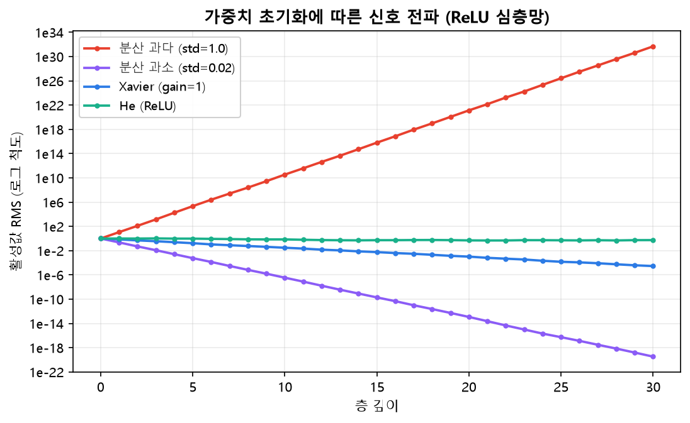{width=68% fig-alt="초기화별 층 통과 활성값 표준편차"}
:::
::: {.figcap}
**그림 2.14** 가중치 초기화에 따른 신호 전파(세로축은 로그 척도). 분산이 과다한 초기화(빨간색)는 층을 지날수록 활성값이 폭발하고, 과소한 초기화(보라색)는 급격히 0으로 소실됩니다. He 초기화(초록색)는 층이 깊어져도 활성값의 크기를 일정하게 유지해, 깊은 망의 안정적 학습을 돕습니다.
:::

## 데이터 파이프라인 설계 {#sec-data-pipeline}

모델만큼 중요한 것이 **데이터를 모델 앞까지 나르는 파이프라인**입니다. 파이토치는 이를 `Dataset`과 `DataLoader`로 분리합니다.

```{mermaid}
flowchart LR
    RAW["원시 데이터<br/>파일·DB·스트림"] --> TF["변환<br/>전처리·증강"]
    TF --> DS["Dataset<br/>__getitem__"]
    DS --> SP["Sampler<br/>인덱스 순서"]
    SP --> DL["DataLoader<br/>배치·병렬 로딩"]
    DL --> BATCH["미니배치 텐서"]
    BATCH --> MODEL["모델"]
```

### 데이터셋 클래스 설계와 그 중요성

`Dataset`은 "$i$번째 샘플이 무엇인가"만 책임집니다. `__len__`(전체 크기)과 `__getitem__`(하나의 샘플)을 구현합니다. 데이터셋을 잘 설계하면 전처리·증강·캐싱을 한곳에 모아 재사용성과 재현성을 확보할 수 있습니다.

```python
from torch.utils.data import Dataset
import torch

class TabularDataset(Dataset):
    def __init__(self, X, y, transform=None):
        self.X = torch.as_tensor(X, dtype=torch.float32)
        self.y = torch.as_tensor(y, dtype=torch.long)
        self.transform = transform
    def __len__(self):
        return len(self.X)
    def __getitem__(self, i):
        x = self.X[i]
        if self.transform:            # 표준화·증강 등을 샘플 단위로 적용
            x = self.transform(x)
        return x, self.y[i]
```

### 데이터로더: 병렬 처리와 반복자

`DataLoader`는 데이터셋을 미니배치로 묶고, 섞고, 여러 워커 프로세스로 병렬 로딩하며, 반복자를 제공합니다. 주요 인자는 `batch_size`, `shuffle`, `num_workers`, `pin_memory` 등입니다.

```python
from torch.utils.data import DataLoader

loader = DataLoader(
    dataset, batch_size=64, shuffle=True,
    num_workers=4,       # 병렬 로딩 프로세스 수
    pin_memory=True,     # GPU 전송 가속(고정 메모리)
    drop_last=False,     # 마지막 불완전 배치 유지 여부
)

for xb, yb in loader:    # DataLoader는 반복자 → for 문으로 순회
    ...
```

`num_workers`를 늘리면 CPU에서 데이터를 준비하는 동안 GPU가 쉬지 않아 학습이 빨라집니다. `pin_memory=True`는 CPU→GPU 전송을 가속합니다.

### 데이터셋과 데이터로더의 관계

둘의 책임은 명확히 분리됩니다. 데이터셋은 **무엇을**(개별 샘플), 데이터로더는 **어떻게**(배치·순서·병렬)를 담당합니다. 이 분리 덕분에 데이터가 바뀌어도 데이터셋만 교체하면 되고, 로딩 전략은 그대로 재사용됩니다. 이런 관심사 분리는 코드의 재사용성과 가독성을 높일 뿐 아니라, 데이터 처리 부분만 따로 테스트하고 최적화할 수 있게 해 줍니다.

데이터 파이프라인의 설계는 성능에도 직결됩니다. GPU가 아무리 빨라도 데이터가 제때 공급되지 않으면 GPU는 데이터를 기다리며 놀게 되는데, 이를 데이터 로딩 병목이라 합니다. 실제로 학습이 느린 원인이 모델이 아니라 데이터 로딩인 경우가 많습니다. 그래서 여러 워커로 데이터를 미리 준비하고, 전처리 결과를 캐싱하며, 고정 메모리로 전송을 가속하는 등의 최적화가 중요합니다. 잘 설계된 데이터 파이프라인은 학습 속도를 몇 배나 끌어올릴 수 있습니다.

### 고급 파이프라인: 이터러블 데이터셋과 collate 함수

전체를 인덱스로 접근하기 어려운 대용량 스트림 데이터에는 **이터러블 데이터셋(`IterableDataset`)**을 씁니다. `__iter__`로 샘플을 하나씩 흘려보내므로, 로그 스트림처럼 크기를 미리 알 수 없는 데이터에 적합합니다.

또한 샘플들의 길이가 서로 다를 때(문장, 가변 길이 시계열), 이들을 하나의 배치 텐서로 묶으려면 **패딩**이 필요합니다. 이 조립 규칙을 정의하는 것이 사용자 정의 **`collate_fn`**입니다.

```python
import torch
from torch.nn.utils.rnn import pad_sequence

def pad_collate(batch):
    # batch: [(seq_i, label_i), ...], seq_i의 길이가 서로 다름
    seqs, labels = zip(*batch)
    lengths = torch.tensor([len(s) for s in seqs])
    padded = pad_sequence(seqs, batch_first=True)   # 가장 긴 길이에 맞춰 0 패딩
    labels = torch.stack(labels)
    return padded, lengths, labels

# loader = DataLoader(ds, batch_size=32, collate_fn=pad_collate)
```

### 데이터 유형별 파이프라인

데이터의 성격에 따라 데이터셋·데이터로더 구성이 달라집니다.

| 데이터 | 샘플의 형태 | 대표 전처리·증강 | 배치 구성 |
|--------|-------------|------------------|-----------|
| 이미지 | (C, H, W) 텐서 | 리사이즈, 정규화, 뒤집기·크롭 | 고정 크기 → 단순 스택 |
| 시계열 | (T, F) 윈도 | 표준화, 슬라이딩 윈도 | 길이 다르면 패딩 |
| 텍스트 | 토큰 ID 시퀀스 | 토크나이즈, 어휘 매핑 | 패딩 + 마스크 |

이미지는 대부분 같은 크기로 맞춰 단순히 쌓을 수 있지만, 시계열과 텍스트는 길이가 달라 패딩과 마스크가 필요합니다. 특히 시계열은 시간 순서가 중요하므로, 분류 데이터처럼 무작위로 섞어 분할하면 미래 정보가 훈련에 새어 드는 문제가 생깁니다. 그래서 시계열은 시간 순으로 앞부분을 훈련, 뒷부분을 검증·테스트로 나누는 것이 원칙입니다. 이런 유형별 처리 방식은 3장(시계열)과 이후 장에서 구체적으로 다룹니다.
