# 1. 이론 {#sec-ch5}

## 합성곱 신경망은 어떻게 생겼는가 {#sec-cnn-overview}

합성곱 신경망(Convolutional Neural Network, CNN)은 이미지를 다루도록 설계된 신경망입니다. 전체 구조는 크게 다섯 종류의 층으로 이루어지며, 앞쪽에서 특징을 뽑고 뒤쪽에서 분류합니다.

- **입력층**: 이미지를 숫자 텐서로 받습니다.
- **합성곱층(convolution layer)**: 작은 커널로 지역 패턴을 훑어 **특징 맵**을 만듭니다.
- **풀링층(pooling layer)**: 특징 맵을 요약해 크기를 줄입니다.
- **완전연결층(fully-connected layer)**: 뽑아낸 특징을 모아 클래스별 점수로 바꿉니다.
- **출력층**: 소프트맥스로 클래스 확률을 냅니다.

합성곱층과 풀링층이 번갈아 반복되며 특징을 점점 추상화하는 앞부분을 **특징 추출부**, 마지막의 완전연결층과 출력층을 **분류부**라고 부릅니다. 층을 지날수록 공간 크기(높이·너비)는 줄고 채널 수는 늘어나는 것이 전형적인 흐름입니다.

::: {.figbody}
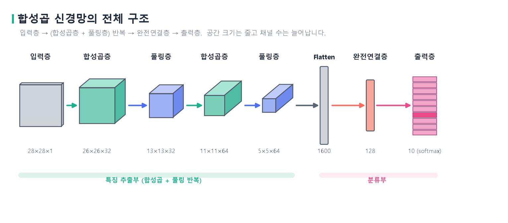{width=100% fig-alt="합성곱 신경망의 전체 구조"}
:::
::: {.figcap}
**그림 5-1** 합성곱 신경망의 전체 구조. 입력층에서 시작해 합성곱층과 풀링층이 번갈아 반복되며 공간 크기는 $28\times28\to13\times13\to5\times5$로 줄고 채널은 $1\to32\to64$로 늘어납니다. 마지막에 특징 맵을 한 줄로 펼쳐(Flatten) 완전연결층을 거쳐 출력층에서 10개 클래스의 확률을 냅니다.
:::

그런데 왜 이미지에 완전연결망(MLP)을 그대로 쓰지 않을까요. 2차원 격자를 1차원 벡터로 펼쳐 넣으면 두 가지 문제가 생깁니다. 첫째, **파라미터가 폭발합니다.** $224\times224\times3$ 이미지를 펼치면 입력이 약 15만 차원이고, 은닉 뉴런 1,000개짜리 층 하나만 붙여도 가중치가 약 1억 5천만 개입니다. 둘째, **공간 구조가 사라집니다.** 펼치는 순간 인접한 픽셀이 서로 멀어져 "가까운 픽셀끼리 강하게 연관된다"는 성질이 무너지고, 고양이가 왼쪽에 있든 오른쪽에 있든 같은 고양이인데도 조금만 이동하면 전혀 다른 입력으로 보입니다. 합성곱 신경망은 이 두 문제를 지역 연결과 파라미터 공유로 풀며, 그 뿌리는 시각 피질을 모방한 후쿠시마의 네오코그니트론과 이를 역전파로 학습 가능하게 정립한 르쿤 등의 연구로 거슬러 올라갑니다.

## 입력층: 이미지 데이터 {#sec-image-limits}

CNN의 입력은 숫자 격자입니다. **흑백 이미지**는 각 픽셀이 밝기 하나를 갖는 $H\times W$ 격자로, 채널이 1개입니다. 밝기는 보통 0(검정)에서 255(흰색) 사이의 값입니다. **컬러 이미지**는 빨강·초록·파랑(R, G, B) 세 채널을 겹쳐 놓은 $H\times W\times 3$ 텐서로, 한 픽셀이 세 값의 묶음 $(R, G, B)$입니다. 그림 5-2가 둘의 차이를 보여 줍니다.

::: {.figbody}
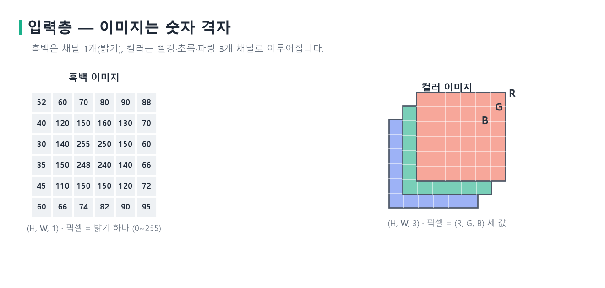{width=100% fig-alt="흑백과 컬러 이미지 데이터의 차이"}
:::
::: {.figcap}
**그림 5-2** 입력 데이터. 흑백 이미지는 밝기 하나로 이루어진 격자(채널 1개, 왼쪽)이고, 컬러 이미지는 빨강·초록·파랑 세 채널을 겹친 것(채널 3개, 오른쪽)입니다. 컬러에서는 한 픽셀이 $(R, G, B)$ 세 값을 가집니다.
:::

컴퓨터에게 이미지는 이런 숫자 격자일 뿐, 그 안에 "고양이"라는 의미는 담겨 있지 않습니다. 시각 정보를 이해한다는 것은 이 저수준 픽셀에서 경계선으로, 경계선에서 부분 형태로, 부분에서 물체 전체로 점점 더 추상적인 **표현(representation)**을 단계적으로 만들어 내는 일입니다. 참고로 파이토치는 이미지 텐서를 채널이 앞에 오는 $(C, H, W)$ 순서로 다루고, 배치까지 붙으면 $(N, C, H, W)$가 됩니다. `nn.Conv2d`를 비롯한 이미지 모듈이 모두 이 순서를 가정합니다.

## 합성곱층 {#sec-convolution}

### 합성곱 연산과 특징 맵

합성곱층의 핵심은 **합성곱(convolution)**입니다. 작은 **필터(filter)** 또는 **커널(kernel)**을 이미지 위에서 미끄러뜨리며, 겹치는 영역과 곱해 더한 값으로 새 값을 만듭니다. 입력 $I$와 $F\times F$ 커널 $K$에 대해 출력의 $(i,j)$ 값은 다음과 같습니다.

$$
(I * K)(i,j) = \sum_{m=0}^{F-1}\sum_{n=0}^{F-1} I(i+m,\ j+n)\, K(m,n) + b.
$$

여기서 $b$는 편향입니다. 커널을 한 위치에 겹쳐 대응 픽셀과 곱해 모두 더한 뒤 편향을 더하고, 커널을 한 칸씩 옮기며 반복하면 하나의 **특징 맵(feature map)**이 완성됩니다. 커널 값은 사람이 정하지 않고 학습으로 결정됩니다. 학습을 거치면 어떤 커널은 수직 모서리에, 어떤 커널은 특정 질감에 반응하도록 스스로 변합니다.

::: {.figbody}
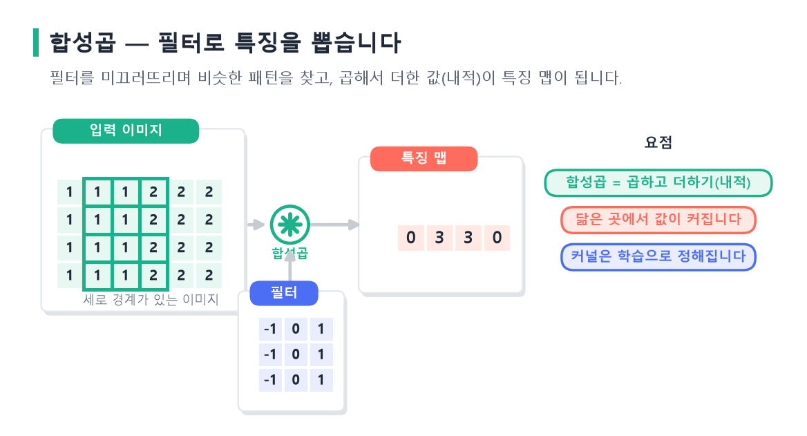{width=100% fig-alt="합성곱으로 특징을 뽑는 원리"}
:::
::: {.figcap}
**그림 5-3** 합성곱으로 특징을 뽑는 원리. 필터를 이미지 위에서 미끄러뜨리며 곱해 더한 값이 특징 맵이 됩니다. 필터와 닮은 곳(여기서는 세로 경계)에서 값이 커집니다. 이 필터는 좌우 밝기 차를 재도록 되어 있어, 밝기가 급변하는 모서리에서 반응이 강합니다.
:::

이 원리는 고전 영상 처리와 맞닿아 있습니다. 수직 모서리를 찾는 소벨 필터는 좌우 픽셀의 밝기 차이를 재도록 값이 정해져 있어, 밝기가 급변하는 모서리에서 반응이 큽니다. CNN은 이런 필터를 사람이 설계하는 대신 데이터에서 직접 학습합니다. 참고로 딥러닝의 "합성곱"은 수학적으로는 커널을 뒤집지 않는 상호상관이며, `nn.Conv2d`도 상호상관을 계산합니다.

### 커널을 밀며 특징 맵 완성하기 (stride = 1)

식이 실제로 어떻게 계산되는지, $5\times5$ 입력에 $3\times3$ 커널을 스트라이드 1로 적용해 따라가 봅니다. 이 커널은 네 모서리와 가운데가 1이고 나머지가 0이라, 겹친 영역에서 그 다섯 자리의 값만 더하면 됩니다.

$$
I=\begin{pmatrix}1&2&0&1&3\\0&1&2&3&1\\1&0&1&2&0\\2&1&0&1&1\\0&2&1&0&2\end{pmatrix},\qquad
K=\begin{pmatrix}1&0&1\\0&1&0\\1&0&1\end{pmatrix}.
$$

왼쪽 위 $3\times3$에 커널을 겹치면 $O(0,0)=1+0+1+1+1=4$입니다(커널이 1인 다섯 자리의 합). 커널을 오른쪽으로 한 칸 옮기면 $O(0,1)=2+1+2+0+2=7$이 됩니다. 이렇게 한 칸씩 밀며 계산을 반복하면 $3\times3$ 특징 맵이 완성됩니다.

$$
I * K=\begin{pmatrix}4&7&7\\4&7&7\\4&4&5\end{pmatrix}.
$$

::: {.figbody}
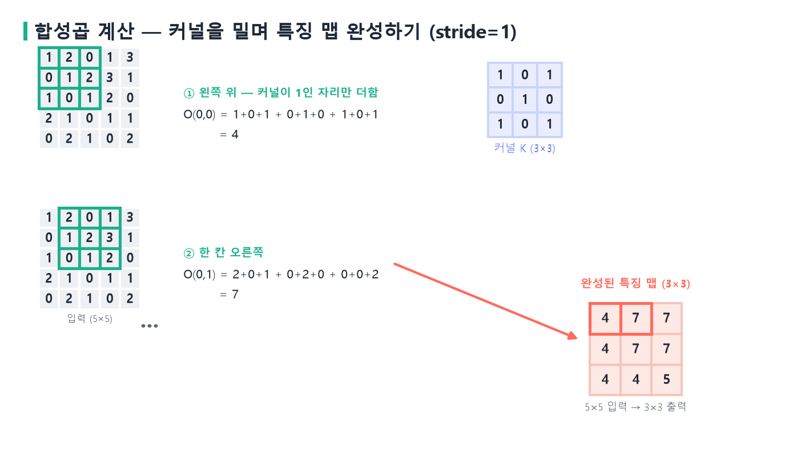{width=100% fig-alt="합성곱 계산을 단계별로 따라가기"}
:::
::: {.figcap}
**그림 5-4** 커널을 밀며 특징 맵 완성하기. 왼쪽 위에서 시작해($O(0,0)=4$) 커널을 한 칸씩 오른쪽·아래로 옮기며($O(0,1)=7$, …) 곱해 더한 값을 채우면, $5\times5$ 입력이 $3\times3$ 특징 맵으로 요약됩니다. 스트라이드가 1이라 커널이 한 칸씩 이동합니다.
:::

특징 맵의 값에는 의미가 있습니다. 값이 클수록 그 위치의 지역 패턴이 커널이 찾는 모양과 닮았다는 뜻입니다. 실제 CNN에서는 특징 맵에 ReLU를 적용해 음수를 0으로 만든 뒤 풀링으로 요약하는데, 이렇게 하면 "필터와 닮은 패턴이 어디에 얼마나 강하게 있는지"가 숫자로 남습니다.

### 스트라이드와 패딩, 출력 크기

합성곱에는 두 가지 설정이 있습니다. **스트라이드(stride)** $S$는 커널을 몇 칸씩 옮길지 정하고, **패딩(padding)** $P$은 가장자리에 보통 0을 덧대어 가장자리 정보를 보존합니다. 입력 크기 $W$, 커널 $F$, 패딩 $P$, 스트라이드 $S$일 때 출력 크기는 다음과 같습니다.

$$
O = \left\lfloor \frac{W - F + 2P}{S} \right\rfloor + 1.
$$

$5\times5$ 입력에 $3\times3$ 커널을 쓸 때, 패딩 없이 스트라이드 1이면 $(5-3+0)/1+1=3$으로 $3\times3$이 됩니다. 패딩을 1 주면 $(5-3+2)/1+1=5$가 되어 입력과 크기가 같아지고, 패딩 없이 스트라이드를 2로 키우면 $\lfloor(5-3)/2\rfloor+1=2$로 절반 가까이 줄어듭니다. 그림 5-5가 이 세 경우입니다.

::: {.figbody}
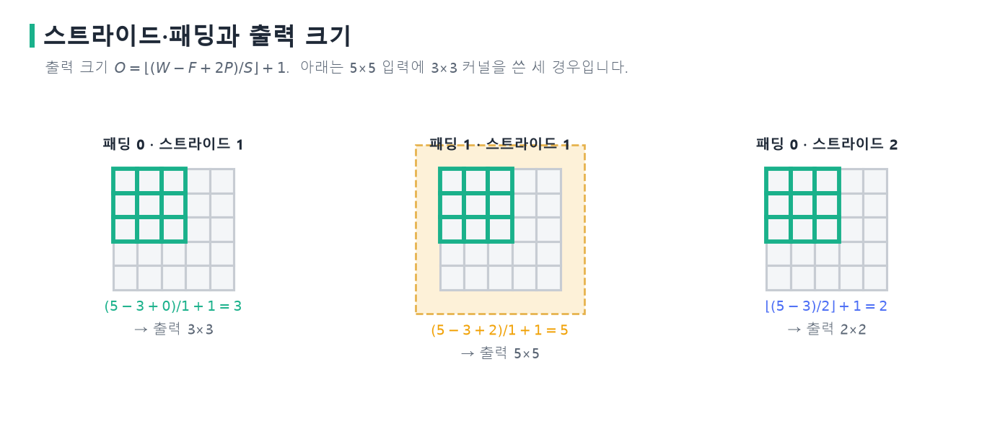{width=100% fig-alt="스트라이드와 패딩이 출력 크기에 미치는 영향"}
:::
::: {.figcap}
**그림 5-5** 스트라이드·패딩과 출력 크기. $5\times5$ 입력에 $3\times3$ 커널을 적용한 세 경우입니다. 패딩 1은 가장자리에 한 겹을 덧대어 출력을 입력과 같은 크기로 유지하고(가운데), 스트라이드 2는 커널을 두 칸씩 건너뛰어 출력을 절반 가까이 줄입니다(오른쪽).
:::

크기를 보존하려면 보통 $3\times3$ 커널과 패딩 1을 함께 씁니다. 반대로 스트라이드가 큰 합성곱은 풀링처럼 특징 맵을 줄이는 데 쓰기도 합니다.

### 채널과 여러 개의 필터

지금까지는 채널이 하나인 경우였습니다. 컬러 이미지는 채널이 셋이므로 커널도 입력 채널 수만큼 깊이를 가집니다. $3\times3$ 커널이 3채널 입력에 적용되면 실제로는 $3\times3\times3$ 부피가 되어, 채널마다 곱-합을 구한 뒤 그 결과를 모두 더해 값 하나를 냅니다. 예를 들어 채널이 둘일 때 1번 채널의 곱-합이 $0$, 2번 채널의 곱-합이 $2$라면 출력의 한 칸은 $0+2=2$(에 편향을 더한 값)입니다. 채널이 몇 개든 필터 하나가 내는 것은 여전히 채널 1개짜리 특징 맵입니다.

한 층은 보통 **여러 개의 필터**를 둡니다. 필터가 $C_{out}$개이면 각 필터가 특징 맵을 하나씩 만들어 출력 채널이 $C_{out}$개가 됩니다. 곧 **필터 수가 출력 채널 수**입니다. 그림 5-6이 흑백 입력, 컬러 입력, 그리고 컬러 입력에 필터 2개를 쓴 세 경우를 부피로 보여 줍니다.

::: {.figbody}
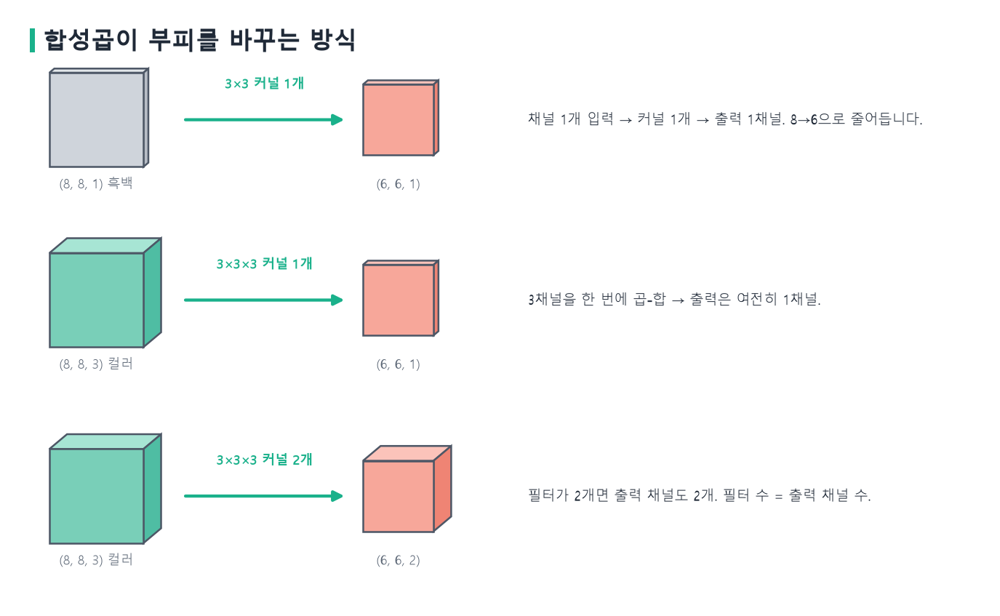{width=100% fig-alt="합성곱이 입력 부피를 바꾸는 방식"}
:::
::: {.figcap}
**그림 5-6** 합성곱이 부피를 바꾸는 방식. $(8,8,1)$ 흑백에 $3\times3$ 커널 1개를 쓰면 $(6,6,1)$이 됩니다(위). $(8,8,3)$ 컬러에 $3\times3\times3$ 커널 1개를 쓰면 세 채널이 하나로 합쳐져 여전히 $(6,6,1)$이고(가운데), 필터를 2개로 늘리면 출력 채널도 2개가 되어 $(6,6,2)$가 됩니다(아래). 패딩이 없어 공간 크기는 $8\to6$으로 줄어듭니다.
:::

이 구조 덕분에 합성곱 층의 파라미터 수는 입력 이미지 크기와 무관하게 $C_{out}\times C_{in}\times F\times F$에 편향을 더한 값입니다. 입력 3채널, 출력 64채널, $3\times3$ 커널이면 파라미터가 $64\times3\times3\times3+64\approx1{,}800$개에 불과합니다. 앞서 완전연결망이 같은 이미지에 1억 개가 넘는 가중치를 요구했던 것과 대조적입니다. 한편 커널이 $1\times1$인 합성곱은 공간적으로는 한 픽셀만 보지만 채널 방향으로는 모든 채널을 결합해 각 위치에서 채널 수를 조절합니다. 256채널을 64채널로 줄이면 이후 연산량이 크게 감소하며, GoogLeNet이 이 방법으로 효율을 얻었습니다.

## CNN의 핵심 원리 {#sec-cnn-principles}

합성곱이 이미지에 강한 이유는 세 원리로 요약됩니다.

- **지역 수용 영역(local receptive field)**: 각 출력은 입력의 작은 지역에만 연결됩니다. 모서리나 질감 같은 패턴은 대개 국소적이므로 전체를 한꺼번에 볼 필요가 없습니다.
- **파라미터 공유(parameter sharing)**: 같은 커널이 모든 위치에 동일하게 적용됩니다. "왼쪽에서 모서리를 찾는 규칙"과 "오른쪽에서 찾는 규칙"이 같으므로 위치마다 다른 가중치를 둘 필요가 없습니다.
- **이동 등변성(translation equivariance)**: 입력이 이동하면 특징 맵도 같은 만큼 이동합니다. 덕분에 물체 위치가 바뀌어도 같은 필터가 그 물체를 감지합니다.

이 원리들은 "이미지는 국소적이고 위치에 무관한 패턴으로 이루어진다"는 사전 지식을 구조에 새겨 넣은 **귀납적 편향(inductive bias)**입니다. 완전연결층은 모든 출력이 모든 픽셀과 연결되어 연결 수가 폭증하지만, 합성곱은 각 출력이 커널 크기만큼의 입력에만 연결되어 희소합니다. 그 몇 안 되는 연결의 가중치마저 모든 위치가 공유합니다. 희소 연결과 가중치 공유가 겹쳐, CNN은 완전연결망과 비교할 수 없이 적은 파라미터로 이미지를 다룹니다. 파라미터가 적으면 과적합 위험이 줄고 필요한 데이터도 적어집니다.

## 풀링층 {#sec-pooling}

**풀링(pooling)**은 특징 맵을 더 작게 줄이는 연산입니다. 겹치지 않는 작은 영역(예: $2\times2$)을 값 하나로 요약하는데, **최대 풀링**은 그 영역의 최댓값을, **평균 풀링**은 평균을 취합니다.

$$
\text{MaxPool}(x)_{i,j} = \max_{(m,n)\in \mathcal{R}_{i,j}} x_{m,n}.
$$

숫자로 보면 분명합니다. 아래 $4\times4$ 특징 맵 $F$를 겹치지 않는 $2\times2$ 영역으로 나눠 풀링하면 $2\times2$로 줄어듭니다.

$$
F=\begin{pmatrix}1&3&2&4\\5&6&1&2\\0&2&3&1\\4&1&0&5\end{pmatrix},\quad
\text{max}=\begin{pmatrix}6&4\\4&5\end{pmatrix},\quad
\text{avg}=\begin{pmatrix}3.75&2.25\\1.75&2.25\end{pmatrix}.
$$

왼쪽 위 영역 $\left(\begin{smallmatrix}1&3\\5&6\end{smallmatrix}\right)$에서 최대 풀링은 가장 큰 $6$을, 평균 풀링은 $(1+3+5+6)/4=3.75$를 남깁니다. 그림 5-7이 두 방식을 나란히 보여 줍니다.

::: {.figbody}
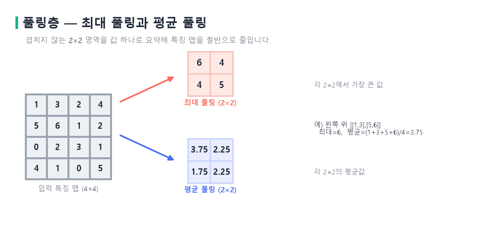{width=100% fig-alt="최대 풀링과 평균 풀링"}
:::
::: {.figcap}
**그림 5-7** 풀링층. $4\times4$ 특징 맵을 겹치지 않는 $2\times2$ 영역으로 나눠, 최대 풀링은 각 영역의 최댓값을(위), 평균 풀링은 평균을(아래) 남깁니다. 어느 쪽이든 특징 맵이 가로·세로 절반으로 줄어듭니다.
:::

풀링은 세 가지 일을 합니다. 특징 맵을 줄여 이후 연산량을 낮추고, 작은 위치 변화에 둔감한 **국소 이동 불변성**을 주며, 위층 뉴런이 원래 이미지에서 바라보는 영역을 넓힙니다. 최대 풀링은 영역 안 어디서 강한 반응이 나오든 그 최댓값만 남기므로, 특징이 조금 이동해도 결과가 크게 변하지 않습니다. 풀링에 학습 파라미터가 없다는 점도 중요합니다. 합성곱이 학습된 가중치로 특징을 뽑는다면, 풀링은 그렇게 뽑힌 특징을 파라미터 없이 요약·축소합니다. 최근에는 풀링 대신 스트라이드가 큰 합성곱으로 크기를 줄이거나, 마지막에 각 채널을 값 하나로 요약하는 **전역 평균 풀링**으로 완전연결층의 파라미터를 크게 덜어내기도 합니다.

## 합성곱의 차원: 1D·2D·3D {#sec-conv-dims}

지금까지 본 것은 커널이 가로·세로 두 축으로 움직이는 **2D 합성곱**으로, 이미지에 쓰입니다. 합성곱은 데이터의 차원에 따라 세 가지로 나뉩니다. **1D 합성곱**은 커널이 한 축(대개 시간)으로만 움직여 시계열·오디오·텍스트 같은 1차원 신호에 쓰이고, **3D 합성곱**은 커널이 가로·세로·깊이 세 축으로 움직여 동영상(시간 축)이나 CT·MRI 같은 볼륨 데이터에 쓰입니다. 핵심 원리—커널을 밀며 곱해 더한다—는 셋이 모두 같고, 커널이 움직이는 축의 수만 다릅니다.

::: {.figbody}
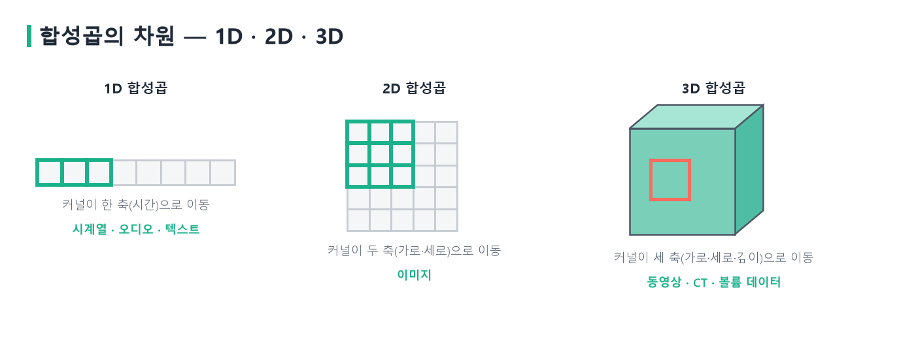{width=100% fig-alt="1D, 2D, 3D 합성곱"}
:::
::: {.figcap}
**그림 5-8** 합성곱의 차원. 1D는 커널이 한 축으로 움직이고(시계열·오디오), 2D는 두 축으로 움직이며(이미지), 3D는 세 축으로 움직입니다(동영상·CT). 움직이는 축의 수만 다를 뿐 계산 방식은 같습니다.
:::

## 수용 영역 {#sec-receptive}

합성곱과 풀링을 번갈아 쌓으면 특징은 점점 추상적으로, 공간 해상도는 점점 낮게 바뀝니다. 이 과정에서 위층 뉴런이 원래 입력에서 바라보는 영역, 곧 **수용 영역(receptive field)**이 넓어집니다. 첫 $3\times3$ 합성곱 뒤의 뉴런은 입력의 $3\times3$만 봅니다. 그 위에 $3\times3$ 합성곱을 한 번 더 쌓으면, 두 번째 층의 한 뉴런은 첫 층의 $3\times3$을 보고 그 $3\times3$이 다시 입력의 $5\times5$에 걸치므로, 결국 입력의 $5\times5$를 바라봅니다. 스트라이드 1인 $k\times k$ 합성곱을 $L$번 쌓으면 수용 영역은 $1+L(k-1)$로 커지며, $3\times3$을 두 번 쌓은 경우가 $1+2\times2=5$입니다.

::: {.figbody}
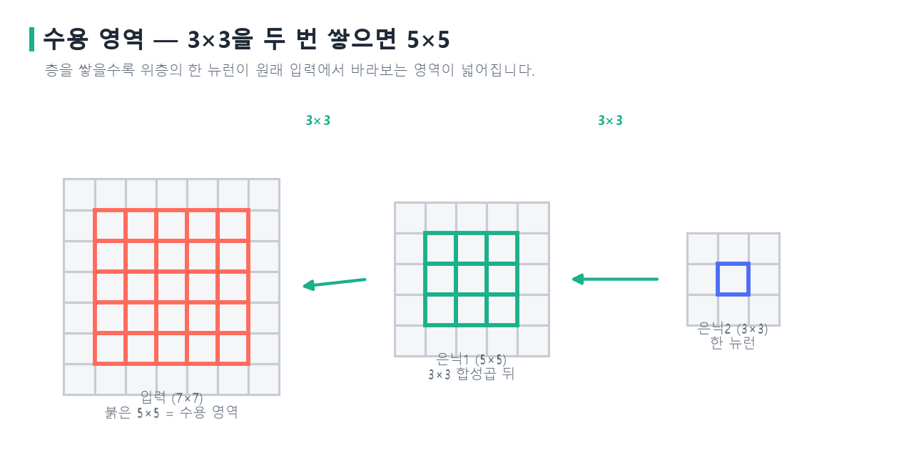{width=100% fig-alt="수용 영역이 넓어지는 원리"}
:::
::: {.figcap}
**그림 5-9** 수용 영역의 성장. 은닉2의 한 뉴런(파랑)은 은닉1의 $3\times3$(초록)에서 나오고, 그 $3\times3$은 다시 입력의 $5\times5$(빨강)에 대응합니다. $3\times3$ 합성곱을 두 번 쌓는 것만으로 한 뉴런이 입력의 $5\times5$를 봅니다.
:::

VGG가 큰 커널 대신 $3\times3$ 작은 커널을 깊게 쌓은 이유가 여기 있습니다. $3\times3$을 두 번 쌓으면 $5\times5$ 하나와 수용 영역이 같으면서도, 파라미터는 채널 한 쌍당 $2\times9=18$개로 $5\times5$의 $25$개보다 적고, 두 합성곱 사이에 비선형 활성화가 한 번 더 들어가 표현력이 커집니다. 작은 커널을 깊게 쌓는 편이 대체로 유리하다는 이 통찰은 이후 여러 구조의 설계 원칙이 되었습니다.

## 대표 CNN 아키텍처의 발전 {#sec-cnn-history}

CNN의 역사는 이미지 인식 성능의 도약사입니다.

```{mermaid}
timeline
    title 대표 CNN 아키텍처의 발전
    1998 : LeNet-5
    2012 : AlexNet (ImageNet 우승)
    2014 : VGG · GoogLeNet
    2015 : ResNet (잔차 연결)
    2017~ : DenseNet · MobileNet · EfficientNet
```

- **LeNet-5**: 손글씨 숫자 인식을 위한 초기 CNN으로, 합성곱과 풀링을 번갈아 쌓는 오늘날 구조의 원형을 제시했습니다.
- **AlexNet**: 2012년 ImageNet 대회에서 기존 방법을 큰 격차로 앞서며 딥러닝 시대를 열었습니다. 깊은 CNN, ReLU, 드롭아웃, GPU 학습을 결합해, 큰 데이터와 연산과 좋은 학습 기법이 만나면 깊은 CNN이 뛰어난 성능을 낸다는 것을 입증했습니다.
- **VGG**: $3\times3$ 작은 커널만 깊게 쌓아 단순하면서 강력한 구조를 보였습니다.
- **GoogLeNet(Inception)**: 여러 크기의 커널을 병렬로 두는 인셉션 모듈과 차원을 줄이는 $1\times1$ 합성곱으로 효율을 높였습니다.
- **ResNet**: 층이 깊어질수록 오히려 성능이 나빠지는 열화 문제를 잔차 연결로 풀었습니다.

층이 많으면 표현력이 늘 것 같지만, 너무 깊은 망은 학습 자체가 어려워 얕은 망보다 나빠지기도 합니다. ResNet은 층이 출력 전체를 새로 만드는 대신 입력에 더할 잔차 $F(x)$만 학습하도록 바꾸었습니다($y=F(x)+x$). 어떤 층이 필요 없으면 $F(x)$를 0으로 만들어 항등 사상을 쉽게 표현하고, 역전파 때 기울기가 덧셈 지름길을 따라 흘러 기울기 소실이 완화됩니다. 그 결과 100층이 넘는 망도 안정적으로 학습됩니다. 이 잔차 연결은 트랜스포머의 잔차 연결과 같은 원리이며, 오늘날 깊은 신경망의 필수 요소가 되었습니다.

::: {.figbody}
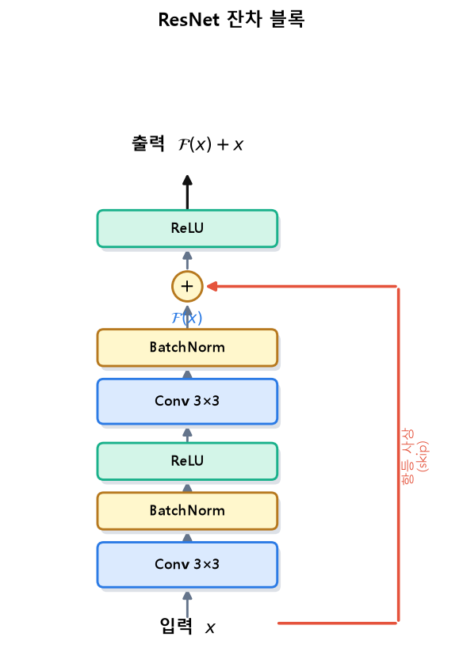{width=52% fig-alt="ResNet 잔차 블록 구조"}
:::
::: {.figcap}
**그림 5-10** ResNet 잔차 블록. 입력 $x$가 두 번의 변환 $\mathcal{F}(x)$를 거친 뒤, 변형 없이 우회한 입력 $x$(붉은 항등 사상)와 더해집니다($\mathcal{F}(x)+x$). 이 덧셈 지름길 덕분에 기울기가 잘 전달되어 아주 깊은 망도 학습됩니다.
:::

이후에도 발전이 이어졌습니다. **DenseNet**은 각 층을 이전 모든 층과 직접 연결해 특징 재사용을 극대화했고, **MobileNet**은 합성곱을 깊이별·점별로 분리해 모바일 환경에서도 돌아가도록 했습니다. **EfficientNet**은 깊이·너비·해상도를 균형 있게 함께 키우는 복합 스케일링으로 효율과 정확도를 함께 높였습니다. 최근에는 합성곱 대신 어텐션을 쓰는 비전 트랜스포머(ViT)도 대규모 데이터에서 CNN에 필적하는 성능을 보입니다.

## 이미지 분류 학습의 실무 {#sec-cnn-training}

CNN을 실제로 학습시킬 때는 몇 가지 기법이 성능을 좌우합니다. **배치 정규화**는 각 층의 입력을 미니배치 통계로 정규화해 학습을 가속하고 큰 학습률을 쓸 수 있게 합니다. 다만 학습과 추론에서 동작이 다르므로 평가 전에 반드시 `model.eval()`을 호출해야 합니다. ReLU를 쓰는 CNN에는 He 초기화가 잘 맞습니다.

**데이터 증강(data augmentation)**은 이미지 인식에서 특히 강력한 정규화입니다. 원본을 좌우 뒤집기, 무작위 자르기, 회전, 색상 변형 등으로 바꿔 학습 데이터를 인위적으로 늘립니다. 고양이 사진을 좌우로 뒤집어도 여전히 고양이이므로, 이런 변형을 학습에 넣으면 모델이 다양한 조건에 강인해져 과적합이 줄어듭니다. 다만 증강은 데이터의 의미를 보존하는 범위에서 신중히 적용합니다.

이미지는 대개 채널별로 표준화합니다. ImageNet으로 사전학습한 모델을 쓸 때는 그 데이터의 채널별 평균·표준편차로 정규화해야 사전학습된 특징이 제대로 동작합니다. 이 값이 맞지 않으면 입력 분포가 사전학습 때와 달라져 성능이 떨어지므로, 전이학습에서 자주 놓치는 실수입니다.

## 전이학습 {#sec-transfer-learning}

**전이학습(transfer learning)**은 한 과제에서 학습한 지식을 다른 과제에 재활용하는 기법입니다. 이미지 분야에서는 대개 ImageNet 같은 대규모 데이터로 사전학습한 CNN을 가져와 목표 과제에 맞게 재사용합니다. 근거는 CNN 특징의 계층적 성질에 있습니다. 앞쪽 층이 배우는 모서리·질감 같은 저수준 특징은 개를 분류하든 의료 영상을 판독하든 공통으로 유용합니다. 대규모 데이터로 학습한 표현을 재활용하면 우리 데이터가 적어도 좋은 성능을 냅니다. 처음부터 학습하면 수십만 장이 필요하지만, 전이학습은 수백~수천 장으로 충분한 경우가 많습니다.

학습의 관점에서 보면, 사전학습은 좋은 **초기값**을 제공합니다. 무작위 가중치에서 손실 지형을 헤매는 대신, 이미지의 일반적 구조를 이미 반영한 지점에서 출발하므로 더 적은 데이터로 더 빨리 더 좋은 지점에 이릅니다. 전략은 크게 둘입니다.

```{mermaid}
flowchart TB
    PRE["ImageNet 사전학습 CNN"] --> S1["특징 추출<br/>합성곱부 동결, 분류기만 학습"]
    PRE --> S2["미세조정<br/>일부/전체 층을 낮은 학습률로 재학습"]
```

- **특징 추출(feature extraction)**: 합성곱부를 동결해 고정된 특징 추출기로 쓰고, 마지막 분류기만 우리 클래스 수에 맞게 새로 학습합니다. 파이토치에서는 `requires_grad`를 꺼서 동결합니다. 빠르고, 데이터가 매우 적을 때 유리합니다.
- **미세조정(fine-tuning)**: 사전학습 가중치를 초기값으로 삼아 일부 또는 전체 층을 낮은 학습률로 다시 학습합니다. 낮은 학습률은 좋은 특징을 크게 망가뜨리지 않으면서 목표 과제에 맞게 조금씩 조정하기 위함입니다.

어떤 전략을 쓸지는 데이터 양과 원래 과제와의 유사성으로 정합니다.

| 데이터 양 | 과제 유사성 | 권장 전략 |
|-----------|-------------|-----------|
| 적음 | 높음 | 특징 추출(분류기만 학습) |
| 적음 | 낮음 | 앞쪽 층 특징 추출 + 신중한 미세조정 |
| 많음 | 높음 | 전체 미세조정 |
| 많음 | 낮음 | 전체 미세조정 또는 처음부터 학습 |

데이터가 적을수록 사전학습 특징을 많이 보존하고, 많을수록 과감하게 재학습하는 것이 원칙입니다. `torchvision.models`가 ImageNet 사전학습 가중치를 제공하므로 몇 줄로 강력한 모델을 불러와 두 전략을 그대로 구현할 수 있습니다.

```python
import torch, torch.nn as nn
from torchvision import models

# ImageNet 사전학습 ResNet-18 불러오기
model = models.resnet18(weights=models.ResNet18_Weights.DEFAULT)

# (전략 1) 특징 추출: 합성곱부를 동결해 특징 추출기로만 사용
for p in model.parameters():
    p.requires_grad = False

# 마지막 분류기를 내 클래스 수(예: 10개)에 맞게 교체 → 이 층만 학습된다
model.fc = nn.Linear(model.fc.in_features, 10)
optimizer = torch.optim.Adam(model.fc.parameters(), lr=1e-3)

# (전략 2) 미세조정: 위 동결을 생략하고 전체 파라미터를 낮은 학습률로 학습
# optimizer = torch.optim.Adam(model.parameters(), lr=1e-4)
```

::: {.keybox}
CNN이 이미지에 강한 이유는 세 귀납적 편향입니다 — [지역 연결·파라미터 공유·이동 등변성]{.key}. 여기에 풀링이 크기를 줄이고, 층을 쌓아 수용 영역을 넓히며, 저수준에서 고수준으로 특징을 계층적으로 학습합니다. 이렇게 학습한 특징은 일반적이라, 전이학습으로 데이터가 적은 새 과제에도 옮겨 쓸 수 있습니다.
:::

## 분류에서 탐지·분할로 {#sec-tasks-compare}

지금까지 다룬 이미지 분류는 이미지 전체에 라벨 하나를 답합니다. 그러나 현실의 시각 문제는 "무엇인가"를 넘어 "무엇이 어디에 있는가"를 묻습니다. 컴퓨터 비전의 대표 과제 셋은 출력의 세밀함으로 구분됩니다.

```{mermaid}
flowchart LR
    IMG["입력 이미지"] --> A["분류<br/>이미지 → 클래스 1개"]
    IMG --> B["객체탐지<br/>물체마다 박스 + 클래스"]
    IMG --> C["의미 분할<br/>픽셀마다 클래스"]
```

- **이미지 분류**: 이미지 전체에 클래스 하나를 출력합니다. 위치는 다루지 않습니다.
- **객체탐지**: 각 물체에 **경계 상자(bounding box)**와 클래스를 함께 냅니다. 여러 물체의 종류와 위치를 동시에 찾습니다.
- **이미지 분할**: 픽셀마다 클래스를 부여합니다. 같은 종류를 하나로 묶는 **의미 분할**과, 개체까지 구분하는 **인스턴스 분할**로 나뉩니다.

셋 모두 CNN이 추출한 특징 위에서 동작합니다. ImageNet으로 사전학습한 분류 모델을 **백본(backbone)**으로 삼아 그 위에 과제별 머리를 붙이는 전이학습 구조가 공통으로 쓰입니다. 차이는 출력의 공간적 세밀함이며, 세밀할수록 더 정교한 구조와 상세한 라벨이 필요합니다. 특히 객체탐지는 분류(무엇인가)와 위치 회귀(어디인가)를 동시에 푸는 문제라, 분류의 확장으로 볼 수 있습니다.

## 객체탐지의 개념과 평가 {#sec-detection-concept}

객체탐지는 물체의 위치를 사각형 상자로 찾는 **위치 추정**과 그 안 물체가 무엇인지 맞히는 **분류**를 동시에 수행합니다. 경계 상자는 보통 중심 좌표와 너비·높이 $(x, y, w, h)$로 표현합니다. 객체탐지가 분류보다 어려운 이유는 세 가지입니다. 한 이미지에 물체가 몇 개인지 미리 알 수 없어 출력 개수가 가변적이고, 물체의 크기 편차가 크며, 물체가 서로 가리거나 겹치면 구분이 어렵습니다.

이를 다루는 핵심 도구가 **앵커 상자(anchor box)**입니다. 미리 여러 크기와 비율의 기준 상자를 정해 두고, 모델이 각 기준 상자를 얼마나 이동·확대해야 물체에 맞는지를 예측합니다. 상자를 무에서 예측하는 대신 기준으로부터의 보정값을 예측하므로 학습이 안정됩니다. 앵커는 Faster R-CNN, SSD, YOLO의 바탕이 되었습니다.

예측 상자가 정답과 얼마나 겹치는지는 **IoU(Intersection over Union)**로 잽니다. 교집합 넓이를 합집합 넓이로 나눈 값으로, 0에서 1 사이이며 1에 가까울수록 정확합니다. 보통 IoU가 0.5 이상이면 올바른 검출로 봅니다.

$$
\text{IoU} = \frac{\text{Area}(\text{예측} \cap \text{정답})}{\text{Area}(\text{예측} \cup \text{정답})}.
$$

::: {.figbody}
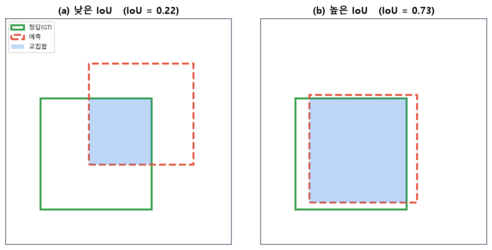{width=80% fig-alt="IoU 시각화"}
:::
::: {.figcap}
**그림 5-11** IoU. 정답 상자(초록)와 예측 상자(빨강 점선)의 교집합(파랑 음영)을 합집합으로 나눕니다. 어긋나면 IoU가 낮고, 잘 겹치면 1에 가까워집니다.
:::

검출기는 한 물체 주위에 비슷한 상자를 여러 개 예측하기 쉽습니다. 이를 정리하는 것이 **비최대 억제(Non-Maximum Suppression, NMS)**입니다. 같은 물체로 판단되는(IoU가 높은) 상자들 중 확신도가 가장 높은 하나만 남기고 나머지를 제거합니다. 거의 모든 검출기가 마지막 후처리로 NMS를 씁니다.

::: {.figbody}
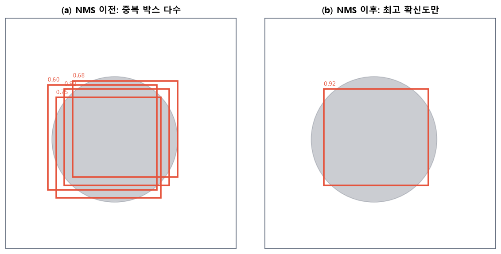{width=80% fig-alt="NMS 전후"}
:::
::: {.figcap}
**그림 5-12** 비최대 억제(NMS). (a) 검출기는 한 물체 주위에 겹치는 상자를 여러 개 예측합니다. (b) NMS는 많이 겹치는 상자 중 확신도가 가장 높은 하나만 남겨, 물체마다 상자 하나만 출력하도록 정리합니다.
:::

검출 성능은 흔히 **mAP(mean Average Precision)**로 측정합니다. 각 클래스의 정밀도-재현율 곡선 아래 면적(AP)을 구해 모든 클래스에 대해 평균한 값입니다. PASCAL VOC나 MS COCO 같은 표준 데이터셋과 mAP가 검출 연구의 공통 척도가 되어 왔습니다.

## 객체탐지의 두 갈래 {#sec-detection-taxonomy}

딥러닝 검출기는 접근 방식에 따라 두 갈래로 나뉩니다. **2단계 검출기**는 먼저 물체가 있을 법한 후보 영역을 뽑고 그 후보를 분류합니다. 정확하지만 느립니다. **1단계 검출기**는 후보 추출 없이 이미지에서 한 번에 상자와 클래스를 예측해 빠릅니다. "후보를 먼저 좁혀 정밀하게 볼 것인가, 전체를 한 번에 훑을 것인가"의 차이입니다.

::: {.figbody}
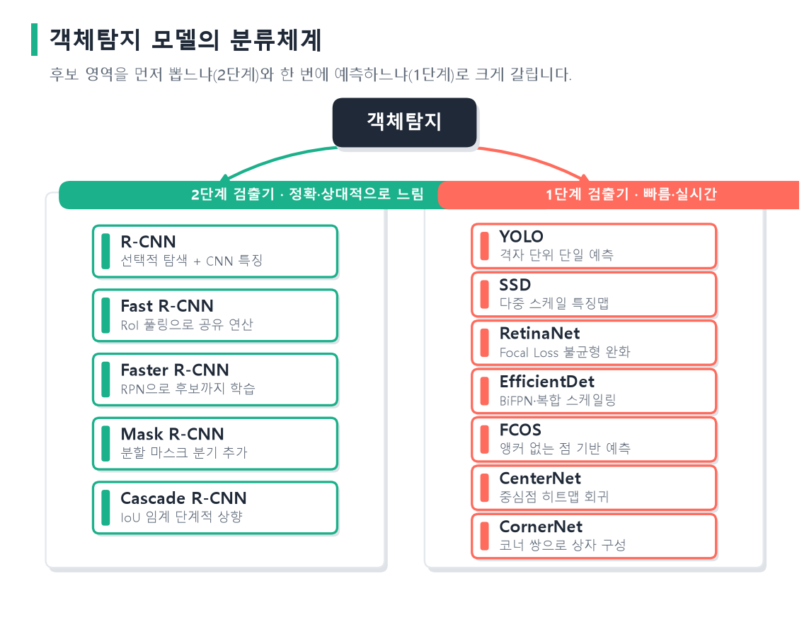{width=95% fig-alt="객체탐지 모델 분류체계"}
:::
::: {.figcap}
**그림 5-13** 객체탐지 모델의 분류체계. 후보를 먼저 뽑는 **2단계 검출기**(R-CNN 계열)는 정확하지만 상대적으로 느리고, 한 번에 예측하는 **1단계 검출기**(YOLO·SSD 계열)는 빠르고 실시간에 적합합니다.
:::

### 2단계 검출기: R-CNN 계열

**R-CNN**은 딥러닝을 검출에 본격 도입한 모델입니다. 선택적 탐색으로 후보 영역 약 2,000개를 뽑고, 각 후보를 잘라 CNN에 넣어 특징을 뽑은 뒤, SVM으로 분류하고 회귀기로 상자를 보정합니다. 획기적인 정확도를 보였지만 후보마다 CNN을 따로 돌려 매우 느렸고, 특징 추출·분류·회귀가 분리되어 학습이 복잡했습니다. 이후 발전은 이 비효율을 하나씩 제거하는 과정입니다.

**Fast R-CNN**은 후보마다 CNN을 돌리는 대신 이미지 전체에 CNN을 한 번만 적용해 특징 맵을 만든 뒤, 각 후보에 해당하는 부분을 그 특징 맵에서 잘라 씁니다. 이때 크기가 제각각인 후보를 고정 크기 특징으로 바꾸는 **RoI 풀링**을 도입하고, 분류와 상자 회귀를 하나의 신경망에서 함께 학습했습니다. 그러나 후보를 뽑는 선택적 탐색이 신경망 밖의 느린 단계로 남았습니다.

**Faster R-CNN**은 이 병목마저 신경망 안으로 끌어들였습니다. 특징 맵 위에서 물체 후보를 직접 예측하는 **영역 제안 네트워크(RPN)**를 도입해, 앵커 기반으로 물체 확률과 상자 보정값을 예측합니다. RPN과 검출 머리가 특징 맵을 공유하므로 후보 제안부터 최종 검출까지 하나의 신경망으로 끝에서 끝까지 학습됩니다. 이로써 준실시간에 가까운 속도와 높은 정확도를 얻어 2단계 검출기의 표준이 되었습니다.

```{mermaid}
flowchart LR
    I["입력 이미지"] --> B["백본 CNN<br/>특징 맵"]
    B --> RPN["RPN<br/>앵커 기반 후보 제안"]
    B --> ROI["RoI 풀링"]
    RPN --> ROI
    ROI --> HEAD["분류 + 상자 회귀"]
```

여기서 두 방향으로 확장됩니다. **Mask R-CNN**은 검출 머리와 나란히 픽셀 단위 마스크를 예측하는 가지를 더해 인스턴스 분할까지 수행하며, 좌표 반올림 문제를 없앤 RoIAlign으로 정밀도를 높였습니다. **Cascade R-CNN**은 점점 높은 IoU 기준으로 학습한 검출기를 이어 붙여 상자를 단계적으로 정밀하게 다듬습니다. 여러 크기의 물체를 위해 얕은 층의 고해상도 특징과 깊은 층의 의미 특징을 결합하는 **특징 피라미드 네트워크(FPN)**가 함께 쓰이기도 합니다.

### 1단계 검출기

1단계 검출기는 후보 제안 없이 한 번의 순전파로 상자와 클래스를 직접 예측합니다. **YOLO(You Only Look Once)**는 이미지를 $S\times S$ 격자로 나누고, 각 칸이 그 칸을 중심으로 하는 물체의 상자·확신도·클래스 확률을 예측합니다. 클래스가 $C$개일 때 전체 출력은 $S\times S\times(B\times 5 + C)$ 크기의 텐서 하나이며, 여기서 $5$는 상자 좌표 넷과 확신도 하나입니다. 검출을 여러 단계가 아니라 하나의 회귀 문제로 통합한 이 발상이 속도와 단순함의 원천입니다. 전체 이미지를 한꺼번에 보므로 배경을 물체로 오인하는 실수도 적습니다. 다만 초기 버전은 작은 물체가 밀집한 경우에 약했고, 이후 여러 세대를 거치며 앵커와 다중 스케일 예측을 도입해 실시간 검출의 대표 계열이 되었습니다. 앵커·배치 정규화를 도입한 YOLOv2, 다중 스케일 예측의 YOLOv3, 학습 기법을 결합한 YOLOv4에 이어, 파이토치로 재구현되어 쓰기 쉬워진 YOLOv5, 앵커 프리 구조를 채택한 **YOLOv8**, 그리고 최신 YOLO11까지 발전이 이어졌습니다.

오늘날 YOLO는 실전에서 가장 널리 쓰이는 검출기입니다. 특히 `ultralytics` 패키지의 YOLOv8은 사전학습 모델을 몇 줄로 불러와 검출하고, 자신의 데이터로 미세조정까지 할 수 있어 전이학습의 대표적 실전 사례입니다.

```python
# 설치: pip install ultralytics
from ultralytics import YOLO

# 1) COCO(80개 클래스)로 사전학습된 YOLOv8 불러오기
model = YOLO("yolov8n.pt")        # n → s → m → l → x 순으로 크고 정확

# 2) 추론: 이미지에서 물체를 검출
results = model("dog.jpg")
results[0].show()                 # 상자·클래스·확신도를 그려 표시

# 3) 전이학습: 내 데이터셋(data.yaml)으로 미세조정
model.train(data="data.yaml", epochs=50, imgsz=640)
```

사전학습된 `yolov8n.pt`는 이미 일반 물체를 잘 검출하므로, 새 과제에서는 소수의 라벨만으로 `train`을 몇 에폭 돌려 미세조정하면 됩니다. 이것이 검출에서의 전이학습입니다.

초기 YOLO와 견주면 YOLOv8의 구조에는 몇 가지 중요한 변화가 있습니다. 첫째, **앵커 프리(anchor-free)** 방식입니다. 미리 정한 앵커 상자 없이 각 위치에서 물체 중심 여부와 상자 네 변까지의 거리를 직접 예측하므로, 앵커의 크기·비율을 사람이 조정하는 부담이 사라졌습니다. 둘째, **분리형 헤드(decoupled head)**입니다. "무엇인가"(분류)와 "어디인가"(상자 회귀)를 서로 다른 가지로 예측해 두 목표가 서로 간섭하지 않게 했습니다. 셋째, **백본–넥–헤드** 구조입니다. CSP 계열 백본(C2f 블록)이 특징을 뽑고, FPN·PAN 계열의 넥이 여러 해상도의 특징을 섞어 크고 작은 물체를 함께 다루며, 헤드가 여러 스케일에서 상자와 클래스를 예측합니다. 손실은 분류에 이진 교차 엔트로피를, 상자에 CIoU와 분포 초점 손실(DFL)을 쓰고, 마지막에 NMS로 중복 상자를 정리합니다. 이 설계 덕분에 YOLOv8은 같은 틀로 검출뿐 아니라 분할·자세 추정까지 처리하며, 속도와 정확도의 균형이 좋아 실전 표준으로 자리 잡았습니다.

**SSD**는 여러 해상도의 특징 맵에서 동시에 검출합니다. 큰 특징 맵은 작은 물체를, 작은 특징 맵은 큰 물체를 담당하게 해 다양한 크기를 한 번에 잡습니다. **RetinaNet**은 1단계가 오랫동안 정확도에서 뒤진 원인이 **클래스 불균형**임을 밝혔습니다. 이미지 대부분이 배경이라 쉬운 배경 예제가 손실을 지배해 어려운 물체 학습을 방해한 것입니다. 이를 풀려고 잘 맞힌 쉬운 예제의 손실을 줄이는 **초점 손실(focal loss)**을 제안했습니다.

$$
\text{FL}(p_t) = -(1-p_t)^{\gamma}\,\log(p_t).
$$

$p_t$는 정답 클래스의 예측 확률이고 $\gamma$는 조절 계수입니다. $p_t$가 1에 가까운(이미 잘 맞힌) 예제는 $(1-p_t)^\gamma$가 작아져 손실 기여가 줄고, 어려운 예제에 학습이 집중됩니다. $\gamma=2$이고 어떤 배경을 0.9의 확률로 맞혔다면 그 손실은 일반 교차 엔트로피의 100분의 1 수준으로 줄어듭니다. 덕분에 RetinaNet은 1단계의 속도를 유지하면서 2단계에 필적하는 정확도를 얻었습니다.

한편 앵커의 크기·비율을 사람이 조정해야 하는 부담을 없앤 **앵커 프리(anchor-free)** 검출기도 등장했습니다. FCOS는 각 픽셀에서 물체 안 여부와 상자 네 변까지의 거리를 직접 예측하고, CenterNet은 물체를 중심점 하나로 표현합니다. 물체를 상자가 아니라 점으로 보는 이 발상은 구조를 단순화하고 검출을 바라보는 새로운 관점을 열었습니다.

| 구분 | 2단계 검출기 | 1단계 검출기 |
|------|--------------|--------------|
| 절차 | 후보 제안 → 분류 | 한 번에 직접 예측 |
| 대표 | Faster/Mask R-CNN | YOLO, SSD, RetinaNet |
| 속도 | 상대적으로 느림 | 빠름(실시간) |
| 정확도 | 전통적으로 높음 | 초점 손실 등으로 근접 |

정확도가 중요하면 2단계를, 속도가 중요하면 1단계를 택하되, 최근에는 1단계의 정확도가 크게 올라 경계가 흐려지고 있습니다.

## 이미지 분할과 인코더-디코더 {#sec-segmentation}

**이미지 분할**은 픽셀마다 클래스를 부여하는 과제입니다. 입력과 같은 크기의 라벨 지도를 출력해야 하므로, 특징을 압축한 뒤 다시 원래 해상도로 복원하는 구조가 필요합니다. 분류 CNN은 풀링을 거치며 해상도를 계속 낮춰 "무엇인가"는 판단하지만 "어디인가"를 픽셀 단위로 답하기엔 부족합니다. 그래서 분할 모델은 낮아진 해상도를 다시 키우는 **업샘플링**을 둡니다. 업샘플링에는 보간법이나, 합성곱의 역방향으로 특징 맵을 확장하는 학습 가능한 **전치 합성곱**이 쓰입니다.

분할의 표준 틀은 **인코더-디코더(encoder-decoder)** 구조입니다. 인코더는 합성곱과 풀링으로 이미지를 작은 특징 맵으로 압축하며 "무엇이 있는가"를 추출하고, 디코더는 업샘플링으로 특징 맵을 키워 "어디에 있는가"를 픽셀 단위로 복원합니다.

```{mermaid}
flowchart LR
    I["입력 이미지"] --> E["인코더<br/>다운샘플링·의미 추출"]
    E --> Z["압축된 특징"]
    Z --> D["디코더<br/>업샘플링·해상도 복원"]
    D --> O["픽셀별 클래스 지도"]
```

이 발상을 처음 픽셀 단위 분할에 적용한 것이 **완전 합성곱 네트워크(FCN)**입니다. FCN은 분류 CNN의 완전연결층을 합성곱으로 바꿔 임의 크기 입력에 픽셀별 예측을 내놓았습니다. 확장 합성곱으로 넓은 문맥을 보는 DeepLab 등이 이 계보를 이었습니다.

**U-Net**은 인코더-디코더에 **스킵 연결(skip connection)**을 더한 분할 모델입니다. 이름은 인코더와 디코더가 대칭을 이뤄 U자 모양을 그리는 데서 왔습니다.

::: {.figbody}
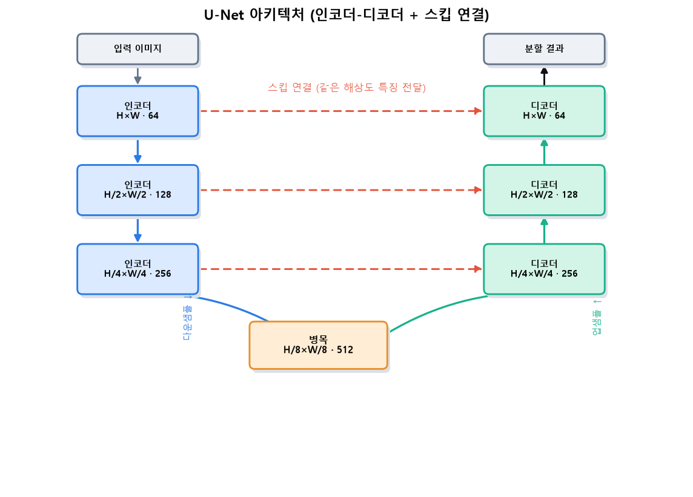{width=96% fig-alt="U-Net 아키텍처"}
:::
::: {.figcap}
**그림 5-14** U-Net. 왼쪽 인코더는 다운샘플링으로 의미를 추출하고, 오른쪽 디코더는 업샘플링으로 해상도를 복원합니다. 핵심은 붉은 **스킵 연결**로, 같은 해상도의 인코더 특징을 디코더에 직접 이어 붙여 다운샘플링에서 잃은 세밀한 위치 정보를 되살립니다.
:::

U-Net은 두 경로로 이루어집니다. **수축 경로(인코더)**는 $3\times3$ 합성곱 두 번과 ReLU 뒤에 $2\times2$ 최대 풀링을 반복하며, 해상도를 절반씩 줄이고 채널 수를 두 배씩 늘려 "무엇이 있는가"를 압축합니다. **확장 경로(디코더)**는 반대로 $2\times2$ 업샘플링(전치 합성곱)으로 해상도를 두 배 키우고 채널을 절반으로 줄인 뒤, 같은 해상도의 인코더 특징을 **이어 붙이고(concatenate)** 다시 $3\times3$ 합성곱 두 번을 적용합니다. 마지막 $1\times1$ 합성곱이 각 픽셀을 클래스 수만큼의 점수로 바꿉니다. 인코더와 디코더가 대칭을 이루어 전체가 U자를 그립니다.

U-Net의 핵심은 이 확장 경로에서 이뤄지는 **스킵 연결**입니다. 인코더에서 다운샘플링하며 잃는 세밀한 위치 정보를, 같은 해상도의 인코더 특징을 디코더에 직접 이어 붙여 되살립니다. 디코더는 깊은 층의 의미 정보와 얕은 층의 경계 정보를 함께 써서 경계가 정확한 분할을 만듭니다. 스킵 연결이 없으면 압축 과정에서 사라진 미세한 경계를 복원하기 어려워 분할 경계가 뭉개집니다. 이 덕분에 U-Net은 적은 데이터로도 정밀한 분할을 해내어, 데이터가 귀한 의료 영상에서 표준처럼 자리 잡았습니다.

## 최신 동향: 트랜스포머 기반 검출 {#sec-modern}

앞의 검출기들은 앵커 설계, NMS, 후보 제안처럼 사람이 정한 요소를 많이 포함했고, 이런 부분이 성능을 좌우하면서도 조정이 까다로웠습니다. **DETR(Detection Transformer)**는 이런 수작업 요소를 없애고 검출을 **집합 예측(set prediction)** 문제로 다룹니다. CNN 백본이 뽑은 특징에 트랜스포머 인코더-디코더를 적용하고, 학습된 질의(object query)들이 각각 하나의 물체를 직접 예측합니다. 예측과 정답을 일대일로 짝짓는 이분 매칭 손실로 학습하므로, 한 물체에 여러 상자가 나오지 않아 NMS가 필요 없습니다. DETR는 복잡했던 검출 파이프라인을 하나의 신경망으로 단순화했습니다.

지금까지의 흐름을 되짚으면 하나의 방향이 보입니다. 검출에서 사람이 손으로 설계하던 부분—특징, 후보 제안, 앵커, 중복 제거—이 하나씩 학습 가능한 신경망 안으로 흡수되며 점점 단순하고 강력해져 왔습니다. 그 바탕에는 언제나 CNN이 학습한 시각 특징이 있으며, 검출과 분할은 그 특징으로 "무엇이 어디에 있는가"를 답하는 문제였습니다.

::: {.keybox}
**핵심.** 객체탐지는 [위치(박스) + 분류]{.key}를 동시에 푸는 문제이며 IoU·NMS·mAP로 평가합니다. **2단계 검출기**(R-CNN 계열)는 후보를 먼저 뽑아 정밀하게, **1단계 검출기**(YOLO·SSD·RetinaNet)는 한 번에 예측해 빠르게 처리합니다. **이미지 분할**은 인코더-디코더로 압축 후 복원하며, U-Net의 스킵 연결이 경계를 되살립니다.
:::

## 핵심 정리 {#sec-ch5-summary}

- 완전연결망은 파라미터가 폭발하고 공간 구조를 무시하지만, CNN은 지역 연결·파라미터 공유·이동 등변성으로 적은 파라미터로 이미지를 다룹니다.
- 합성곱은 특징을 추출하고 풀링은 요약·축소하며, 층을 쌓을수록 수용 영역이 넓어져 저수준에서 고수준으로 특징이 계층적으로 조직됩니다.
- ResNet의 잔차 연결은 아주 깊은 망의 학습을 가능하게 했고, 오늘날 깊은 신경망의 필수 요소입니다.
- 전이학습은 사전학습 특징을 좋은 초기값으로 삼아, 적은 데이터로도 높은 성능을 냅니다. 데이터 양과 과제 유사성으로 특징 추출·미세조정을 선택합니다.
- 객체탐지는 위치와 분류를 동시에 풀며, IoU·NMS·mAP로 평가합니다. 2단계는 정밀하고 1단계는 빠릅니다.
- 이미지 분할은 인코더-디코더로 압축 후 복원하며, U-Net의 스킵 연결이 세밀한 경계를 되살립니다.
- 검출·분할의 발전은 사람이 설계하던 요소가 학습 가능한 신경망으로 흡수되어 온 과정이며, DETR는 그 연장선에서 파이프라인을 단순화했습니다.
