# 1. 이론 {#sec-ch6}

## 컴퓨터 비전의 과제와 CNN 특징 {#sec-cv-concept}

**컴퓨터 비전(computer vision)**은 컴퓨터가 이미지나 영상에서 의미 있는 정보를 읽어 내도록 하는 인공지능 분야입니다. 컴퓨터에게 이미지는 숫자의 격자일 뿐이므로, 낮은 수준의 픽셀 값에서 점점 추상적인 **표현(representation)**을 단계적으로 만들어 내는 것이 핵심입니다. 같은 물체라도 각도·조명·크기·가려짐에 따라 픽셀 값이 완전히 달라지기 때문에, 이런 변화에 강인한 표현을 얻는 일이 컴퓨터 비전의 근본 과제입니다.

초기에는 사람이 HOG나 비올라-존스 검출기처럼 특징을 직접 설계했지만, 조명·자세·배경이 바뀌면 성능이 크게 떨어졌습니다. 5장에서 본 합성곱 신경망(CNN)은 **특징을 데이터로부터 학습**합니다. 앞쪽 층은 모서리·색 같은 저수준 특징을, 뒤쪽 층은 눈·바퀴 같은 고수준 특징을 계층적으로 만듭니다. 이 장에서 다루는 전이학습, 객체탐지, 분할은 모두 이 CNN 특징 위에서 동작합니다.

이미지를 이해하는 과제는 출력의 세밀함에 따라 구분됩니다.

::: {.figbody}
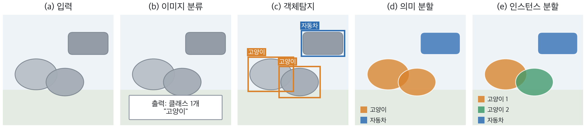{width=100% fig-alt="분류, 객체탐지, 의미 분할, 인스턴스 분할 비교"}
:::
::: {.figcap}
**그림 6-1** 이미지 이해 과제의 비교(모식도). (a) 입력. (b) 이미지 분류는 이미지 전체에 클래스 하나를 부여합니다. (c) 객체탐지는 물체마다 경계 상자와 클래스를 출력합니다. (d) 의미 분할은 픽셀마다 클래스를 부여하되 같은 종류의 개체를 구분하지 않습니다. (e) 인스턴스 분할은 같은 종류라도 개체를 구분합니다.
:::

- **이미지 분류**: 이미지당 클래스 1개를 출력합니다. 위치는 다루지 않습니다.
- **객체탐지**: 물체마다 **경계 상자(bounding box)**와 클래스를 출력합니다. 분류에 위치 회귀가 더해진 문제입니다.
- **이미지 분할**: 픽셀마다 클래스를 부여합니다. 개체를 구분하지 않으면 **의미 분할**, 구분하면 **인스턴스 분할**입니다.

출력이 세밀해질수록 더 정교한 구조와 더 상세한 라벨이 필요합니다. 이 장은 세 가지 핵심 주제를 순서대로 다룹니다. 먼저 모든 과제의 출발점인 **전이학습**, 다음으로 객체탐지의 대표 모델인 **YOLOv8**, 마지막으로 분할의 대표 모델인 **U-Net**입니다. 각 주제는 개념을 설명한 뒤 PyTorch 코드로 구현합니다.

## 전이학습 {#sec-transfer-learning}

### 개념

**전이학습(transfer learning)**은 한 과제에서 학습한 지식을 다른 과제에 재활용하는 기법입니다. 이미지 분야에서는 ImageNet(약 120만 장, 1,000개 클래스) 같은 대규모 데이터로 **사전학습(pretraining)**한 CNN을 가져와 목표 과제에 맞게 재사용합니다.

근거는 CNN 특징의 계층성입니다. 앞쪽 층이 배우는 모서리·질감 같은 저수준 특징은 개를 분류하든 의료 영상을 판독하든 공통으로 유용합니다. 뒤쪽 층의 고수준 특징은 원래 과제에 더 특화되어 있습니다. 따라서 앞쪽은 그대로 쓰고, 뒤쪽만 새 과제에 맞게 바꾸면 됩니다. 처음부터 학습하면 수십만 장이 필요하지만, 전이학습은 수백~수천 장으로도 충분한 경우가 많습니다. 학습의 관점에서는 사전학습이 손실 지형에서 **좋은 초기값**을 제공하는 셈입니다.

::: {.figbody}
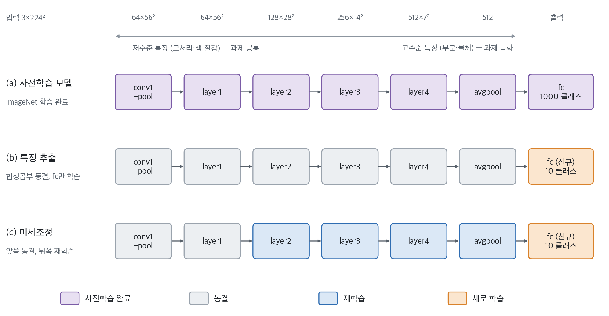{width=100% fig-alt="사전학습, 특징 추출, 미세조정 비교"}
:::
::: {.figcap}
**그림 6-2** ResNet-18(입력 3×224×224)을 이용한 전이학습 전략. 색은 층의 상태를 뜻합니다: 보라(사전학습 완료), 회색(동결), 파랑(재학습), 주황(새로 학습). (a) ImageNet 1,000개 클래스로 사전학습을 마친 원래 모델로, 이 단계에서는 더 학습하지 않습니다. (b) **특징 추출**: 합성곱부를 동결하고 새로 초기화한 `fc`만 학습합니다. (c) **미세조정**: 앞쪽 층은 동결하고 뒤쪽 층을 낮은 학습률로 재학습하며 `fc`는 새로 학습합니다. 각 상자 위의 수치는 출력 텐서의 채널×공간 크기입니다.
:::

그림 6-2의 색은 층이 처음에 어떤 값을 가졌고 학습 중에 그 값이 바뀌는지에 따라 구분한 것이며, 용어는 다음과 같이 정의합니다.

| 용어 | 정의 | 시작 값 | 학습 중 갱신 | PyTorch |
|------|------|---------|--------------|---------|
| **사전학습**(pretraining) | 대규모 데이터(ImageNet)로 미리 학습을 마친 상태. 그 결과로 얻은 값을 **사전학습 가중치**라 부릅니다 | 이미 학습된 값 | (학습 완료) | `weights=...DEFAULT` |
| **동결**(freeze) | 사전학습 가중치를 **그대로 유지**하고 갱신하지 않습니다. 순전파에는 계속 사용합니다 | 사전학습 가중치 | 하지 않음 | `requires_grad = False` |
| **재학습**(미세조정) | 사전학습 가중치에서 출발해 **낮은 학습률**로 갱신합니다 | 사전학습 가중치 | 함 (낮은 학습률) | `requires_grad = True`, `lr=1e-4` |
| **새로 학습** | **무작위로 초기화**한 새 층을 처음부터 학습합니다. 사전학습 값이 없습니다 | 무작위 값 | 함 | `nn.Linear(512, 10)` |

- **동결은 값을 지우는 것이 아닙니다.** 값은 그대로 두고 갱신만 막으며, 얼린 층도 순전파에서는 입력을 변환하는 데 계속 쓰입니다.
- **새로 학습하는 층이 필요한 이유**: 사전학습 모델의 `fc`는 1,000개 클래스를 출력하도록 학습되어 있어 10개 클래스 문제에는 재사용할 수 없습니다. 클래스 수가 달라지는 마지막 층만 새로 만들어 처음부터 학습합니다.
- **재학습과 새로 학습의 차이**: 둘 다 갱신되지만, 재학습은 이미 좋은 값에서 출발하므로 작게 움직이고(낮은 학습률), 새로 학습은 무작위에서 출발하므로 크게 움직입니다. 그래서 층마다 학습률을 다르게 줍니다(코드 6-3).

전략은 크게 두 가지입니다.

- **특징 추출(feature extraction)**: 합성곱부를 동결해 고정된 특징 추출기로 쓰고, 마지막 분류기만 새 클래스 수에 맞게 학습합니다. 학습할 파라미터가 적어 빠르고, 데이터가 매우 적을 때 안전합니다.
- **미세조정(fine-tuning)**: 사전학습 가중치를 초기값으로 삼아 일부 또는 전체 층을 **낮은 학습률**로 다시 학습합니다. 낮은 학습률은 좋은 특징을 망가뜨리지 않으면서 목표 과제에 맞게 조금씩 조정하기 위함입니다.

어떤 전략을 쓸지는 데이터 양과 원래 과제와의 유사성으로 정합니다.

| 데이터 양 | 과제 유사성 | 권장 전략 |
|-----------|-------------|-----------|
| 적음 | 높음 | 특징 추출(분류기만 학습) |
| 적음 | 낮음 | 앞쪽 층 특징 추출 + 신중한 미세조정 |
| 많음 | 높음 | 전체 미세조정 |
| 많음 | 낮음 | 전체 미세조정 또는 처음부터 학습 |

데이터가 적을수록 사전학습 특징을 많이 보존하고, 많을수록 과감하게 재학습하는 것이 원칙입니다.

### PyTorch 구현: 특징 추출

`torchvision.models`는 ImageNet 사전학습 가중치를 제공합니다. 사전학습 모델을 쓸 때는 **해당 가중치가 학습될 때와 같은 방식으로 입력을 전처리**해야 합니다. 채널별 평균·표준편차 정규화가 대표적입니다. 가중치 객체의 `transforms()`가 이 전처리를 그대로 돌려줍니다.

**코드 6-1** 사전학습 ResNet-18을 불러와 특징 추출 모델로 바꿉니다.

```python
import torch
import torch.nn as nn
from torchvision import models

def build_feature_extractor(num_classes):
    weights = models.ResNet18_Weights.DEFAULT        # ImageNet 사전학습 가중치
    model = models.resnet18(weights=weights)

    for p in model.parameters():                     # 1) 모든 층 동결
        p.requires_grad = False

    # 2) 마지막 분류기를 새 클래스 수로 교체 (새로 만든 층은 requires_grad=True)
    model.fc = nn.Linear(model.fc.in_features, num_classes)
    return model, weights.transforms()               # 가중치에 맞는 전처리 함께 반환

model, preprocess = build_feature_extractor(num_classes=10)

total = sum(p.numel() for p in model.parameters())
trainable = sum(p.numel() for p in model.parameters() if p.requires_grad)
print(f"전체 {total:,}개 중 학습 대상 {trainable:,}개")
```

```
전체 11,181,642개 중 학습 대상 5,130개
```

**코드 읽는 법**

- `weights=...DEFAULT`는 사전학습 가중치를 가리키고, 같은 객체의 `transforms()`가 그 가중치가 학습될 때의 전처리(크기 조정·정규화)를 돌려줍니다.
- `requires_grad = False`는 그 파라미터의 기울기를 계산하지 않게 합니다. 역전파에서 빠지므로 메모리와 시간이 줄고, 옵티마이저가 건드려도 값이 바뀌지 않습니다.
- `model.fc = nn.Linear(...)`로 교체한 층은 새로 만들어졌기 때문에 기본값이 `requires_grad=True`입니다. 그래서 "전부 동결한 뒤 `fc`만 교체"하면 `fc`만 학습됩니다. `in_features`(512)를 읽어 쓰면 입력 크기를 직접 적지 않아도 됩니다.
- 마지막 두 줄은 검증 습관입니다. 학습 대상이 정말 `fc`뿐인지 숫자로 확인합니다.
- **자주 하는 실수**: `fc`를 먼저 교체한 뒤 "모든 파라미터 동결"을 하면 `fc`까지 동결되어 아무것도 학습되지 않습니다. 순서가 중요합니다.


학습 대상은 `fc`의 가중치 512×10과 편향 10을 합한 5,130개뿐입니다. 동결한 층은 기울기를 계산하지 않으므로 메모리와 시간이 절약됩니다. 옵티마이저에는 학습 대상만 넘깁니다.

배치 정규화(BN)가 있는 모델에서는 한 가지 주의가 필요합니다. `requires_grad=False`는 가중치의 갱신만 막을 뿐, `model.train()` 상태에서는 BN이 입력 배치의 통계로 **이동 평균(running mean/var)을 계속 갱신**합니다. 특징 추출 용도라면 사전학습 통계를 그대로 유지하도록 BN을 평가 모드로 두는 것이 안전합니다.

**코드 6-2** 동결한 BN을 평가 모드로 유지하는 학습 루프입니다.

```python
def set_train_mode(model):
    model.train()
    for m in model.modules():
        if isinstance(m, nn.BatchNorm2d):
            m.eval()                                 # 사전학습 통계 유지

optimizer = torch.optim.Adam(
    [p for p in model.parameters() if p.requires_grad], lr=1e-3)
criterion = nn.CrossEntropyLoss()

def train_one_epoch(model, loader, device):
    set_train_mode(model)
    for x, y in loader:
        x, y = x.to(device), y.to(device)
        loss = criterion(model(x), y)
        optimizer.zero_grad()
        loss.backward()
        optimizer.step()
```

**코드 읽는 법**

- `model.train()`은 하위 모듈 **전부**를 학습 모드로 돌립니다. 그 직후 BN만 `eval()`로 되돌려, 동결한 층의 이동 평균이 갱신되지 않게 합니다.
- 옵티마이저에는 `requires_grad`가 켜진 파라미터만 넘깁니다. 동결된 파라미터는 기울기가 `None`이라 어차피 갱신되지 않지만, 명시하는 편이 의도가 분명합니다.
- 학습 루프의 `zero_grad → backward → step` 세 줄은 5장에서 배운 순서 그대로입니다. 전이학습이라고 달라지는 것이 없습니다.
- **자주 하는 실수**: 에폭마다 `model.train()`을 따로 호출하면 BN의 `eval()` 설정이 풀립니다. `set_train_mode`를 호출하는 한 곳으로 모아 두세요.


### PyTorch 구현: 미세조정

미세조정에서는 층마다 다른 학습률을 주는 **차등 학습률(discriminative learning rate)**을 자주 씁니다. 이미 잘 학습된 층은 작은 학습률로 조금만 움직이고, 새로 만든 `fc`는 큰 학습률로 빠르게 학습시킵니다. 옵티마이저의 파라미터 그룹으로 구현합니다.

**코드 6-3** 앞쪽 층은 동결하고, 뒤쪽 층과 `fc`에 서로 다른 학습률을 주는 미세조정입니다(그림 6-2c).

```python
weights = models.ResNet18_Weights.DEFAULT
model = models.resnet18(weights=weights)
model.fc = nn.Linear(model.fc.in_features, 10)

# 앞쪽 층(conv1, bn1, layer1)은 동결 → 저수준 특징 보존
for module in (model.conv1, model.bn1, model.layer1):
    for p in module.parameters():
        p.requires_grad = False

backbone = [p for name in ("layer2", "layer3", "layer4")
            for p in getattr(model, name).parameters()]

optimizer = torch.optim.Adam([
    {"params": backbone,           "lr": 1e-4},      # 사전학습 층: 작게
    {"params": model.fc.parameters(), "lr": 1e-3},   # 새 분류기: 크게
])
```

**코드 읽는 법**

- 동결 대상에 `bn1`이 들어 있는 이유는, `conv1`과 짝을 이루는 BN도 사전학습 상태로 두기 위함입니다.
- 옵티마이저의 **파라미터 그룹**은 딕셔너리마다 다른 학습률을 줍니다. 사전학습 층에는 `1e-4`, 새로 만든 `fc`에는 10배인 `1e-3`을 줍니다.
- 학습률을 정하는 감각: 이미 좋은 값에서 출발한 층은 작게 움직이고, 무작위로 시작한 층은 빨리 따라와야 합니다.
- **확인 방법**: `optimizer.param_groups`의 길이와 각 `lr`을 출력하면 설정이 의도대로인지 바로 볼 수 있습니다.


전체 층을 미세조정하려면 동결 부분을 생략하고 `model.parameters()`를 낮은 학습률로 넘기면 됩니다. 다만 **새 `fc`가 아직 무작위 상태일 때 전체를 크게 흔들면** 큰 기울기가 사전학습 특징을 망가뜨릴 수 있습니다. 그래서 `fc`를 먼저 학습한 뒤 뒤쪽 층을 풀어 주는 2단계 방식도 흔히 쓰입니다.

::: {.keybox}
**핵심.** 전이학습은 [사전학습 특징을 재사용]{.key}해 적은 데이터로 좋은 성능을 얻는 방법입니다. 데이터가 적으면 **특징 추출**, 충분하면 **낮은 학습률의 미세조정**을 택하고, 입력은 사전학습과 **같은 방식으로 전처리**해야 합니다.
:::

## 객체탐지의 기초 {#sec-detection-concept}

### 문제와 상자 표현

객체탐지는 두 가지를 동시에 풉니다. 물체의 위치를 사각형으로 찾는 **위치 추정(localization)**과, 그 안의 물체가 무엇인지 맞히는 **분류**입니다. 한 이미지에 물체가 몇 개 있는지 모르고, 크기 편차가 크며, 서로 가려지기도 하므로 분류보다 어렵습니다.

경계 상자는 라이브러리마다 표현이 다르므로 변환에 주의해야 합니다.

| 형식 | 의미 | 사용처 |
|------|------|--------|
| `xyxy` | 좌상단·우하단 좌표 $(x_1,y_1,x_2,y_2)$ | torchvision, YOLO 추론 결과 |
| `xywh` | 좌상단 좌표와 너비·높이 | COCO 주석 |
| `cxcywh` | 중심 좌표와 너비·높이 | YOLO 라벨(0~1로 정규화) |

**코드 6-4** `torchvision.ops.box_convert`로 상자 형식을 변환합니다.

```python
import torch
from torchvision.ops import box_convert

# YOLO 라벨: 클래스, 중심x, 중심y, 너비, 높이 (이미지 크기로 나눈 0~1 값)
box_norm = torch.tensor([[0.5, 0.5, 0.4, 0.2]])
W, H = 640, 480

box_cxcywh = box_norm * torch.tensor([W, H, W, H])         # 픽셀 단위로 환산
box_xyxy = box_convert(box_cxcywh, in_fmt="cxcywh", out_fmt="xyxy")
print(box_xyxy)        # tensor([[192., 192., 448., 288.]])
```

**코드 읽는 법**

- YOLO 라벨은 `(cx, cy, w, h)`를 이미지 크기로 나눈 0~1 값입니다. 그림을 그리거나 IoU를 계산하려면 먼저 픽셀로 되돌려야 합니다. `[W, H, W, H]`를 곱하는 한 줄이 그 변환입니다.
- 결과 확인: 중심 $(320, 240)$, 너비 256, 높이 96이므로 좌상단은 $(320-128,\,240-48)=(192,\,192)$, 우하단은 $(448,\,288)$입니다.
- **자주 하는 실수**: 상자 형식을 확인하지 않고 `xyxy`와 `xywh`를 섞어 쓰면 오류 없이 엉뚱한 상자가 만들어집니다. 라이브러리를 바꿀 때는 가장 먼저 형식부터 확인하세요.


### 겹침 정도: IoU

예측 상자가 정답 상자와 얼마나 겹치는지는 **IoU(Intersection over Union)**로 잽니다. 교집합 넓이를 합집합 넓이로 나눈 값입니다.

$$
\text{IoU} = \frac{\text{Area}(B_{pred}\cap B_{gt})}{\text{Area}(B_{pred}\cup B_{gt})}.
$$

IoU는 0에서 1 사이이며 1에 가까울수록 정확히 겹친 것입니다. 보통 0.5 이상이면 올바른 검출로 간주합니다.

::: {.figbody}
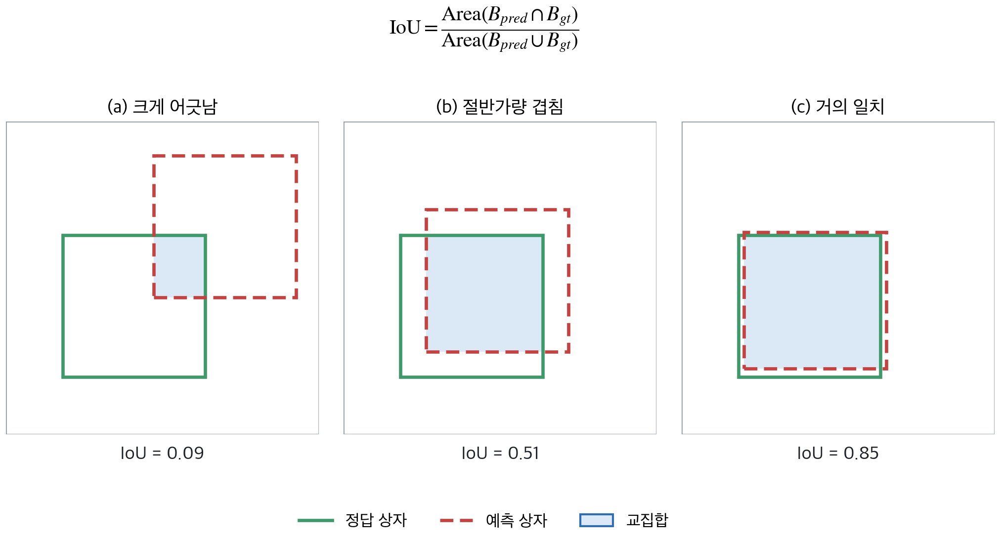{width=88% fig-alt="IoU 비교"}
:::
::: {.figcap}
**그림 6-3** IoU의 예. 정답 상자(초록 실선)와 예측 상자(빨강 점선)의 교집합(파랑)을 합집합으로 나눈 값입니다. (a)처럼 크게 어긋나면 IoU가 낮고, (c)처럼 거의 일치하면 1에 가까워집니다. 값은 그림의 좌표로 계산한 것입니다.
:::

### 중복 제거: NMS

검출기는 한 물체 주위에 비슷한 상자를 여러 개 예측하기 쉽습니다. **비최대 억제(Non-Maximum Suppression, NMS)**는 확신도가 가장 높은 상자를 남기고, 그 상자와 IoU가 임계값 이상으로 겹치는 나머지를 제거하는 과정을 반복합니다.

::: {.figbody}
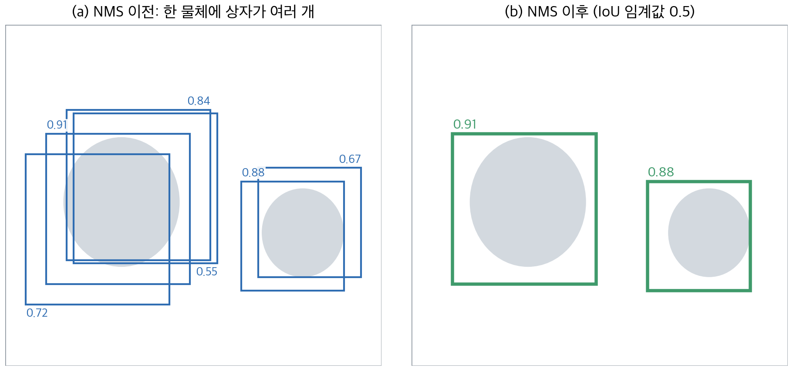{width=80% fig-alt="NMS 전후"}
:::
::: {.figcap}
**그림 6-4** NMS. (a) 한 물체에 확신도가 다른 상자가 여러 개 예측되었습니다. (b) IoU 임계값 0.5로 NMS를 적용하면 물체마다 확신도가 가장 높은 상자 하나만 남습니다. 서로 다른 물체의 상자는 겹치지 않으므로 함께 유지됩니다.
:::

IoU와 NMS는 직접 구현해 보면 원리가 분명해집니다. 아래 코드는 그림 6-4의 상자와 같은 값을 사용합니다.

**코드 6-5** IoU를 직접 계산하고 `torchvision.ops`의 결과와 비교합니다.

```python
import torch
from torchvision.ops import box_iou, nms

def my_box_iou(a, b):
    """a: (N,4), b: (M,4), xyxy 형식 → (N,M) IoU 행렬"""
    area_a = (a[:, 2] - a[:, 0]) * (a[:, 3] - a[:, 1])
    area_b = (b[:, 2] - b[:, 0]) * (b[:, 3] - b[:, 1])
    lt = torch.max(a[:, None, :2], b[None, :, :2])     # 교집합 좌상단
    rb = torch.min(a[:, None, 2:], b[None, :, 2:])     # 교집합 우하단
    wh = (rb - lt).clamp(min=0)                        # 겹치지 않으면 0
    inter = wh[..., 0] * wh[..., 1]
    return inter / (area_a[:, None] + area_b[None, :] - inter)

boxes = torch.tensor([[1.2, 2.4, 5.4, 6.8], [1.8, 3.1, 6.0, 7.5],
                      [0.6, 1.8, 4.8, 6.2], [2.0, 3.0, 6.2, 7.4],
                      [6.9, 2.2, 9.9, 5.4], [7.4, 2.6, 10.4, 5.8]])
scores = torch.tensor([0.91, 0.84, 0.72, 0.55, 0.88, 0.67])

print(torch.allclose(my_box_iou(boxes, boxes), box_iou(boxes, boxes)))   # True

keep = nms(boxes, scores, iou_threshold=0.5)
print(keep)            # tensor([0, 4])  → 확신도 0.91, 0.88 상자만 남음
```

**코드 읽는 법**

- `a[:, None, :2]`와 `b[None, :, :2]`는 모양이 `(N,1,2)`와 `(1,M,2)`이므로 브로드캐스트로 모든 쌍을 한 번에 비교합니다. 결과는 `(N, M)` IoU 행렬입니다. 이중 반복문이 필요 없습니다.
- `clamp(min=0)`은 두 상자가 겹치지 않을 때 교집합 너비가 음수가 되는 것을 0으로 막습니다.
- `nms`는 확신도가 높은 순서로 남긴 상자의 **인덱스**를 돌려줍니다. `iou_threshold`가 클수록 "많이 겹쳐도 같은 물체로 보지 않는다"는 뜻이라 중복이 더 많이 남습니다.
- 실제 모델은 클래스가 여러 개이므로 `batched_nms`로 클래스별로 따로 적용합니다.


`nms`는 남길 상자의 인덱스를 확신도 내림차순으로 돌려줍니다. 실제 검출기는 클래스별로 NMS를 따로 적용하는 `batched_nms`를 흔히 씁니다.

### 종합 성능: mAP

검출 성능은 **mAP(mean Average Precision)**로 측정합니다. 클래스별로 정밀도-재현율 곡선 아래 면적(AP)을 구한 뒤 클래스 전체에 평균합니다. 어떤 IoU 기준으로 "맞은 검출"을 판정하느냐에 따라 값이 달라집니다.

- **mAP@0.5**: IoU 0.5 이상을 정답으로 인정합니다(PASCAL VOC 방식).
- **mAP@0.5:0.95**: IoU 임계값을 0.5부터 0.95까지 0.05 간격으로 바꿔 평균합니다(MS COCO 방식). 상자의 정밀도까지 엄격하게 평가하므로 더 낮게 나옵니다.

### 두 갈래의 검출기

딥러닝 검출기는 접근 방식에 따라 두 갈래로 나뉩니다. **2단계 검출기**는 물체가 있을 법한 후보 영역을 먼저 뽑고 그 후보를 분류·보정합니다. 정확하지만 느립니다. **1단계 검출기**는 후보 제안 없이 이미지에서 한 번에 상자와 클래스를 예측해 빠릅니다.

::: {.figbody}
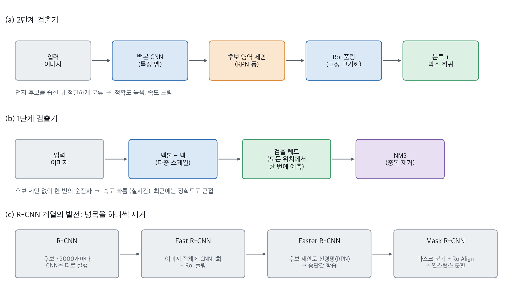{width=94% fig-alt="2단계와 1단계 검출기 비교"}
:::
::: {.figcap}
**그림 6-5** 검출기의 두 갈래. (a) 2단계 검출기는 후보 제안 후 분류합니다. (b) 1단계 검출기는 모든 위치에서 한 번에 예측하고 마지막에 NMS로 정리합니다. (c) R-CNN 계열은 느린 부분을 하나씩 신경망 안으로 흡수하며 발전했습니다.
:::

R-CNN 계열의 발전 과정은 병목을 제거하는 이야기로 이해하면 쉽습니다. **R-CNN**은 선택적 탐색으로 뽑은 후보 약 2,000개를 각각 CNN에 넣어 매우 느렸습니다. **Fast R-CNN**은 이미지 전체에 CNN을 한 번만 적용한 특징 맵에서 후보 영역을 **RoI 풀링**으로 잘라 쓰도록 바꿨습니다. **Faster R-CNN**은 후보 제안까지 **영역 제안 네트워크(RPN)**로 신경망 안에 넣어 종단간 학습이 가능해졌고, **Mask R-CNN**은 여기에 마스크 분기와 **RoIAlign**을 더해 인스턴스 분할로 확장했습니다. 이 계열은 정확도가 높아 정밀도가 중요한 과제에 쓰입니다.

1단계 검출기는 오랫동안 정확도에서 뒤졌습니다. **RetinaNet**은 그 원인이 **클래스 불균형**에 있다고 보았습니다. 이미지 대부분이 배경이라 쉬운 배경 예제가 손실을 지배한다는 것입니다. 이를 해결한 **초점 손실(focal loss)**은 이미 잘 맞힌 쉬운 예제의 손실을 줄입니다.

$$
\text{FL}(p_t) = -(1-p_t)^{\gamma}\,\log(p_t).
$$

여기서 $p_t$는 정답 클래스에 대한 예측 확률이고 $\gamma$는 조절 계수입니다. $\gamma=2$이고 배경을 $p_t=0.9$로 잘 맞혔다면 $(1-0.9)^2=0.01$이므로 손실이 교차 엔트로피의 100분의 1로 줄어듭니다.

**코드 6-6** 이진 초점 손실의 구현과 쉬운 예제의 손실 감소 확인입니다.

```python
import torch
import torch.nn.functional as F

def focal_loss(logits, targets, gamma=2.0, alpha=0.25):
    ce = F.binary_cross_entropy_with_logits(logits, targets, reduction="none")
    p = torch.sigmoid(logits)
    p_t = p * targets + (1 - p) * (1 - targets)          # 정답 클래스의 확률
    alpha_t = alpha * targets + (1 - alpha) * (1 - targets)
    return (alpha_t * (1 - p_t) ** gamma * ce).mean()

# 이미 잘 맞힌 쉬운 배경 예제(p_t = 0.9)의 손실 비교
logit = torch.logit(torch.tensor([0.1]))                 # 배경인데 물체일 확률 0.1 → p_t = 0.9
target = torch.tensor([0.0])
ce = F.binary_cross_entropy_with_logits(logit, target)
fl = focal_loss(logit, target, alpha=0.5)                # alpha=0.5는 가중을 동일하게 둠
print(f"CE {ce.item():.4f}  FL {fl.item() * 2:.4f}  비율 {(fl * 2 / ce).item():.3f}")
```

```
CE 0.1054  FL 0.0011  비율 0.010
```

**코드 읽는 법**

- 입력이 확률이 아니라 **로짓**(`sigmoid` 이전 값)이라서, `binary_cross_entropy_with_logits`로 안정적으로 교차 엔트로피를 계산하고 `sigmoid`로 확률을 따로 구합니다.
- `p_t`는 "정답 클래스에 준 확률"입니다. 정답이 1이면 `p`, 0이면 `1-p`입니다. 한 줄로 두 경우를 처리하려고 `p*t + (1-p)*(1-t)`로 썼습니다.
- `(1 - p_t) ** gamma`가 초점 손실의 핵심입니다. 잘 맞힐수록(`p_t`가 1에 가까울수록) 0에 가까워져 손실이 사라집니다. `gamma`가 클수록 쉬운 예제를 더 강하게 억제합니다.
- `alpha`는 양성과 음성의 비중을 다르게 주는 보조 가중치입니다. 위 검증에서는 효과를 제거하려고 0.5로 두었습니다.


(`alpha=0.5`일 때 $\alpha_t$는 모든 예제에 0.5이므로, 2를 곱해 $\alpha$ 효과를 제거하고 $(1-p_t)^\gamma$만 비교한 것입니다.)

## YOLO와 YOLOv8 {#sec-yolo}

### YOLO의 입력과 출력

YOLO를 이해하려면 먼저 이 모델이 **무엇을 입력받아 무엇을 내놓는지**를 분명히 해야 합니다. 원 논문의 YOLO(v1)는 이미지 한 장(448×448 RGB)을 입력받아 **숫자 표 하나**를 출력합니다. 이 표는 $7\times7\times30$, 곧 숫자 1,470개이며, 이미지를 가로세로 7칸으로 나눈 격자의 **칸마다 30개의 숫자**가 들어 있습니다. 그 30개는 "그 칸이 맡은 물체"의 ① 상자의 위치와 크기, ② 물체가 있다는 확신도, ③ 물체의 종류(클래스)입니다.

::: {.figbody}
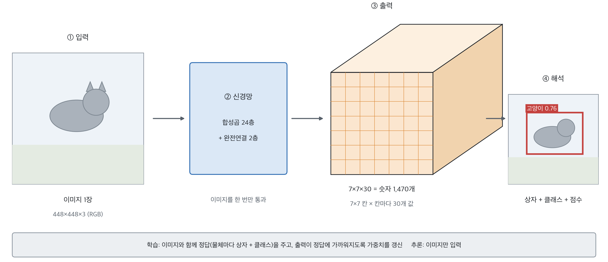{width=100% fig-alt="YOLO의 입력과 출력"}
:::
::: {.figcap}
**그림 6-6** YOLO의 입력과 출력. ① 이미지 1장이 ② 신경망(합성곱 24층 + 완전연결 2층)을 한 번 통과하면 ③ $7\times7\times30$ 숫자 표가 나오고, ④ 이를 해석하면 상자·클래스·점수가 됩니다. 아래 상자는 학습과 추론에서 모델이 받는 것의 차이를 보입니다.
:::

**탐지(detection)한다**는 것은 이렇게 이미지 속 물체의 위치(경계 상자)와 종류(클래스)를 함께 찾아내는 것입니다. 학습할 때와 추론할 때 모델이 받는 입력이 다릅니다.

- **학습**: 이미지와 함께 **정답(라벨)**을 줍니다. 정답은 사람이 이미지마다 물체를 상자로 그리고 클래스 이름을 붙여 둔 것입니다. 모델의 출력이 이 정답에 가까워지도록 손실을 계산해 가중치를 갱신합니다.
- **추론**: 학습이 끝난 모델에 이미지만 넣습니다. 정답은 없으며, 모델이 스스로 낸 숫자를 해석해 검출 결과를 얻습니다.

### 격자와 담당 칸

앞에서 격자의 "칸"이라는 말이 나왔는데, 이는 이미지를 조각으로 자르는 것이 아닙니다. **이미지는 통째로 신경망에 한 번 들어가고, 격자는 출력 표의 한 칸이 이미지의 어느 부분에 해당하는지를 정하는 좌표**입니다.

::: {.figbody}
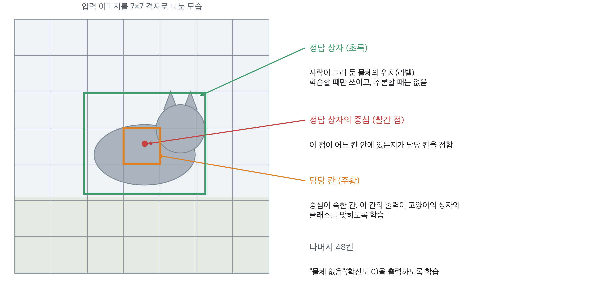{width=88% fig-alt="격자와 담당 칸"}
:::
::: {.figcap}
**그림 6-7** 격자와 담당 칸. 초록 상자는 사람이 그려 둔 **정답 상자**(라벨)이고, 빨간 점은 그 중심입니다. 중심이 속한 주황색 칸이 이 고양이의 **담당 칸**입니다. 정답 상자는 학습할 때만 쓰이고 추론할 때는 없습니다.
:::

"**담당한다**"는 학습의 규칙입니다. 정답 상자의 **중심이 속한 칸**의 출력만 그 물체의 정답(상자와 클래스)과 비교합니다. 그래서 담당 칸의 출력이 "여기에 고양이가 있고 상자는 이만하다"를 내놓도록 학습됩니다. 나머지 48칸은 이 물체에 책임이 없으므로 "물체 없음"(확신도 0)을 내도록 학습합니다. 추론할 때는 정답이 없으므로 모든 칸이 각자 자기 몫의 상자와 확신도를 내고, 확신도가 높은 것만 남깁니다.

### 원형 YOLO 구조의 요약

**YOLO(You Only Look Once)**는 이름 그대로 이미지를 한 번만 보고 모든 물체를 찾는 1단계 검출기입니다. 이미지를 $S\times S$ 격자로 나누고, **물체의 중심이 속한 칸**이 그 물체의 상자·확신도·클래스를 예측합니다. 각 칸은 $B$개의 상자를 내놓으며 하나의 상자는 위치 $(x,y,w,h)$와 물체 존재 확신도로 이루어집니다. 클래스가 $C$개일 때 전체 출력은 하나의 텐서 $S\times S\times(B\cdot5+C)$입니다.

::: {.figbody}
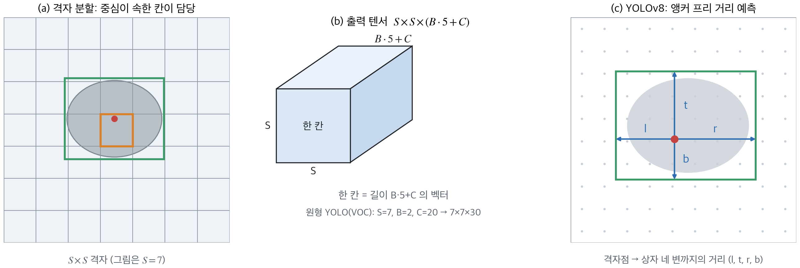{width=100% fig-alt="YOLO 격자, 출력 텐서, 앵커 프리 거리 예측"}
:::
::: {.figcap}
**그림 6-8** YOLO의 예측 방식. (a) 이미지를 $S\times S$ 격자로 나누면, 물체 중심(빨간 점)이 속한 칸(주황)이 그 물체를 담당합니다. (b) 원형 YOLO의 출력 텐서. 한 칸의 벡터는 상자 $B$개의 $(x,y,w,h,\text{확신도})$와 클래스 확률 $C$개로 구성됩니다. (c) YOLOv8은 앵커 없이 격자점에서 상자 네 변까지의 거리 $(l,t,r,b)$를 직접 예측합니다.
:::

검출을 여러 단계가 아니라 **하나의 회귀 문제**로 통합한 것이 YOLO의 속도와 단순함의 원천입니다. 다만 초기 버전은 한 칸이 예측하는 상자 수가 제한되어 작은 물체가 밀집한 경우에 약했습니다. 이후 앵커 상자(YOLOv2), 다중 스케일 예측(YOLOv3) 등으로 발전하며 실시간 검출의 대표 계열이 되었습니다.

### 한 칸이 내는 30개의 숫자

격자의 **칸 하나**가 내놓는 출력은 길이 30의 **벡터**(숫자를 한 줄로 나열한 것)입니다. 아래 그림은 앞에서 본 담당 칸이 낸 값의 예시입니다.

::: {.figbody}
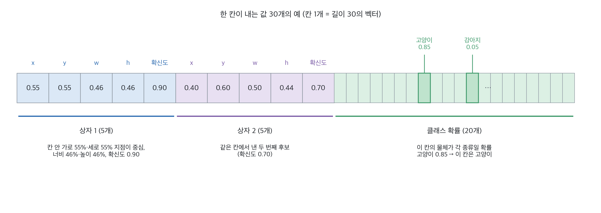{width=100% fig-alt="한 칸이 내는 30개 값의 예"}
:::
::: {.figcap}
**그림 6-9** 한 칸이 내는 값 30개의 예. 앞의 5개는 상자 1, 다음 5개는 상자 2, 나머지 20개는 클래스 확률입니다. 격자가 $7\times7=49$칸이고 칸마다 상자를 2개 내므로 **후보 상자는 98개**입니다. 클래스 확률은 상자 수와 무관하게 칸당 한 벌뿐입니다.
:::

| 값 | 의미 | 예시 값 |
|----|------|---------|
| $x,\ y$ | 칸 안에서 상자 **중심의 위치**. 칸의 왼쪽 위가 0, 오른쪽 아래가 1 | 0.55, 0.55 (칸의 거의 한가운데) |
| $w,\ h$ | 상자의 **너비·높이**. 이미지 전체에 대한 비율 | 0.46, 0.46 (이미지의 46%) |
| 확신도 | 이 상자 안에 물체가 있다고 얼마나 확신하는가 | 0.90 |
| 클래스 확률 | 이 칸의 물체가 20종 각각일 확률 | 고양이 0.85, 강아지 0.05, 나머지 ≈ 0 |

클래스가 20개인 이유는 원 논문이 20종(사람, 자전거, 새, 고양이, 개, 자동차 등)으로 구성된 PASCAL VOC 데이터를 썼기 때문입니다. 예시에서는 고양이의 확률이 가장 높으므로 이 칸이 담당하는 물체는 고양이입니다. 한 칸이 상자를 2개 내는 것은 서로 다른 모양의 후보를 시도하게 하려는 것이며, 학습할 때는 정답과 더 잘 겹치는 쪽이 그 물체를 책임집니다.

여기서 두 가지를 짚어야 합니다.

- **확신도**는 "이 상자 안에 물체가 있을 확률"과 "예측 상자가 정답과 얼마나 겹치는가(IoU)"를 곱한 값을 학습 목표로 삼습니다. 즉 위치가 부정확하면 확신도도 낮아집니다.
- **클래스 확률은 칸마다 하나**입니다. 한 칸의 상자 2개는 같은 클래스를 공유합니다. 그래서 한 칸에 서로 다른 종류의 물체가 겹쳐 있으면 하나만 인식하게 되며, 이것이 초기 YOLO가 겹치거나 밀집한 작은 물체에 약했던 이유입니다.

### 박스는 어떻게 만들어지는가

모델이 낸 $x,y,w,h$는 0~1 사이의 **비율**이라서 그대로는 화면에 그릴 수 없습니다. 입력 크기와 칸 크기를 곱해 픽셀 좌표로 바꿔야 합니다. 핵심은 **무엇을 기준으로 잰 값인가**입니다. 예를 들어 입력이 448×448이고 격자가 7×7이면 한 칸은 64픽셀입니다. 모델이 담당 칸(열 3, 행 3)에서 $(x,y,w,h)=(0.55,\,0.55,\,0.46,\,0.46)$을 냈다고 합시다.

::: {.figbody}
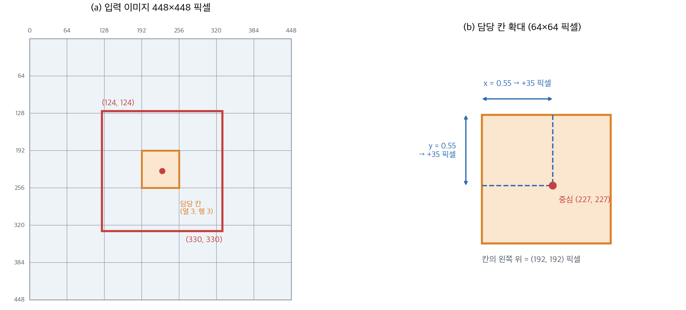{width=96% fig-alt="YOLO 박스 복원의 계산 예"}
:::
::: {.figcap}
**그림 6-10** 박스의 복원 예. (a) 입력 이미지 448×448 픽셀 위의 담당 칸(주황)과 복원된 상자(빨강). (b) 담당 칸을 확대한 모습으로, 칸 안의 비율 $x,y$가 픽셀 거리로 바뀌는 과정입니다.
:::

| 단계 | 하는 일 | 계산 |
|------|---------|------|
| ① 담당 칸 | 칸 위치를 픽셀로 | 열 3, 행 3 → 왼쪽 위 $(3\times64,\ 3\times64)=(192,\ 192)$ |
| ② 중심 | **칸 안**의 비율 $x,y$를 더함 | $192+0.55\times64\approx227$ |
| ③ 크기 | **이미지 전체**의 비율 $w,h$를 곱함 | $0.46\times448\approx206$ |
| ④ 상자 | 중심에서 반 너비(103)만큼 좌우·상하로 | $(227-103,\ 227-103)\sim(227+103,\ 227+103)=(124,\ 124)\sim(330,\ 330)$ |

위 4단계를 한 계산씩 풀어 쓰면 다음과 같습니다(입력 $W=H=448$, 격자 $S=7$, 담당 칸 열 $c=3$·행 $r=3$).

| 단계 | 식 | 대입 | 결과 |
|------|----|------|------|
| ① 칸 한 개의 크기 | $W/S$ | $448\div7$ | 64 픽셀 |
| ② 담당 칸의 왼쪽 위 | $(c\times64,\ r\times64)$ | $(3\times64,\ 3\times64)$ | $(192,\ 192)$ |
| ③ 칸 안 오프셋 | $x\times64,\ y\times64$ | $0.55\times64$ | 35.2, 35.2 |
| ④ 중심 | ② + ③ | $192+35.2$ | $(227.2,\ 227.2)$ |
| ⑤ 상자 크기 | $w\times W,\ h\times H$ | $0.46\times448$ | $206.08\times206.08$ |
| ⑥ 반 크기 | ⑤ ÷ 2 | $206.08\div2$ | 103.04 |
| ⑦ 왼쪽 위 | ④ − ⑥ | $227.2-103.04$ | $(124.16,\ 124.16)$ |
| ⑧ 오른쪽 아래 | ④ + ⑥ | $227.2+103.04$ | $(330.24,\ 330.24)$ |

**검산**: 오른쪽 아래에서 왼쪽 위를 빼면 $330.24-124.16=206.08$로 ⑤의 크기와 같고, 중심 227.2는 담당 칸의 범위 $192\le227.2<256$ 안에 있습니다. 중심 좌표 ②~④는 $c_x=(c+x)/S\times W$ 한 줄로 쓸 수 있으며 같은 227.2가 나옵니다. **자주 하는 실수**는 $w$를 칸 기준으로 해석해 64를 곱하는 것으로, 약 29픽셀의 상자가 나와 정답의 $1/7$ 크기가 됩니다.

일반식으로 쓰면 다음과 같습니다.

| 값 | 기준 | 복원 |
|----|------|------|
| $x, y$ | 담당 **칸** (0~1) | $c_x=(\text{열}+x)/S$, $c_y=(\text{행}+y)/S$ |
| $w, h$ | **이미지 전체** (0~1) | 그대로 이미지 비율 |

중심을 칸 기준으로 두는 이유는 학습 안정성입니다. 칸 번호가 이미 대략적인 위치를 알려 주므로 네트워크는 0~1 범위의 작은 오프셋만 맞히면 됩니다. 참고로 일부 설명 자료가 $w,h$도 칸 기준이라고 적고 있으나, 원 논문은 이미지 기준입니다.

학습할 때 누가 어떤 물체를 맡는지는 다음 규칙으로 정해집니다.

1. 정답 박스의 **중심이 속한 칸**이 그 물체를 담당합니다.
2. 그 칸의 상자 $B$개 중 정답과 **IoU가 가장 큰 하나**만 그 물체를 책임집니다.
3. 물체가 없는 칸은 확신도를 0으로 내도록 학습하며, 이런 칸이 압도적으로 많아 손실에서 가중치를 낮춥니다.

### 두 갈래의 결과를 합치기

한 이미지에서 네트워크는 사실상 **두 가지 지도**를 만들어 냅니다. 하나는 "상자와 그 확신도", 다른 하나는 "칸마다 어떤 클래스처럼 보이는가"입니다. 둘을 곱하면 상자마다 **클래스별 점수**가 됩니다.

::: {.figbody}
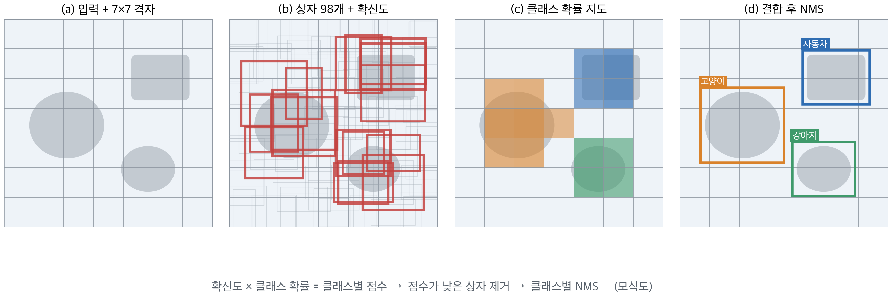{width=100% fig-alt="YOLO 추론: 상자, 클래스 확률 지도, 결합, NMS"}
:::
::: {.figcap}
**그림 6-11** YOLO의 추론 과정(모식도). (a) 입력. (b) 98개 후보 상자와 확신도(선이 굵고 붉을수록 확신도가 큼). (c) 칸마다 가장 가능성 높은 클래스를 색으로 표시한 클래스 확률 지도. (d) 두 결과를 곱해 점수가 낮은 상자를 버리고 클래스별 NMS를 적용한 최종 결과.
:::

$$
\text{클래스별 점수}_{\,i,c} = \underbrace{P(\text{물체})\times\text{IoU}}_{\text{상자 } i \text{의 확신도}}\;\times\;\underbrace{P(\text{클래스 } c\mid\text{물체})}_{\text{칸의 클래스 확률}}
$$

상자 98개 각각에 클래스 20개의 점수를 구하면 $98\times20$개의 점수가 나옵니다. 점수가 임계값보다 낮은 후보를 버리고, 남은 후보에 **클래스마다 따로** NMS를 적용해 중복을 제거합니다. 클래스별로 따로 하는 이유는 서로 다른 종류의 물체가 겹쳐 있어도 서로를 지우지 않게 하기 위해서입니다.

이 전체 과정을 텐서 연산으로 옮기면 다음과 같습니다. 학습된 모델 대신, 한 물체를 가리키는 값을 직접 채운 출력 텐서를 사용해 각 단계의 의미를 확인합니다.

**코드 6-7** 원형 YOLO의 출력 텐서 $7\times7\times30$을 상자로 디코딩합니다.

```python
import torch
from torchvision.ops import batched_nms

S, B, C = 7, 2, 20
out = torch.zeros(S, S, B * 5 + C)          # 네트워크 출력 (여기서는 예시 값을 직접 채움)
out[3, 3, :5]   = torch.tensor([0.55, 0.55, 0.46, 0.46, 0.90])   # 칸(행3,열3) 상자 1
out[3, 3, 5:10] = torch.tensor([0.40, 0.60, 0.50, 0.44, 0.70])   # 같은 칸 상자 2
out[3, 3, 10 + 7] = 0.85                                         # 클래스 7번 확률
out[3, 4, :5]   = torch.tensor([0.10, 0.50, 0.48, 0.46, 0.60])   # 옆 칸도 같은 물체를 봄
out[3, 4, 10 + 7] = 0.80

# 1) 30개 값을 5 + 5 + 20 으로 나눠 읽기
boxes_raw = out[..., :B * 5].reshape(S, S, B, 5)     # (7,7,2,5): x, y, w, h, 확신도
cls_prob = out[..., B * 5:]                          # (7,7,20): 칸마다 하나

# 2) 칸 기준 (x, y) → 이미지 비율 중심 좌표.  w, h 는 이미지 비율 그대로
row, col = torch.meshgrid(torch.arange(S), torch.arange(S), indexing="ij")
cx = (col[..., None] + boxes_raw[..., 0]) / S        # (7,7,2)
cy = (row[..., None] + boxes_raw[..., 1]) / S
w, h, conf = boxes_raw[..., 2], boxes_raw[..., 3], boxes_raw[..., 4]
xyxy = torch.stack([cx - w / 2, cy - h / 2, cx + w / 2, cy + h / 2], dim=-1).reshape(-1, 4)  # (98,4)

# 3) 클래스별 점수 = 확신도 × 클래스 확률  → (98, 20)
scores = (conf[..., None] * cls_prob[:, :, None, :]).reshape(-1, C)

# 4) 점수가 임계값을 넘는 (상자, 클래스) 쌍만 남기고 클래스별 NMS
idx, cls = (scores > 0.2).nonzero(as_tuple=True)
keep = batched_nms(xyxy[idx], scores[idx, cls], cls, iou_threshold=0.5)
print(xyxy.shape, scores.shape)
for k in keep:
    i, c = idx[k], cls[k]
    print(f"클래스 {c.item()}  점수 {scores[i, c]:.2f}  상자 {[round(v, 3) for v in xyxy[i].tolist()]}")
```

```
torch.Size([98, 4]) torch.Size([98, 20])
클래스 7  점수 0.76  상자 [0.277, 0.277, 0.737, 0.737]
```

**코드 읽는 법**

- **1단계**: `reshape(S, S, B, 5)`는 길이 30 벡터의 앞 10개를 상자 2개 × 값 5개로 바꿉니다. 나머지 20개는 칸당 한 벌인 클래스 확률이므로 그대로 둡니다.
- **2단계**: $x,y$는 칸 기준이므로 `(열 + x) / S`로 이미지 비율로 바꿉니다. $w,h$는 이미 이미지 기준이라 변환이 없습니다. `[..., None]`은 칸의 열 번호를 상자 축에 맞춰 브로드캐스트하기 위함입니다.
- **3단계**: `conf[..., None] * cls_prob[:, :, None, :]`가 확신도 × 클래스 확률입니다. 결과는 상자 98개 × 클래스 20개의 점수 행렬입니다.
- **4단계**: `batched_nms`는 `cls`가 같은 상자끼리만 비교합니다. 출력에서 상자 하나만 남은 이유는, 같은 물체를 본 세 후보가 서로 크게 겹치므로 점수가 가장 높은 하나(0.90×0.85=0.77)만 살아남았기 때문입니다.
- **자주 하는 실수**: $w,h$까지 `/ S`로 나누면 상자가 7배 작아집니다. $w,h$는 칸 기준이 아닙니다.

원형 YOLO의 구조적 한계는 분명합니다. 한 칸이 클래스를 하나만 내고 상자도 $B$개로 고정되어, 작은 물체가 모여 있으면 놓칩니다. 이후 버전은 **앵커 상자**(YOLOv2·v3)와 **다중 스케일 예측**으로 이를 보완했고, YOLOv8은 한 걸음 더 나아가 앵커 자체를 없앴습니다.

### YOLO 계열의 발전

YOLO는 2015년 원 논문 이후 개발 주체가 바뀌며 발전해 왔습니다. Joseph Redmon과 Ali Farhadi가 v1부터 v3까지 이끌었고, v4부터는 Alexey Bochkovskiy를 비롯한 연구진이 이어받았습니다. v5는 논문 없이 Ultralytics가 코드로 공개했고, v6는 Meituan, v10은 칭화대 연구진이 만들었습니다. 따라서 버전 번호가 같은 팀의 순차적 후속을 뜻하지는 않으며, 숫자가 클수록 항상 좋은 모델인 것도 아닙니다.

::: {.figbody}
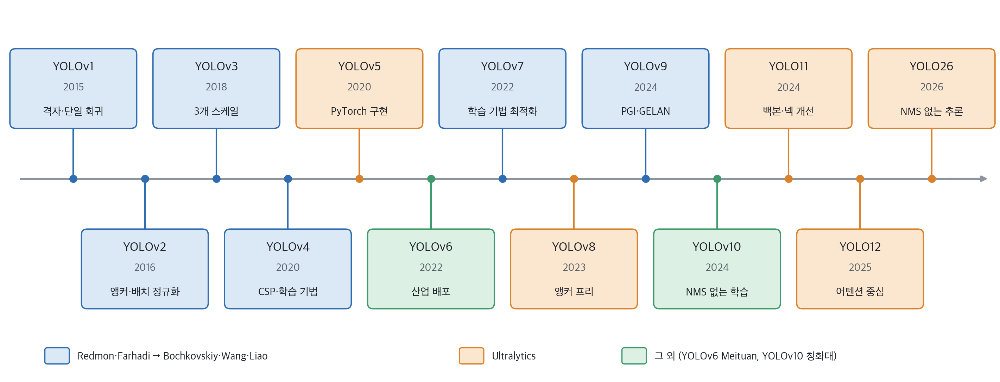{width=100% fig-alt="YOLO 계열 타임라인"}
:::
::: {.figcap}
**그림 6-12** YOLO 계열의 타임라인. 연도는 arXiv 최초 공개 또는 공식 릴리스 기준이고, 색은 개발 주체를 나타냅니다. 상자 안은 각 버전의 핵심 변화입니다.
:::

| 버전 | 개발 | 핵심 변화 | 보고된 수치 |
|------|------|-----------|-------------|
| YOLOv1 | Redmon 외 | 격자 기반 단일 회귀, 합성곱 24층 + 완전연결 2층 | VOC07 63.4 mAP, 45 FPS (Titan X) |
| YOLOv2 | Redmon, Farhadi | 앵커, 배치 정규화, 완전 합성곱 | VOC07 78.6 mAP, 40 FPS |
| YOLOv3 | Redmon, Farhadi | Darknet-53, 3개 스케일, 독립 로지스틱 분류 | COCO AP50 57.9, 51 ms (Titan X) |
| YOLOv4 | Bochkovskiy 외 | CSPDarknet53 + SPP + PAN, 학습 기법 모음 | COCO AP 43.5 (AP50 65.7), 약 65 FPS (V100) |
| YOLOv5 | Ultralytics | PyTorch 구현, n/s/m/l/x 크기 체계 | 논문 없음 |
| YOLOv6 | Meituan 외 | 산업 배포 지향, 양자화 | YOLOv6-N: 35.9 AP, 1,234 FPS (T4) |
| YOLOv7 | Wang 외 | 학습 방식만 개선하는 trainable bag-of-freebies | 56.8 AP (V100, 30 FPS 이상 검출기 중 최고) |

표의 수치는 각 논문이 보고한 값이며 데이터셋, GPU, 해상도가 서로 달라 **버전끼리 직접 비교할 수 없습니다.**

**YOLOv1 (2015)**은 앞에서 설명한 구조입니다. 원 논문 기준으로 입력은 $448\times448$이고 합성곱 24층과 완전연결 2층을 거쳐 $7\times7\times30$을 출력합니다. 손실은 합 제곱 오차이며, 좌표 오차에 $\lambda_{coord}=5$를, 물체가 없는 칸의 확신도 오차에 $\lambda_{noobj}=0.5$를 곱합니다. 큰 상자와 작은 상자의 오차를 공정하게 다루려고 $w,h$는 제곱근을 취해 예측합니다. VOC 2007에서 YOLO는 63.4 mAP에 45 FPS, 합성곱을 9층으로 줄인 Fast YOLO는 52.7 mAP에 155 FPS였습니다. 같은 표에서 Faster R-CNN(VGG-16)은 73.2 mAP에 7 FPS, Fast R-CNN은 70.0 mAP에 0.5 FPS였습니다. 정확도는 낮았지만 속도가 압도적이었습니다. 한계는 앞 절에서 본 대로 칸당 상자 2개와 클래스 1개라는 공간 제약, 그리고 작은 물체에서의 낮은 성능입니다.

**YOLOv2 (2016, YOLO9000)**는 v1의 한계를 하나씩 고쳤습니다.

- 모든 합성곱층에 **배치 정규화**를 적용합니다.
- 분류 사전학습을 더 높은 해상도($448\times448$)로 수행해 검출용 해상도에 적응시킵니다.
- 완전연결층을 없애 **완전 합성곱** 구조로 만들고, **앵커 상자**를 도입해 상자를 앵커 기준의 보정값으로 예측합니다.
- 앵커 크기는 학습 데이터의 상자를 **k-means**로 군집화해 정합니다. 거리는 유클리드 거리 대신 $1-\text{IoU}$를 쓰므로 큰 상자가 군집화를 지배하지 않습니다.
- **직접 위치 예측**: $b_x=\sigma(t_x)+c_x$ 처럼 중심이 담당 칸을 벗어나지 못하게 제한해 학습을 안정시킵니다.
- **passthrough**: 해상도가 높은 앞쪽 특징을 뒤쪽 특징에 이어 붙여 작은 물체의 세밀한 정보를 살립니다.
- 학습 중 입력 해상도를 바꿔 가며 학습(다중 해상도 학습)해 여러 크기에 강인하게 만듭니다.

그 결과 VOC 2007에서 67 FPS에 76.8 mAP, 40 FPS에 78.6 mAP를 보고했습니다. 같은 논문의 **YOLO9000**은 검출 데이터(COCO)와 분류 데이터(ImageNet)를 함께 학습해, 검출 라벨이 없는 클래스까지 포함한 9,000개 이상의 범주를 검출하는 방법을 제안했습니다.

**YOLOv3 (2018)**은 기술 보고서 형식으로, 설계 변경을 모은 "점진적 개선"입니다. 백본을 53층의 **Darknet-53**으로 키우고, 세 가지 스케일에서 예측하며(특징 피라미드와 비슷한 구조), 앵커 9개(스케일당 3개)를 k-means로 정합니다. 클래스는 softmax 대신 클래스별 **독립 로지스틱 분류기**로 예측해 한 상자가 여러 라벨을 가질 수 있게 했고, 물체 존재 점수(objectness)도 로지스틱 회귀로 구합니다. 보고된 수치는 $320\times320$ 입력에서 22 ms에 28.2 mAP(SSD와 비슷한 정확도로 3배 빠름), Titan X에서 57.9 AP50을 51 ms에 달성한 것으로, 같은 조건의 RetinaNet(198 ms)보다 3.8배 빠르다고 합니다. 작은 물체에 약했던 v1의 문제를 다중 스케일로 완화한 것이 핵심입니다.

**YOLOv4 (2020)**는 새 구조를 발명하기보다 당시 알려진 기법을 체계적으로 조합하고 효과를 검증했습니다. 구성은 백본 CSPDarknet53, 넥 SPP와 PAN, 헤드 YOLOv3입니다. 사용한 기법은 두 부류로 나뉩니다.

- **Bag of Freebies**: 학습 비용만 늘리고 추론 비용은 그대로인 기법. Mosaic 증강, CIoU 손실, DropBlock, CmBN 등
- **Bag of Specials**: 추론 비용이 조금 늘지만 정확도를 높이는 기법. Mish 활성화, SPP, SAM, PAN, DIoU-NMS 등

Tesla V100에서 약 65 FPS로 COCO 43.5 AP(AP50 65.7)를 보고했습니다. 이때부터 "백본, 넥, 헤드"라는 현재의 구조 구분이 자리 잡았습니다.

**YOLOv5 (2020)**는 Ultralytics가 2020년 6월 논문 없이 저장소로 공개했습니다. C로 작성된 Darknet 대신 PyTorch로 구현해 학습, 검증, 모델 내보내기를 쉽게 만들었고, n/s/m/l/x 크기 체계를 정착시켰습니다. 원래 v5는 앵커 기반이었고, 현재 `ultralytics` 패키지의 `yolov5u` 모델은 앵커 프리 분리형 헤드를 사용합니다.

**YOLOv6와 YOLOv7 (2022)**는 같은 해에 서로 다른 방향으로 나왔습니다. YOLOv7(Wang, Bochkovskiy, Liao)은 추론 비용을 늘리지 않고 학습 방식만 개선하는 *trainable bag-of-freebies*를 제안했고, MS COCO만으로 처음부터 학습해 V100에서 30 FPS 이상인 실시간 검출기 중 최고인 56.8 AP를 보고했습니다. YOLOv6(Meituan)은 산업 현장 배포를 목표로 양자화와 최적화 방법까지 포함했으며, YOLOv6-N은 T4에서 1,234 FPS에 35.9 AP, YOLOv6-S는 495 FPS에 43.5 AP를 보고했습니다.

이렇게 v1에서 v7까지의 흐름을 정리하면, 앵커 도입(v2), 다중 스케일 예측(v3), 백본-넥-헤드 체계와 학습 기법(v4, v7), 구현과 배포 편의(v5, v6)로 요약됩니다. 이 위에서 YOLOv8은 앵커를 다시 없앴습니다.

### YOLOv8의 구조

YOLOv8은 `ultralytics` 라이브러리로 제공되는 현재 널리 쓰이는 YOLO 계열 모델입니다. 구조는 **백본 → 넥 → 헤드**의 세 부분입니다.

::: {.figbody}
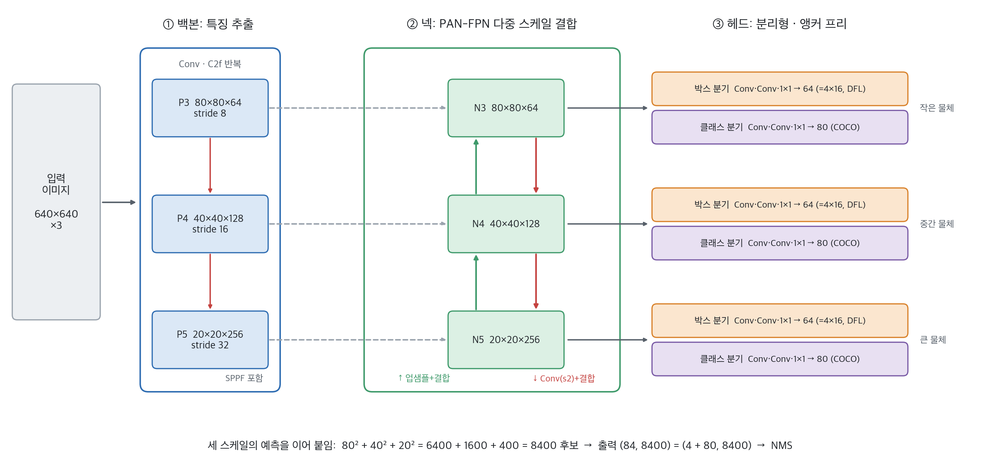{width=100% fig-alt="YOLOv8n 구조"}
:::
::: {.figcap}
**그림 6-13** YOLOv8n의 구조(입력 640×640). 백본이 stride 8·16·32의 세 특징 맵(P3~P5)을 내놓고, 넥(PAN-FPN)이 이를 위아래로 결합해 세 스케일의 특징(N3~N5)을 만들며, 헤드가 각 스케일에서 박스와 클래스를 분리해 예측합니다. 특징 맵 크기와 채널 수는 `ultralytics`로 모델을 만들어 확인한 값입니다.
:::

YOLOv8도 v1과 같은 일을 합니다. **입력**은 640×640×3 이미지이고, **출력**은 `(84, 8400)`입니다. 8,400은 **후보의 수**이고, 후보 하나당 84개의 값, 곧 상자 값 4개와 COCO 80개 클래스의 점수가 들어 있습니다. v1이 후보 98개를 냈던 것과 달리 훨씬 많은 후보를 냅니다. 세 부분이 각각 무엇을 입력받아 무엇을 내놓는지 차례로 봅시다.

**① 백본(backbone): 이미지 → 세 해상도의 특징 맵**

백본은 이미지에서 특징을 뽑는 CNN입니다. **특징 맵**이란 이미지에 합성곱을 적용해 얻은 격자 모양의 숫자 판이고, 칸 하나가 입력의 일정 영역의 특징을 요약합니다.

::: {.figbody}
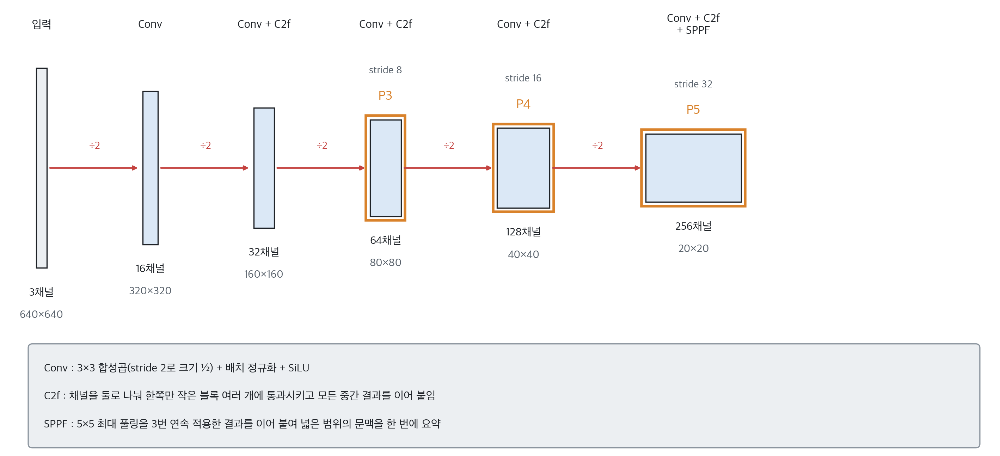{width=100% fig-alt="YOLOv8n 백본"}
:::
::: {.figcap}
**그림 6-14** YOLOv8n 백본의 크기와 채널 변화(입력 640×640). `Conv`를 지날 때마다 크기가 절반이 되고 채널이 늘어납니다. 주황 테두리의 P3·P4·P5가 넥으로 넘어가는 세 출력입니다. 수치는 `ultralytics`로 모델을 만들어 확인한 값입니다.
:::

- **Conv 블록**: 3×3 합성곱(stride 2로 크기를 절반으로) + 배치 정규화 + SiLU 활성화.
- **C2f 블록**: 채널을 둘로 나눠 한쪽만 작은 블록(Bottleneck) 여러 개에 통과시키고, 모든 중간 결과를 이어 붙인 뒤 합성곱으로 섞습니다. 기울기가 잘 흐르고 계산이 가볍습니다.
- **SPPF**: 5×5 최대 풀링을 세 번 연속 적용한 결과를 이어 붙여 넓은 범위의 문맥을 한 번에 요약합니다.
- **출력**: P3(80×80×64, stride 8), P4(40×40×128, stride 16), P5(20×20×256, stride 32). stride 8은 특징 맵 한 칸이 입력의 8×8 픽셀을 대표한다는 뜻입니다. 해상도가 높은 P3는 **작은 물체**에, P5는 넓은 문맥이 필요한 **큰 물체**에 유리합니다. 이 수치는 가장 작은 모델 YOLOv8n 기준이며 s, m, l, x는 채널과 블록 수가 더 많습니다.

**② 넥(neck): 특징 맵 세 개 → 섞인 특징 맵 세 개**

넥은 백본의 P3, P4, P5를 입력받아 같은 크기의 N3, N4, N5를 내놓습니다. 크기와 채널은 같지만 내용이 **섞여** 있습니다. 백본의 깊은 층(P5)은 "이것이 고양이다" 같은 의미 정보가 풍부하지만 해상도가 낮아 위치가 거칩니다. 얕은 층(P3)은 해상도가 높아 위치가 세밀하지만 의미가 약합니다. 둘이 서로의 약점을 보완하게 하는 것이 넥의 역할입니다.

::: {.figbody}
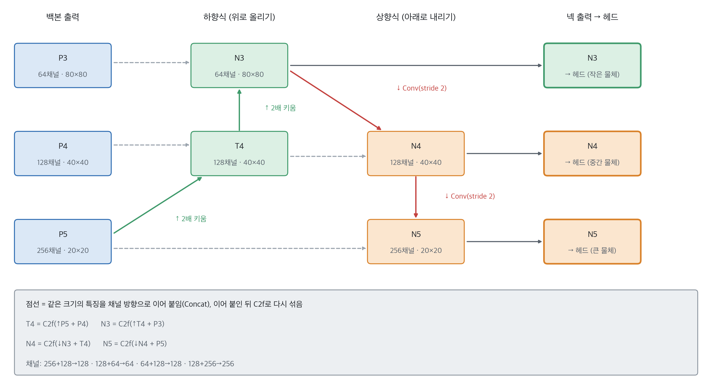{width=100% fig-alt="YOLOv8n 넥(PAN-FPN)"}
:::
::: {.figcap}
**그림 6-15** YOLOv8n의 넥(PAN-FPN). 하향식(초록)은 깊은 특징을 2배로 키워 얕은 특징에 이어 붙이고, 상향식(빨강)은 얕은 특징을 stride 2 합성곱으로 줄여 깊은 특징에 이어 붙입니다. 점선은 같은 크기의 특징을 채널 방향으로 이어 붙이는(Concat) 연결입니다.
:::

- **하향식**: P5를 2배로 키워(Upsample) P4와 이어 붙이면 채널이 $256+128=384$가 되고, C2f로 다시 섞어 128채널(T4)로 줄입니다. 같은 과정을 한 번 더 해 N3를 만듭니다. 깊은 층의 **의미 정보**가 얕은 층으로 전달됩니다.
- **상향식**: N3를 stride 2 합성곱으로 줄여 T4와 이어 붙이면 N4, 다시 줄여 P5와 이어 붙이면 N5가 됩니다. 얕은 층의 **세밀한 위치 정보**가 깊은 층으로 전달됩니다.
- 이름 **PAN-FPN**은 하향식 경로가 FPN(Feature Pyramid Network), 상향식 경로가 PAN(Path Aggregation Network)에서 왔기 때문입니다. 5장 이후 반복되는 "저수준·고수준 특징의 결합"을 검출에 적용한 것입니다.

**③ 헤드(head): 섞인 특징 맵 → 상자와 클래스**

헤드는 N3, N4, N5를 입력받아 최종 예측을 냅니다. 세 스케일에 같은 구조를 적용하되 가중치는 스케일마다 따로입니다. **박스 분기**와 **클래스 분기**를 분리한 이유는 "상자를 어디에 그릴까"와 "이것이 무엇인가"가 요구하는 것이 달라 한 층이 둘을 함께 푸는 것보다 나누는 편이 낫기 때문입니다.

::: {.figbody}
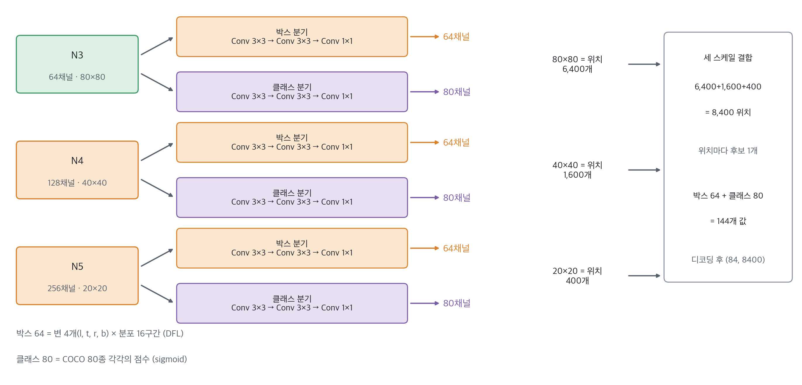{width=96% fig-alt="YOLOv8n 헤드"}
:::
::: {.figcap}
**그림 6-16** YOLOv8n의 헤드. 스케일마다 박스 분기(주황)와 클래스 분기(보라)가 3×3 합성곱 두 번과 1×1 합성곱 한 번으로 이루어집니다. 특징 맵의 위치 하나가 후보 하나이며, 세 스케일을 합치면 8,400개입니다.
:::

- **박스 분기**의 출력 채널은 64입니다. 4변($l,t,r,b$)마다 거리를 `reg_max=16`개 구간의 확률 분포로 예측하므로 $4\times16=64$입니다(DFL). 이 분포의 기댓값이 그 위치에서 각 변까지의 거리가 됩니다.
- **클래스 분기**의 출력 채널은 80입니다. COCO 80개 클래스 각각에 대해 이 위치에 그 물체가 있을 점수를 0~1(sigmoid)로 냅니다.
- **위치 하나가 후보 하나**입니다. 80×80, 40×40, 20×20 위치를 합치면 8,400개이고, 위치마다 박스 64 + 클래스 80 = 144개 값을 냅니다. 디코딩하면 `(84, 8400)`이 됩니다.
- 마지막 처리는 앞에서 배운 대로입니다. 박스 분기의 분포를 거리로 디코딩해 상자를 만들고, 클래스 점수가 임계값을 넘는 후보만 남기고, NMS로 중복을 정리합니다.

YOLOv8의 핵심 특징은 다음과 같습니다.

- **앵커 프리(anchor-free)**: 미리 정한 앵커 상자 없이 각 격자점에서 상자 네 변까지의 거리 $(l,t,r,b)$를 직접 예측합니다(그림 6-8c). 앵커의 크기·비율을 사람이 정할 필요가 없습니다.
- **분포 기반 회귀(DFL)**: 각 변까지의 거리를 하나의 값이 아니라 `reg_max=16`개 구간에 대한 **확률 분포**로 예측하고 그 기댓값을 거리로 씁니다. 박스 분기의 출력 채널이 $4\times16=64$인 이유입니다.
- **손실 함수**: 박스에는 CIoU 손실과 DFL을, 클래스에는 이진 교차 엔트로피(BCE)를 씁니다. 어떤 격자점이 어떤 정답과 짝지어질지는 예측 품질을 함께 보는 **Task-Aligned Assigner**가 정합니다.

모델 크기는 n, s, m, l, x의 다섯 가지이며 폭과 깊이만 다릅니다. 숫자는 COCO(80개 클래스) 기준입니다.

| 모델 | 파라미터 | mAP@0.5:0.95 |
|------|---------:|-------------:|
| YOLOv8n | 3.2M | 37.3 |
| YOLOv8s | 11.2M | 44.9 |
| YOLOv8m | 25.9M | 50.2 |
| YOLOv8l | 43.7M | 52.9 |
| YOLOv8x | 68.2M | 53.9 |

### PyTorch로 이해하는 YOLOv8 출력 해석

헤드의 출력은 세 스케일의 격자점 $6400+1600+400=8400$개 각각에 대한 예측입니다. 이 값이 어떻게 상자가 되는지 PyTorch로 직접 풀어 보면 구조가 선명해집니다. 먼저 모든 격자점의 좌표와 stride를 만들고, DFL 분포를 거리로 바꾼 뒤 상자로 복원합니다.

**코드 6-8** YOLOv8 박스 분기 출력(DFL)을 상자 좌표로 디코딩합니다.

```python
import torch

reg_max = 16
sizes, strides_ = (80, 40, 20), (8, 16, 32)

def make_anchors(sizes, strides):
    """모든 스케일의 격자점 중심 좌표(특징 맵 단위)와 stride를 이어 붙인다."""
    pts, st = [], []
    for s, stride in zip(sizes, strides):
        ys, xs = torch.meshgrid(torch.arange(s), torch.arange(s), indexing="ij")
        pts.append(torch.stack([xs, ys], dim=-1).view(-1, 2) + 0.5)   # 칸의 중심
        st.append(torch.full((s * s, 1), float(stride)))
    return torch.cat(pts), torch.cat(st)

anchors, strides = make_anchors(sizes, strides_)
print(anchors.shape, strides.shape)            # (8400, 2) (8400, 1)

# 박스 분기의 원시 출력: (배치, 4*reg_max, 8400) — 여기서는 무작위 값으로 흉내
raw = torch.randn(1, 4 * reg_max, 8400)

# DFL: 16개 구간의 softmax 분포의 기댓값 = 변까지의 거리(특징 맵 단위)
prob = raw.view(1, 4, reg_max, 8400).softmax(dim=2)
bins = torch.arange(reg_max, dtype=torch.float32).view(1, 1, reg_max, 1)
ltrb = (prob * bins).sum(dim=2)                # (1, 4, 8400): l, t, r, b

# 격자점에서 네 변까지의 거리 → 좌상단·우하단 좌표 → 픽셀 단위로 환산
ltrb = ltrb.permute(0, 2, 1)                   # (1, 8400, 4)
x1y1 = anchors - ltrb[..., :2]
x2y2 = anchors + ltrb[..., 2:]
boxes = torch.cat([x1y1, x2y2], dim=-1) * strides      # (1, 8400, 4) xyxy, 픽셀
print(boxes.shape)                             # torch.Size([1, 8400, 4])
```

**코드 읽는 법**

- `make_anchors`: 스케일마다 격자점을 만들고 `+ 0.5`로 **칸의 중심**에 놓습니다. 세 스케일을 이어 붙이면 8,400개 점이 됩니다. `strides`는 점마다 "특징 맵 한 칸이 원본 몇 픽셀인가"를 담습니다.
- `raw.view(1, 4, 16, 8400).softmax(dim=2)`: 네 변(l,t,r,b) 각각에 대해 **16개 구간**의 확률 분포를 만듭니다. `dim=2`가 그 16개 구간 축입니다.
- `(prob * bins).sum(dim=2)`는 분포의 **기댓값**, 곧 변까지의 거리입니다. 확률이 몰린 구간이 곧 예측 거리가 됩니다.
- 마지막에 `anchors ± 거리`로 좌상단·우하단을 만들고 `* strides`로 픽셀로 환산합니다.
- **자주 하는 실수**: 거리는 특징 맵 단위입니다. `strides`를 곱하지 않으면 상자가 stride배 작게 나옵니다.


여기에 클래스 분기의 80개 점수(`sigmoid` 통과)를 붙이면 `(84, 8400)` 출력이 됩니다. 이 8,400개 후보 중 확신도가 임계값을 넘는 것만 추리고 NMS(코드 6-5)로 중복을 제거하면 최종 검출이 됩니다. 이 후처리는 `ultralytics`가 내부에서 모두 수행합니다.

### ultralytics로 검출하고 미세조정하기

실전에서는 사전학습된 YOLOv8을 불러와 바로 검출하거나, 자신의 데이터로 미세조정합니다. COCO로 사전학습한 모델을 새 데이터에 맞게 학습하는 것은 앞서 본 **전이학습**의 한 예입니다.

**코드 6-9** `ultralytics` YOLOv8로 이미지를 검출합니다.

```python
# 설치: pip install ultralytics
from ultralytics import YOLO

model = YOLO("yolov8n.pt")            # COCO 사전학습 가중치 (처음 실행 시 자동 다운로드)

results = model.predict("dog.jpg", conf=0.25, iou=0.7)   # conf: 확신도 임계값, iou: NMS 임계값
r = results[0]
print(r.boxes.xyxy)                   # (N, 4) 상자 좌표 (픽셀)
print(r.boxes.conf)                   # (N,)  확신도
print(r.boxes.cls)                    # (N,)  클래스 번호
for c in r.boxes.cls.int().tolist():
    print(r.names[c])                 # 클래스 이름
r.show()                              # 상자·클래스·확신도를 그려서 표시
```

**코드 읽는 법**

- `YOLO("yolov8n.pt")`: 가중치 파일이 없으면 처음 실행할 때 자동으로 내려받습니다. `n`은 가장 작은 모델이며 `s/m/l/x`로 바꿀 수 있습니다.
- `conf=0.25`는 클래스 점수가 이보다 낮은 후보를 버리는 임계값, `iou=0.7`은 NMS의 임계값입니다. 둘을 높이거나 낮추면 검출 개수가 달라집니다.
- `r.boxes.xyxy / conf / cls`는 이 장에서 직접 만든 `(상자, 점수, 클래스)`와 같은 것입니다. 앞서 디코딩 코드로 만든 결과를 라이브러리가 대신해 준 셈입니다.
- `r.names`는 클래스 번호를 이름으로 바꾸는 딕셔너리입니다.


`dog.jpg`는 예시 파일명이므로 자신의 이미지로 바꿔 실행합니다. 미세조정에는 데이터셋 설정 파일(`data.yaml`)과 YOLO 형식의 라벨이 필요합니다. 라벨은 이미지마다 `.txt` 파일 하나에, 물체당 한 줄씩 `클래스번호 cx cy w h`(0~1로 정규화, 코드 6-4의 `cxcywh`)로 적습니다.

**코드 6-10** `data.yaml`의 예와 미세조정·평가입니다.

```yaml
# data.yaml
path: datasets/my_data        # 데이터셋 루트
train: images/train           # path 기준 학습 이미지 폴더 (labels/train에 .txt 라벨)
val: images/val
names:
  0: cat
  1: dog
```

```python
model = YOLO("yolov8n.pt")                                   # 사전학습 가중치에서 출발
model.train(data="data.yaml", epochs=50, imgsz=640, batch=16)

metrics = model.val()                                        # 검증 세트 평가
print(metrics.box.map50, metrics.box.map)                    # mAP@0.5, mAP@0.5:0.95
```

**코드 읽는 법**

- `data.yaml`의 `path`는 데이터셋 루트이고 `train`·`val`은 그 아래 이미지 폴더입니다. 라벨은 이미지와 같은 이름의 `.txt`를 `labels/` 폴더에서 자동으로 찾습니다.
- `names`의 번호는 라벨 파일의 클래스 번호와 일치해야 합니다.
- `model.train(...)`은 사전학습 가중치에서 시작해 이 데이터로 이어서 학습합니다(전이학습). `imgsz`는 입력 크기, `batch`는 한 번에 처리할 이미지 수이며 메모리가 부족하면 `batch`를 줄입니다.
- `model.val()`은 검증 세트에서 mAP를 계산합니다. `map50`은 IoU 0.5 기준, `map`은 0.5~0.95 평균입니다.


마지막 분류 층의 클래스 수는 `data.yaml`의 `names`에 맞게 자동으로 바뀌고, 나머지 층은 사전학습 가중치로 초기화됩니다.

::: {.keybox}
**핵심.** YOLOv8은 [백본-넥-헤드]{.key} 구조로 세 스케일(stride 8·16·32)에서 8,400개의 후보를 한 번에 예측하는 **앵커 프리 1단계 검출기**입니다. 박스는 격자점에서 네 변까지의 거리(DFL 분포의 기댓값)로, 클래스는 BCE로 학습하며, 마지막에 NMS로 중복을 제거합니다.
:::

### YOLOv8 이후의 버전

YOLOv8 이후에도 새 버전이 이어졌습니다. 방향은 정보 손실 해소(v9), 후처리 제거(v10, YOLO26), 구조 개선(YOLO11), 어텐션 도입(YOLO12)으로 나뉩니다.

- **YOLOv9 (2024년 2월, Wang, Yeh, Liao)**: 깊은 네트워크를 지나며 입력 정보가 손실되는 *정보 병목* 문제에 주목합니다. 신뢰할 수 있는 기울기를 얻도록 돕는 **PGI**(Programmable Gradient Information)와, 기울기 경로를 설계한 경량 구조 **GELAN**을 제안했고, 처음부터 학습한 모델이 대규모 데이터로 사전학습한 모델보다 우수하다고 보고했습니다.
- **YOLOv10 (2024년 5월, 칭화대, NeurIPS 2024)**: **NMS 없는 학습**(일관된 이중 할당)으로 후처리 NMS를 제거하고, 구성 요소 전반의 효율-정확도 설계를 더했습니다. YOLOv10-S는 RT-DETR-R18과 비슷한 성능에 1.8배 빠르고, YOLOv10-B는 YOLOv9-C보다 지연이 46%, 파라미터가 25% 적다고 보고했습니다.
- **YOLO11 (2024년 9월, Ultralytics)**: 백본과 넥을 개선했습니다. YOLO11m은 YOLOv8m보다 파라미터가 22% 적으면서 COCO mAP는 더 높습니다.
- **YOLO12 (2025년 초, Ultralytics)**: 영역 단위 어텐션(**area attention**)과 **R-ELAN**을 도입한 어텐션 중심 구조입니다. 다만 Ultralytics 문서는 학습 불안정성, 높은 메모리 소비, CPU 처리량 저하를 이유로 대부분의 실서비스에는 YOLO11 또는 YOLO26을 권장합니다.
- **YOLO26 (2026년 1월, Ultralytics)**: 별도의 NMS 없이 예측을 내는 end-to-end 추론을 지원하고, 앞에서 배운 **DFL을 제거**해 검출 헤드를 단순화했습니다. SGD와 Muon을 결합한 MuSGD 최적화기를 도입했습니다.

| 크기 | YOLOv8 | YOLO11 | YOLO12 | YOLO26 |
|------|--------|--------|--------|--------|
| n | 3.2M / 37.3 | 2.6M / 39.5 | 2.6M / 40.6 | 2.4M / 40.9 |
| s | 11.2M / 44.9 | 9.4M / 47.0 | 9.3M / 48.0 | 9.5M / 48.6 |
| m | 25.9M / 50.2 | 20.1M / 51.5 | 20.2M / 52.5 | 20.4M / 53.1 |
| l | 43.7M / 52.9 | 25.3M / 53.4 | 26.4M / 53.7 | 24.8M / 55.0 |
| x | 68.2M / 53.9 | 56.9M / 54.7 | 59.1M / 55.2 | 55.7M / 57.5 |

각 칸은 파라미터 수와 COCO mAP@0.5:0.95입니다(Ultralytics 문서의 보고값).

YOLO 계열의 흐름은 네 가지로 정리할 수 있습니다.

1. **앵커의 도입과 제거**: v2에서 앵커를 넣어 학습을 안정시켰고, v8에서 앵커를 없애 설계 부담을 줄였습니다.
2. **다중 스케일과 특징 결합**: v3의 세 스케일, v4의 PAN, v8의 PAN-FPN으로 작은 물체와 큰 물체를 함께 다룹니다.
3. **학습 방식의 정교화**: v4의 Mosaic·CIoU, v7의 trainable bag-of-freebies, v8의 Task-Aligned Assigner처럼 구조보다 학습 방법이 성능을 좌우하는 비중이 커졌습니다.
4. **후처리의 제거**: v10과 YOLO26은 NMS 없이 최종 예측을 내려는 방향입니다.

이 수업에서는 YOLOv8을 사용합니다. 앞에서 다룬 앵커 프리, DFL, Task-Aligned Assigner가 모두 들어 있어 원리를 설명하기에 적합하기 때문입니다. v8 이후 버전도 `ultralytics` 패키지에서 `YOLO("가중치 파일")` 형태로 불러 쓰는 방식은 같으며, 가중치 이름만 바꾸면 됩니다(예: `yolo11n.pt`). 실서비스에서는 Ultralytics 문서가 권장하는 최신 버전을 같은 조건으로 비교해 선택합니다.

**참고 문헌**

- Redmon et al., *You Only Look Once* (arXiv:1506.02640), YOLO9000 (arXiv:1612.08242), YOLOv3 (arXiv:1804.02767)
- Bochkovskiy et al., YOLOv4 (arXiv:2004.10934), Wang et al., YOLOv7 (arXiv:2207.02696), YOLOv9 (arXiv:2402.13616)
- Li et al., YOLOv6 (arXiv:2209.02976), Wang et al., YOLOv10 (arXiv:2405.14458)
- Ultralytics Docs, <https://docs.ultralytics.com/models/> (YOLOv5, v8, YOLO11, YOLO12, YOLO26)

## 이미지 분할과 U-Net {#sec-segmentation}

### 업샘플링과 인코더-디코더

**이미지 분할**은 픽셀마다 클래스를 부여하는 과제이므로, 입력과 같은 크기의 라벨 지도를 출력해야 합니다. 그런데 분류 CNN은 풀링을 거치며 해상도를 계속 낮추어 마지막에는 공간 정보가 거의 사라진 작은 특징만 남습니다. "무엇인가"를 판단하기엔 충분하지만 "어디인가"를 픽셀 단위로 답하기엔 부족합니다. 따라서 분할 모델은 낮아진 해상도를 다시 키우는 **업샘플링(upsampling)**을 포함해야 합니다.

업샘플링에는 두 부류가 있습니다. 최근접·쌍선형 같은 **보간**은 정해진 규칙으로 값을 채우므로 학습이 필요 없습니다. **전치 합성곱(transposed convolution)**은 합성곱의 역방향으로 작은 특징 맵을 키우는 **학습 가능한** 연산입니다.

::: {.figbody}
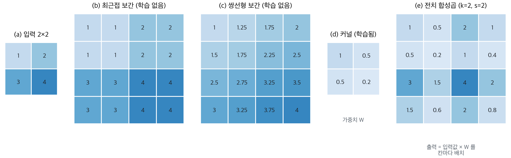{width=100% fig-alt="보간과 전치 합성곱 비교"}
:::
::: {.figcap}
**그림 6-17** 2×2 입력을 4×4로 키우는 세 방법(값은 PyTorch로 계산). (b) 최근접 보간은 값을 복제하고, (c) 쌍선형 보간은 이웃 값을 선형으로 섞습니다. (e) 커널 $k=2$, stride $s=2$의 전치 합성곱은 입력 값에 학습된 가중치 (d)를 곱한 2×2 패치를 칸마다 놓습니다. 커널 값은 학습으로 정해지므로, 데이터에 맞는 업샘플링을 배울 수 있습니다.
:::

**코드 6-11** 보간과 전치 합성곱으로 해상도를 2배로 키웁니다.

```python
import torch
import torch.nn as nn
import torch.nn.functional as F

x = torch.tensor([[1., 2.], [3., 4.]]).view(1, 1, 2, 2)          # (N, C, H, W)

near = F.interpolate(x, scale_factor=2, mode="nearest")
bil = F.interpolate(x, scale_factor=2, mode="bilinear", align_corners=False)
print(near.shape, bil.shape)                                       # (1, 1, 4, 4)

up = nn.ConvTranspose2d(in_channels=1, out_channels=1, kernel_size=2, stride=2, bias=False)
with torch.no_grad():
    up.weight.copy_(torch.tensor([[1.0, 0.5], [0.5, 0.2]]).view(1, 1, 2, 2))
print(up(x)[0, 0].detach())
# tensor([[1.0000, 0.5000, 2.0000, 1.0000],
#         [0.5000, 0.2000, 1.0000, 0.4000],
#         [3.0000, 1.5000, 4.0000, 2.0000],
#         [1.5000, 0.6000, 2.0000, 0.8000]])
```

**코드 읽는 법**

- `F.interpolate(..., mode=...)`는 가중치가 없는 연산입니다. 크기만 두 배로 키우고 값은 규칙으로 채웁니다.
- `ConvTranspose2d(1, 1, kernel_size=2, stride=2)`는 가중치 $2\times2$를 가진 **학습 가능한** 층입니다. 여기서는 확인을 위해 가중치를 직접 넣었습니다(`weight.copy_`). 학습 중에는 이 값이 데이터에 맞게 바뀝니다.
- 커널 크기와 stride가 같으면($k=s=2$) 출력 패치가 서로 겹치지 않습니다. 출력 크기는 $(H-1)\times s+k = (2-1)\times2+2=4$입니다.
- 출력의 각 $2\times2$ 패치는 입력 값 하나에 커널을 곱한 것입니다. 예를 들어 입력 3의 패치는 $[3.0,1.5;1.5,0.6]$입니다.


분할의 표준 틀은 **인코더-디코더(encoder-decoder)** 구조입니다. **인코더**는 합성곱과 풀링으로 이미지를 압축하며 "무엇이 있는가"라는 의미 정보를 추출하고, **디코더**는 업샘플링으로 해상도를 복원하며 "어디에 있는가"라는 위치 정보를 되살립니다. 완전 합성곱 네트워크(FCN)가 분류 CNN의 완전연결층을 합성곱으로 바꿔 이 발상을 처음 픽셀 단위 분할에 적용했고, SegNet과 DeepLab 등이 이 계보를 이었습니다.

### U-Net의 입력과 출력

U-Net이 무엇을 입력받아 무엇을 내놓는지부터 정리합니다. **입력**은 이미지로 모양이 `(N, 3, H, W)`입니다(N은 한 번에 넣는 이미지 수, 3은 RGB 채널). **출력**은 `(N, K, H, W)`이고 K는 분류할 클래스의 수입니다. 이미지의 **모든 픽셀마다 K개의 점수**가 나오고, 가장 큰 점수의 클래스가 그 픽셀의 예측입니다. 핵심은 **출력의 가로세로가 입력과 같다**는 점입니다.

::: {.figbody}
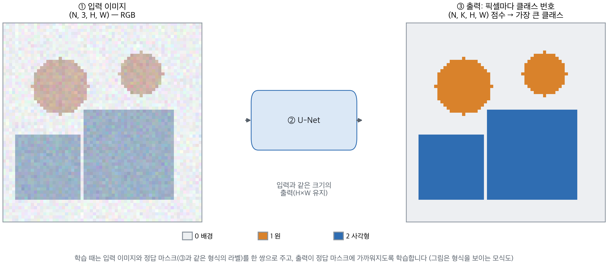{width=100% fig-alt="U-Net의 입력과 출력"}
:::
::: {.figcap}
**그림 6-18** U-Net의 입력과 출력(형식을 보이는 모식도). ① 입력 이미지가 ② U-Net을 지나 ③ 픽셀마다 클래스 번호를 부여한 마스크가 됩니다. 배경(0), 원(1), 사각형(2)의 세 클래스를 색으로 표시했습니다.
:::

학습 데이터는 이미지와 **정답 마스크**의 쌍입니다. 정답 마스크는 이미지와 같은 크기이고 각 픽셀에 클래스 번호가 적혀 있습니다. 사람이 픽셀 단위로 칠해야 하므로 라벨링 비용이 큽니다. YOLO가 물체마다 상자 하나를 내놓는 것과 달리 U-Net은 픽셀마다 클래스 하나를 내놓습니다.

### U-Net의 구조

**U-Net**은 인코더-디코더에 **스킵 연결(skip connection)**을 더한 모델입니다. 인코더와 디코더가 대칭을 이루어 U자 모양이 되어 이런 이름이 붙었습니다. 적은 학습 데이터로도 경계가 정밀한 분할을 만들어 의료 영상에서 표준처럼 쓰이며, 위성 영상 분석과 산업 결함 검사로도 확장되었습니다.

::: {.figbody}
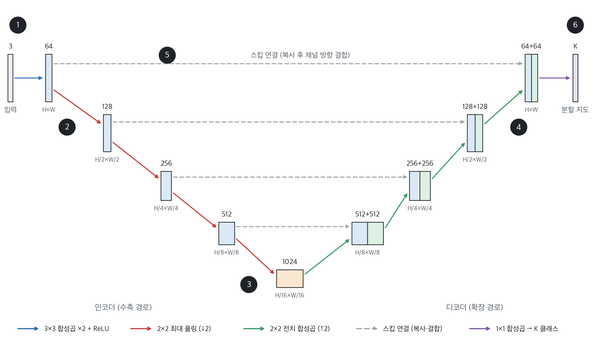{width=100% fig-alt="U-Net 아키텍처"}
:::
::: {.figcap}
**그림 6-19** U-Net 아키텍처. 각 상자 위의 숫자는 채널 수, 아래는 공간 크기입니다. 왼쪽 인코더는 해상도를 절반씩 줄이며 채널을 두 배로 늘리고(64→1024), 오른쪽 디코더는 해상도를 두 배로 키우며 점선의 스킵 연결로 같은 해상도의 인코더 특징을 이어 붙입니다.
:::

| 번호 | 구성 | 하는 일 | 텐서 모양 |
|------|------|---------|-----------|
| ① | 입력 | RGB 이미지 | `(3, H, W)` |
| ② | **인코더** | 3×3 합성곱 2번 → [2×2 최대 풀링 → 3×3 합성곱 2번] ×3 | 채널 64→512, 크기 H→H/8 |
| ③ | **병목** | 풀링 + 합성곱 2번. 가장 넓은 영역을 보는 층 | `(1024, H/16, W/16)` |
| ④ | **디코더** | 2×2 전치 합성곱으로 **2배 키움** → 스킵 특징과 결합 → 합성곱 2번 (×4) | 채널 512→64, 크기 H/16→H |
| ⑤ | **스킵 연결** | 같은 크기의 인코더 특징을 디코더에 **이어 붙임** | 채널이 2배(64+64 등) |
| ⑥ | 출력 | **1×1 합성곱**으로 픽셀마다 클래스 점수 | `(K, H, W)` |

U-Net을 이루는 연산은 네 가지입니다.

- **3×3 합성곱**: 이웃 3×3 픽셀을 보고 특징을 계산합니다. `padding=1`이라 크기는 유지되고 채널 수만 바뀝니다.
- **2×2 최대 풀링**: 2×2 영역마다 **최댓값**만 남겨 크기를 절반으로 줄입니다.
- **전치 합성곱**: 학습되는 커널로 크기를 **두 배로 키웁니다**.
- **1×1 합성곱**: 크기는 그대로 두고 채널 수만 바꿉니다(64 → K).

스킵 연결은 "건너뛴다"는 이름과 달리 값을 더하는 것이 아니라 **복사해서 이어 붙이는** 것이어서 채널 수가 두 배가 됩니다.

### 인코더 한 단계

인코더가 정확히 무슨 일을 하는지 한 단계만 따라가 봅시다. 입력이 64채널 256×256이라면, ① 3×3 합성곱 + 배치 정규화 + ReLU를 두 번 적용해 채널을 128로 늘리고(크기는 256×256 유지), ② 2×2 최대 풀링으로 크기를 128×128로 줄입니다.

::: {.figbody}
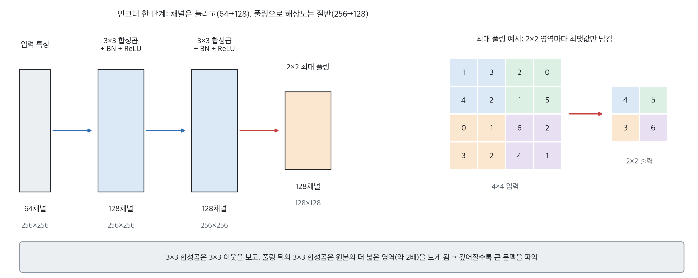{width=100% fig-alt="U-Net 인코더 한 단계"}
:::
::: {.figcap}
**그림 6-20** 인코더 한 단계. 왼쪽은 텐서 모양의 변화(64채널 256×256 → 128채널 128×128)이고, 오른쪽은 2×2 최대 풀링의 숫자 예시입니다(4×4 → 2×2, 값은 PyTorch로 계산).
:::

- **합성곱 두 번**: 채널(필터)이 늘어 더 다양한 패턴을 표현합니다.
- **최대 풀링**: 2×2 영역마다 최댓값만 남깁니다. 중요한 반응은 남기고 세부 위치는 버립니다.
- **왜 반복하는가**: 크기가 줄어든 특징 맵에서는 같은 3×3 합성곱이 원본의 더 넓은 영역을 보게 됩니다. 앞쪽은 모서리·질감 같은 국소 특징을, 깊은 층은 부분·물체 같은 큰 의미를 파악합니다. 대신 정확한 위치 정보는 흐려지며, 이를 되살리는 것이 디코더와 스킵 연결입니다.

### 디코더 한 단계와 스킵 연결

U-Net의 핵심은 스킵 연결입니다. 인코더가 풀링으로 해상도를 낮추는 동안 **세밀한 위치·경계 정보**가 사라지는데, 같은 해상도의 인코더 특징을 디코더에 직접 이어 붙여 이를 되살립니다. 디코더는 깊은 층의 **의미 정보**와 얕은 층의 **경계 정보**를 함께 활용하므로 경계가 정확해집니다. 스킵 연결이 없으면 압축 과정에서 사라진 미세한 경계를 복원하기 어려워 분할 경계가 뭉개집니다. 이 아이디어는 앞서 본 YOLOv8 넥의 다중 스케일 결합과 같은 계열입니다. 디코더 한 단계는 다음 네 단계로 이루어집니다.

::: {.figbody}
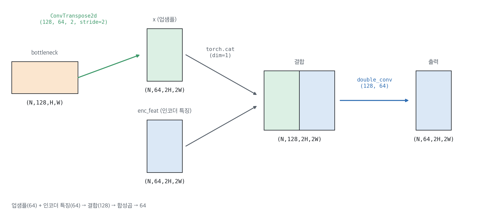{width=92% fig-alt="U-Net 디코더 한 단계의 스킵 연결"}
:::
::: {.figcap}
**그림 6-21** U-Net 디코더 한 단계의 텐서 흐름. 병목 특징(128채널)을 전치 합성곱으로 2배 키워 64채널로 만들고, 같은 해상도의 인코더 특징(64채널)과 채널 방향으로 이어 붙여 128채널이 된 뒤, 합성곱 두 번으로 64채널로 줄입니다. 괄호의 `(N, C, H, W)`는 PyTorch 텐서의 shape입니다.
:::

1. **전치 합성곱**으로 크기를 2배로 키우고 채널을 절반으로 줄입니다: `(128, H, W) → (64, 2H, 2W)`.
2. 같은 크기의 **인코더 특징**을 가져옵니다(스킵 연결): `(64, 2H, 2W)`.
3. 둘을 **채널 방향으로 이어 붙입니다**(`torch.cat(dim=1)`): `(128, 2H, 2W)`.
4. **합성곱 두 번**으로 섞어 채널을 다시 줄입니다: `(64, 2H, 2W)`.

### PyTorch 구현

그림 6-19의 구조를 모듈 단위로 구현합니다. 반복되는 "합성곱 두 번"을 `DoubleConv`로, 인코더 한 단계를 `Down`으로, 디코더 한 단계를 `Up`으로 묶습니다. 합성곱 사이에 배치 정규화를 넣고 `padding=1`로 크기를 유지하므로 출력 해상도가 입력과 같습니다.

**코드 6-12** U-Net 구현.

```python
import torch
import torch.nn as nn

class DoubleConv(nn.Sequential):
    """3×3 합성곱 + BN + ReLU 를 두 번."""
    def __init__(self, cin, cout):
        super().__init__(
            nn.Conv2d(cin, cout, 3, padding=1, bias=False), nn.BatchNorm2d(cout), nn.ReLU(inplace=True),
            nn.Conv2d(cout, cout, 3, padding=1, bias=False), nn.BatchNorm2d(cout), nn.ReLU(inplace=True),
        )

class Down(nn.Sequential):
    """인코더 한 단계: 2×2 최대 풀링으로 해상도 ½ → DoubleConv."""
    def __init__(self, cin, cout):
        super().__init__(nn.MaxPool2d(2), DoubleConv(cin, cout))

class Up(nn.Module):
    """디코더 한 단계: 전치 합성곱으로 해상도 ×2 → 스킵 연결 결합 → DoubleConv."""
    def __init__(self, cin, cout):
        super().__init__()
        self.up = nn.ConvTranspose2d(cin, cout, kernel_size=2, stride=2)
        self.conv = DoubleConv(cout * 2, cout)           # 결합하면 채널이 2배

    def forward(self, x, skip):
        x = self.up(x)                                   # (N, cout, 2H, 2W)
        x = torch.cat([x, skip], dim=1)                  # (N, 2*cout, 2H, 2W)  ← 스킵 연결
        return self.conv(x)

class UNet(nn.Module):
    def __init__(self, in_channels=3, num_classes=2, base=64):
        super().__init__()
        c = [base, base * 2, base * 4, base * 8, base * 16]      # 64, 128, 256, 512, 1024
        self.inc = DoubleConv(in_channels, c[0])
        self.down1, self.down2 = Down(c[0], c[1]), Down(c[1], c[2])
        self.down3, self.down4 = Down(c[2], c[3]), Down(c[3], c[4])
        self.up1, self.up2 = Up(c[4], c[3]), Up(c[3], c[2])
        self.up3, self.up4 = Up(c[2], c[1]), Up(c[1], c[0])
        self.outc = nn.Conv2d(c[0], num_classes, kernel_size=1)  # 픽셀별 클래스 점수

    def forward(self, x):
        x1 = self.inc(x)                 # (N,   64, H,    W)
        x2 = self.down1(x1)              # (N,  128, H/2,  W/2)
        x3 = self.down2(x2)              # (N,  256, H/4,  W/4)
        x4 = self.down3(x3)              # (N,  512, H/8,  W/8)
        x5 = self.down4(x4)              # (N, 1024, H/16, W/16)  병목
        x = self.up1(x5, x4)             # 인코더 특징을 skip으로 전달
        x = self.up2(x, x3)
        x = self.up3(x, x2)
        x = self.up4(x, x1)
        return self.outc(x)              # (N, num_classes, H, W)

model = UNet(in_channels=3, num_classes=2)
x = torch.randn(1, 3, 256, 256)
print(model(x).shape)                    # torch.Size([1, 2, 256, 256])
print(f"{sum(p.numel() for p in model.parameters()) / 1e6:.1f}M 파라미터")
```

**코드 읽는 법**

- `DoubleConv`, `Down`은 `nn.Sequential`을 상속해 `forward`를 따로 쓰지 않습니다. 구조가 그림 6-19와 한 줄씩 대응됩니다.
- `Up.forward`의 `torch.cat([x, skip], dim=1)`이 **스킵 연결**입니다. `dim=1`은 채널 축이므로 채널이 $2\times$cout로 늘어나고, 그래서 뒤의 `DoubleConv`의 입력을 `cout * 2`로 둡니다.
- `UNet.forward`에서 `x1~x4`를 변수로 남겨 두는 이유는 디코더가 그 값을 다시 쓰기 때문입니다. `x5`가 병목이며, `up1(x5, x4)`처럼 같은 해상도의 인코더 출력을 짝지어 넘깁니다.
- 합성곱에 `bias=False`를 쓴 이유는 바로 뒤 BN이 편향 역할을 대신하기 때문입니다.
- **자주 하는 실수**: 입력 크기가 16의 배수가 아니면 풀링으로 홀수가 생겨 `torch.cat`에서 크기가 맞지 않는 오류가 납니다.


입력과 출력의 공간 크기가 같고, 출력 채널이 클래스 수입니다. 입력 높이·너비는 풀링을 네 번 거치므로 **16의 배수**여야 크기가 어긋나지 않습니다.

학습에는 목적에 맞는 손실을 씁니다. 다중 클래스 분할은 `CrossEntropyLoss`를 픽셀 단위로 적용합니다. 정답은 클래스 번호의 `(N, H, W)` 정수 텐서입니다. 배경이 대부분인 의료 영상처럼 클래스 불균형이 심할 때는 겹침을 직접 최적화하는 **Dice 손실**을 함께 쓰는 경우가 많습니다. Dice 계수는 IoU와 가까운 개념으로, 두 영역이 겹치는 정도를 $2|A\cap B|/(|A|+|B|)$로 측정합니다.

**코드 6-13** 분할 손실과 평가 지표(이진 분할 기준)입니다.

```python
import torch
import torch.nn as nn

criterion = nn.CrossEntropyLoss()
logits = model(torch.randn(4, 3, 256, 256))              # (4, 2, 256, 256)
target = torch.randint(0, 2, (4, 256, 256))              # (4, 256, 256) 클래스 번호
loss_ce = criterion(logits, target)

def dice_loss(logits, target, eps=1e-6):
    """전경(클래스 1)의 확률과 정답 마스크의 Dice 손실."""
    prob = logits.softmax(dim=1)[:, 1]                   # (N, H, W)
    t = (target == 1).float()
    inter = (prob * t).sum(dim=(1, 2))
    union = prob.sum(dim=(1, 2)) + t.sum(dim=(1, 2))
    return 1 - ((2 * inter + eps) / (union + eps)).mean()

def iou_score(logits, target, eps=1e-6):
    """전경 클래스의 IoU(Jaccard)."""
    pred = logits.argmax(dim=1) == 1
    t = target == 1
    inter = (pred & t).sum().float()
    return (inter + eps) / ((pred | t).sum().float() + eps)

loss = loss_ce + dice_loss(logits, target)               # 두 손실을 함께 쓰는 것이 흔함
print(loss.item(), iou_score(logits, target).item())
```

**코드 읽는 법**

- `CrossEntropyLoss`는 `(N, K, H, W)` 로짓과 `(N, H, W)` 정수 정답을 그대로 받아 픽셀마다 계산합니다. 정답에 `K` 차원을 만들 필요가 없습니다.
- `dice_loss`: `softmax(dim=1)[:, 1]`은 전경(클래스 1)의 확률 지도입니다. 정답 마스크 `t`와의 겹침 $2|A\cap B|/(|A|+|B|)$을 구하고 `1 - 값`으로 손실로 바꿉니다. `eps`는 분모가 0이 되는 것을 막습니다.
- `iou_score`는 `argmax`로 예측 마스크를 만든 뒤 교집합/합집합을 셉니다. 객체탐지의 IoU와 같은 정의를 픽셀 집합에 적용한 것입니다.
- 두 손실을 더하는 이유: 교차 엔트로피는 픽셀별 정확도에, Dice는 영역 전체의 겹침에 민감해 서로 보완합니다. 무작위 입력이라 출력 수치 자체에는 의미가 없습니다.


더 나은 성능이 필요하면 U-Net의 인코더를 **사전학습한 CNN으로 교체**할 수 있습니다. 이는 이 장 앞에서 배운 전이학습을 분할에 적용한 것으로, 데이터가 적을 때 특히 효과적입니다. `torchvision.models.segmentation`에는 `fcn_resnet50`, `deeplabv3_resnet50` 같은 사전학습 분할 모델이 있어 몇 줄로 불러올 수 있습니다.

::: {.keybox}
**핵심.** 분할은 [인코더로 압축하고 디코더로 복원]{.key}하는 구조이며, U-Net은 **스킵 연결**로 같은 해상도의 인코더 특징을 디코더에 이어 붙여 경계 정보를 되살립니다. 출력은 입력과 같은 크기의 `(N, K, H, W)` 클래스 점수이고, 픽셀 단위 교차 엔트로피와 Dice 손실로 학습합니다.
:::

## 한눈에 비교 {#sec-compare}

이 장에서 다룬 세 과제를 출력·모델·손실·지표로 정리하면 다음과 같습니다.

| 구분 | 이미지 분류 | 객체탐지 | 이미지 분할 |
|------|-------------|----------|-------------|
| 출력 | 이미지당 클래스 1개 | 물체마다 상자 + 클래스 | 픽셀마다 클래스 |
| 출력 shape 예 | `(N, K)` | `(N, 4+K, 8400)` (YOLOv8) | `(N, K, H, W)` |
| 대표 모델 | ResNet 등 CNN | YOLOv8, Faster R-CNN | U-Net, DeepLab |
| 주요 손실 | 교차 엔트로피 | CIoU + DFL + BCE | 픽셀 교차 엔트로피 + Dice |
| 평가 지표 | 정확도 | mAP@0.5, mAP@0.5:0.95 | IoU, Dice |
| 라벨 | 이미지당 클래스 | 상자 + 클래스 | 픽셀 마스크 |

세 과제는 모두 **CNN이 추출한 특징** 위에서 동작하며, ImageNet으로 사전학습한 모델을 백본으로 삼는 **전이학습** 구조를 공통으로 씁니다. 차이는 출력의 공간적 세밀함이고, 세밀할수록 더 정교한 구조와 더 상세한 라벨이 필요합니다.
